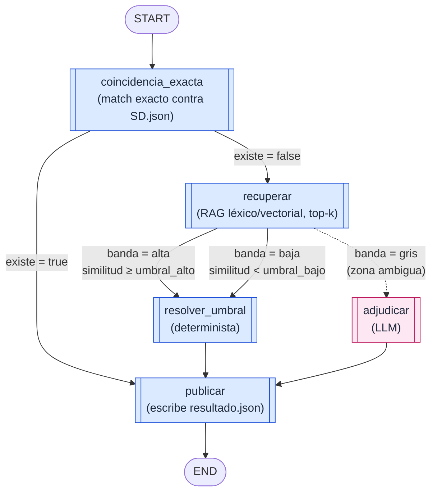
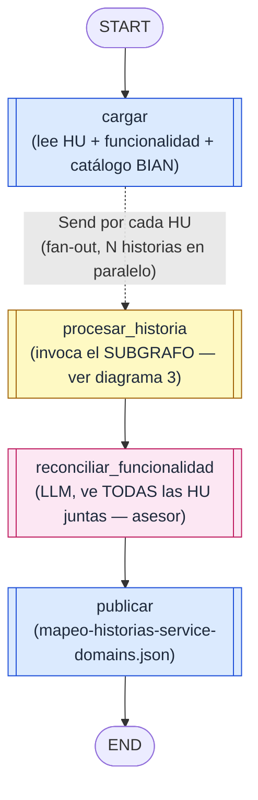
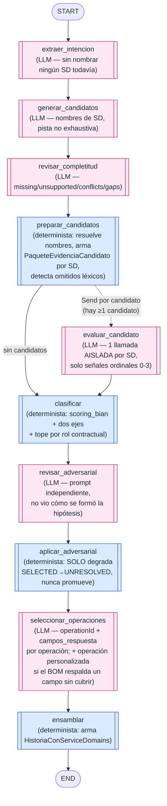

# Grafos LangGraph del proyecto

Diagramas de flujo (grafos dirigidos) de los dos casos de uso orquestados con LangGraph. Reflejan
exactamente los nodos, aristas y ramas condicionales definidos en el código — no son una
simplificación conceptual. Convención de color:

- 🟦 **azul** = nodo determinista (código puro, sin llamada LLM).
- 🟪 **rosa** = nodo que invoca un LLM (con `RetryPolicy` sobre errores transitorios 503/429/etc.).
- Arista punteada = fan-out dinámico (`Send`): se lanza **una instancia del nodo por cada elemento**
  (HU o candidato), en paralelo, no una sola vez.

Fuente: [src/aplicacion/servicios/validar_service_domain.py](src/aplicacion/servicios/validar_service_domain.py)
y [src/aplicacion/servicios/mapear_historias_service_domain.py](src/aplicacion/servicios/mapear_historias_service_domain.py).

---

## 1. `validar-sd` — ¿existe este Service Domain?

Grafo lineal con una única rama donde interviene el LLM: la franja gris de similitud léxica.
`coincidencia_exacta`, `resolver_umbral` y `publicar` son 100% deterministas y reproducibles.

**Regla de negocio clave:** el LLM (`adjudicar`) solo se invoca en la banda gris. Las bandas alta y
baja resuelven `existe` / `service_domain_canonico` con código puro (`decision_similitud.py`).

---

## 2. `mapear-historias` — grafo externo (map-reduce sobre las Historias de Usuario)

**`reconciliar_funcionalidad` es un asesor, no un decisor:** `_consolidar` (determinista, en
`_resultado_mapeo`) decide el estado final (`SELECTED`/`UNRESOLVED`/`REJECTED`) de cada Service
Domain a través de todas las HU; la reconciliación LLM solo aporta `functionality_role`,
`supporting_stories`/`contradicting_stories` y `reason_codes`.

---

## 3. `mapear-historias` — subgrafo por Historia de Usuario (fan-out por candidato)

Cada `Send("procesar_historia", …)` del grafo externo invoca **una copia independiente** de este
subgrafo. Dentro, `preparar_candidatos` vuelve a hacer fan-out — esta vez por cada Service Domain
candidato — para que `evaluar_candidato` reciba un paquete de evidencia cerrado y aislado por SD
(nunca ve a los demás candidatos, evitando contaminación entre evaluaciones).

**El LLM nunca decide el estado final.** `scoring_bian.py` + `clasificacion_historias.py` +
`_consolidar` son el árbitro determinista de `SELECTED`/`UNRESOLVED`/`REJECTED`; los nodos LLM solo
producen señales ordinales, evidencia citada y trazabilidad. Dentro de `seleccionar_operaciones`,
`operacion_evidencia_verificable` (`src/dominio/cobertura_operaciones.py`) verifica de forma
determinista que la cita del LLM (`evidence_refs`) corresponda a un campo real del
`response_schema` de la operación elegida, antes de anclarla.

---

## Correspondencia nodo → código

| Nodo | Método | Tipo |
|---|---|---|
| `coincidencia_exacta` | `_nodo_exacta` | determinista |
| `recuperar` | `_nodo_recuperar` | determinista (RAG léxico/vectorial) |
| `resolver_umbral` | `_nodo_resolver_umbral` | determinista |
| `adjudicar` | `_nodo_adjudicar` | LLM |
| `cargar` | `_nodo_cargar` | determinista |
| `procesar_historia` | `_nodo_procesar` | invoca subgrafo |
| `reconciliar_funcionalidad` | `_nodo_reconciliar` | LLM (asesor) |
| `extraer_intencion` | `_h_intencion` | LLM |
| `generar_candidatos` | `_h_candidatos` | LLM |
| `revisar_completitud` | `_h_completitud` | LLM |
| `preparar_candidatos` | `_h_preparar` | determinista |
| `evaluar_candidato` | `_h_evaluar` | LLM (fan-out por candidato) |
| `clasificar` | `_h_clasificar` | determinista |
| `revisar_adversarial` | `_h_adversarial` | LLM |
| `aplicar_adversarial` | `_h_aplicar_adversarial` | determinista |
| `seleccionar_operaciones` | `_h_operaciones` | LLM + anclaje determinista |
| `ensamblar` | `_h_ensamblar` | determinista |
