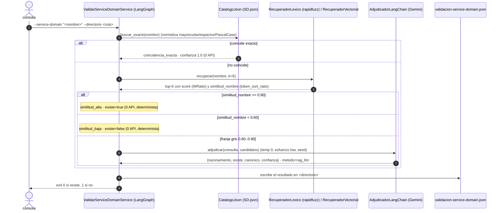

# generacion_contrato_ia_v2

## Pipeline BIAN verificable (8 etapas)

`mapear-historias` ejecuta: extracción de acción/objeto/outcome/dependencias; generación de
candidatos sobre los 341 SD; resolución de evidencia oficial; evaluación estructurada; scoring
determinista; revisión adversarial de ownership; consolidación por funcionalidad; y publicación
auditable de seleccionados, no resueltos, rechazados e incidencias.

La evidencia queda autocontenida en `docs/bian-cache/release14.0.0/`. Por defecto una entrada
existente nunca se descarga otra vez; únicamente se consultan candidatos ausentes. Para forzar
actualización de los candidatos evaluados use `--actualizar-cache-bian`. Si la red falla y no hay
caché, la decisión se conserva como `BIAN_EVIDENCE_UNAVAILABLE`, nunca como falso “no aplica”.

```powershell
python -m src mapear-historias --hu ./HU --func ./funcionalidad.json --dir ./salida
python -m src mapear-historias --hu ./HU --func ./funcionalidad.json --dir ./salida --actualizar-cache-bian
```

Dos casos de uso sobre `docs/SD.json` (341 SD del Service Landscape v14), con evidencia local
cache-first y acceso oficial bajo demanda únicamente para candidatos ausentes:

1. **`validar-sd`** — ¿un nombre de Service Domain existe en SD.json? (`python -m src --service-domain …`)
2. **`mapear-historias`** — mapea un lote de Historias de Usuario a sus Service Domains, con
   **rol contractual** (OWNED / CONSUMED_DEPENDENCY / RELATED), justificación, confianza y
   operaciones oficiales, en 3 grupos (directo / tentativo / descartado). Evidencia BIAN
   íntegra en `docs/`, sin Internet.
   (`python -m src mapear-historias …`) · ver [sección dedicada](#mapear-historias--historias-de-usuario--service-domains).

- **LangGraph** orquesta el grafo · **LangSmith** para observabilidad (opcional).
- **Configuración**: `config.yaml` (versionado) tiene proveedores, modelos, orden de failover,
  umbrales y rutas. `.env` **solo** lleva API keys (`GROQ_API_KEY`, `GOOGLE_API_KEY`,
  `HF_TOKEN`, `OPENROUTER_API_KEY`, …).
- **Failover multi-proveedor / multi-modelo**: se recorre `routing.llm_priority`; dentro de cada
  proveedor, sus `llm.models` en orden. Si un modelo no tiene cuota (429 / sin créditos / no
  disponible) se pasa al siguiente; si un proveedor se agota, al siguiente proveedor. Reintento
  hasta recorrer todo. 503/timeout se reintenta en el mismo modelo antes de avanzar.
- `validar-sd`: `coincidencia exacta` → si falla → `RAG` → `LLM adjudicador`.
- **RAG por defecto: léxico (`rapidfuzz`), sin API de embeddings**. Opcional: RAG vectorial
  (`validar_sd.rag_estrategia: vectorial` en config.yaml).
- Arquitectura **hexagonal** (ver [ARQUITECTURA.md](ARQUITECTURA.md)).

## El grafo



## Cómo decide  —  y cómo se garantiza la reproducibilidad

```
exacto  →  RAG (2 scores)  →  banda por similitud_nombre  →  { alta | baja } determinista
                                                              { gris }         → LLM
```

| Método | Cuándo | Quién decide | Coste API | ¿Reproducible? |
|---|---|---|---|---|
| `coincidencia_exacta` | el nombre está en SD.json salvo forma (caso/espacios/PascalCase) | código | **0** | **100%** |
| `similitud_alta` | `similitud_nombre` ≥ `RAG_UMBRAL_ALTO` (0.90) — erratas, orden de palabras | código | **0** | **100%** |
| `similitud_baja` | `similitud_nombre` < `RAG_UMBRAL_BAJO` (0.60) — nombre incompleto / ajeno | código | **0** | **100%** |
| `rag_llm` | franja gris (0.60–0.90) | LLM | 1 chat | temp 0 · esfuerzo `low` · seed · modelo pinneado |

El **RAG léxico** calcula **dos scores** por candidato:
- `score` (`WRatio`, permisivo) → **ordena el shortlist** (mete el candidato correcto aunque la consulta esté incompleta);
- `similitud_nombre` (`token_sort_ratio`, estricto) → **decide la banda** (penaliza palabras que faltan).

Ejemplo: `saving` → `WRatio` mete `Savings Account` en el shortlist, pero `similitud_nombre ≈ 0.57 < 0.60` → **`similitud_baja` determinista**, sin LLM, igual en Gemini 3.5 / 3.6 / 4.x y para siempre. `Savings Acount` (errata) → `0.97 ≥ 0.90` → **`similitud_alta`**, también sin LLM.

Solo la franja gris (`Card Auth`, `payment initiation`…) llega al LLM. Ahí: `LLM` adjudica con
los 6 candidatos en contexto (CAG) y **solo puede** devolver un nombre de la lista
(anti-alucinación). Ajusta `RAG_UMBRAL_*` para mover cuánto delega al LLM.

`validar_sd.rag_estrategia: vectorial` usa embeddings + `InMemoryVectorStore` para la recuperación
(la banda se sigue calculando con `similitud_nombre`). Los embeddings tienen **failover
multi-modelo en orden de precisión** (`EmbeddingsConFailover`): recorre `routing.embedding_priority`
× `providers.<n>.embedding.models`, prueba cada uno y se queda con el primero disponible (baja al
siguiente si agota cuota). Cadena por defecto: **Cohere** (`embed-v4.0` → `embed-multilingual-v3.0`
→ `embed-english-v3.0` → los `-light` 384d) → Gemini → OpenRouter. El índice se cachea en `.cache/`
por el modelo **activo** (no por la lista), así un failover no carga un índice de otra dimensión.
`COHERE_API_KEY` (free-tier / trial) solo sirve para embeddings.

## Instalación

```powershell
cd generacion_contrato_ia_v2
./setup.ps1                     # venv + últimas versiones + requirements.lock.txt
```

### Configuración: `config.yaml` + `.env`

- **`.env`** (copia de [.env.example](.env.example)) — SOLO API keys, una por proveedor:
  ```ini
  GROQ_API_KEY=gsk_...
  GOOGLE_API_KEY=AIza...          # o AQ.Ab8...
  HF_TOKEN=hf_...
  OPENROUTER_API_KEY=sk-or-v1-...
  # ANTHROPIC_API_KEY=  /  OPENAI_API_KEY=  /  LANGSMITH_API_KEY=
  ```
  Una var ya presente en el entorno del SO NO se pisa por el `.env`.
- **[config.yaml](config.yaml)** (versionado, sin secretos) — todo lo demás:
  - `routing.llm_priority` / `embedding_priority` — orden de failover entre proveedores.
  - `providers.<nombre>` — `enabled`, `api_key_env`, `base_url`, y `llm.models` / `embedding.models`
    **en orden** (el 1º que responda gana; los siguientes son el failover por cuota).
  - `llm` — `temperature`, `seed`, `esfuerzo`, `reintentos_transitorios`, `backoff_*`.
  - `observabilidad` — `langsmith_tracing`, `langsmith_project`.
  - `validar_sd` / `mapear_historias` — umbrales y rutas de cada subcomando.

### LangSmith (observabilidad)

`config.yaml → observabilidad.langsmith_tracing: true` + `LANGSMITH_API_KEY` en `.env` → LangGraph
traza cada nodo, la búsqueda RAG y la llamada al LLM bajo el proyecto `observabilidad.langsmith_project`.

## Uso

```powershell
# existe (coincidencia exacta, sin API)
.\.venv\Scripts\python.exe -m src --service-domain "current account" --directorio .\salida\run

# errata -> RAG + LLM (failover groq -> gemini -> huggingface -> openrouter según config.yaml)
.\.venv\Scripts\python.exe -m src --sd "Isued Device Administraton" --dir .\salida\run -v

# forzar un único proveedor / usar otro config.yaml
.\.venv\Scripts\python.exe -m src --sd "Card Case" --dir .\salida\run --proveedor gemini
.\.venv\Scripts\python.exe -m src --sd "Card Case" --dir .\salida\run --config .\mi-config.yaml
```

| Flag | |
|---|---|
| `--service-domain` / `--sd` | nombre del Service Domain a validar (obligatorio) |
| `--directorio` / `--dir` | carpeta donde se escribe `validacion-service-domain.json` (obligatorio) |
| `--proveedor` | fuerza un único proveedor (`groq` \| `gemini` \| `huggingface` \| `openrouter` \| `anthropic` \| `openai` \| `fake`) — restringe la cadena a ese proveedor; por defecto usa el failover completo de `config.yaml` |
| `--config` | ruta a `config.yaml` (por defecto: raíz del paquete) |
| `--esfuerzo` | `low` \| `medium` \| `high` (pisa `llm.esfuerzo`) |
| `-v` | log DEBUG |

Exit code: `0` existe · `1` no existe · `2` error de configuración.

### Salida (`validacion-service-domain.json`)

```json
{
  "service_domain_consultado": "Isued Device Administraton",
  "existe": true,
  "service_domain_canonico": "Issued Device Administration",
  "metodo": "rag_llm",
  "confianza": 0.98,
  "razonamiento": "La consulta contiene una errata... hace referencia inequívoca a ...",
  "candidatos": [ { "service_domain": "...", "score": 0.75, "service_role": "..." }, ... ],
  "generado_en": "2026-09-08T21:21:23Z"
}
```

## `mapear-historias` — Historias de Usuario → Service Domains

Segundo caso de uso (subcomando). Dado **un directorio de Historias de Usuario** (`.txt` / `.md`)
y **un JSON de funcionalidad macro**, mapea cada HU a los BIAN Service Domains que la implementan.
**Toda la evidencia BIAN vive en `docs/`** — sin Internet, sin conocimiento externo del modelo:

| Archivo en `docs/` | Qué aporta |
|---|---|
| `SD.json` | 341 Service Domains R14: Service Role, Examples of Use, Functional Pattern, Asset Type |
| `bian-business-areas.json` | jerarquía **Business Area → Business Domain → Service Domain** (mismos 341) |
| `bian-operation-catalogs.json` | operaciones oficiales (Control Record / Behavior Qualifier) de **9 Service Domains** materializados |

```powershell
.\.venv\Scripts\python.exe -m src mapear-historias `
  --directorio-hu .\HU `
  --funcionalidad .\ejemplos\funcionalidad-actualizacion-datos-personales.json `
  --directorio .\salida\mapeo
# sin API (verificación de cableado; selección estable pero no semántica):
.\.venv\Scripts\python.exe -m src mapear-historias --hu .\HU --func .\ejemplos\funcionalidad-actualizacion-datos-personales.json --dir .\salida\mapeo --proveedor fake
# sin el paso 2 (no mapea operaciones) · forzar un proveedor:
.\.venv\Scripts\python.exe -m src mapear-historias --hu .\HU --func <f.json> --dir .\salida\mapeo --sin-operaciones --proveedor gemini
```

> **Cuota / failover:** `mapear-historias` hace **~2 llamadas por HU** (paso 1 + paso 2). El chat es
> un **failover** definido en `config.yaml`: recorre `routing.llm_priority` (por defecto
> `groq → gemini → huggingface → openrouter`) y, dentro de cada proveedor, sus `llm.models` en orden. Si un modelo
> da 429 / sin créditos / no disponible / prompt-demasiado-grande, salta al siguiente; si el
> proveedor se agota, al siguiente proveedor. `validar-sd` usa la misma cadena.
> `--proveedor <n>` la restringe a un proveedor.
>
> **Groq** (LPU, muy rápido, free) va primero pero su free tier limita ~15k tokens/min: sirve
> `validar-sd` (prompts pequeños) pero da **413** en `mapear-historias` (catálogo BIAN ~26k tokens),
> así que ahí el failover pasa a Gemini automáticamente.

### El grafo (map-reduce con LangGraph)

```
START
  → cargar            HU + funcionalidad macro + evidencia BIAN local (docs/ + docs/bian-cache/)
  → (Send por HU) →   procesar_historia
                        paso 1 (LLM): propone Service Domains + ROL contractual + escenarios_hu +
                                      rúbricas 0-3 (match_service_role / match_objeto_negocio) + confianza
                        evidencia    : para cada SD que resuelve, asegura su catálogo oficial
                                       (cache-first en docs/bian-cache/; descarga solo los ausentes)
                        dominio      : score determinista (scoring_bian) + TOPE por rol + 2 ejes de decisión
                        2º pase      : detecta léxicamente SD que el LLM pudo omitir (service_domains_omitidos)
                        paso 2 (LLM) : SD directos con catálogo local → operaciones oficiales (CR/BQ)
  → publicar          consolida por funcionalidad (reconcilia el mismo SD entre HU) y escribe el JSON
  → END
```

**Rol contractual** (taxonomía BIAN business-alignment) — clasifica *por qué* aplica el SD:

| rol | significado | tope |
|---|---|---|
| `OWNED_CONTRACT` | la historia **administra/ejecuta** la capacidad y su ciclo de vida | puede ser `directo` |
| `CONSUMED_DEPENDENCY` | solo **consulta/valida/consume** (guard de auth, permisos, auditoría, notificación, riesgo, proveedor externo); lleva `dependency_kind` | **nunca `directo`** (confianza topada `< umbral_directo`) |
| `RELATED_NOT_OWNED` | relación temática, no necesaria para implementar la historia | **nunca `directo`** |

**Dos ejes de decisión** — el `score` es determinista (`scoring_bian`): 30% correspondencia con la
acción oficial (Service Role + operationId/summary/grupo CR-BQ, con tokenización camelCase) · 25%
objeto/schema BOM · 20% ownership · 15% trazabilidad a escenarios · 10% coherencia Business
Area/Domain · ±0.05 según haya o no evidencia BOM verificable. **La confianza libre del LLM no
entra al score** (solo se guarda en `confianza_llm`); el LLM aporta rúbricas enteras 0-3.

| eje | valores |
|---|---|
| grupo (aplicabilidad) | `directo` ≥ 0.90 · `tentativo` 0.63–0.90 · `descartado` < 0.63 |
| `decision_contractual` | `SELECTED` / `UNRESOLVED` / `REJECTED` |
| `motivo_decision` | `OWNED_SELECTED` · `TENTATIVE_SCORE` · `NO_OFFICIAL_BIAN_EVIDENCE` · `CONSUMED_DEPENDENCY` · `RELATED_NOT_OWNED` · `OUT_OF_SCOPE` · `NAME_UNRESOLVED` |

`SELECTED` exige `grupo = directo`, `rol = OWNED_CONTRACT` y evidencia BOM verificable. Falta de
evidencia con score suficiente → `UNRESOLVED / NO_OFFICIAL_BIAN_EVIDENCE` (nunca "no aplica"); score
por debajo de la banda tentativa → `REJECTED / OUT_OF_SCOPE` aunque falte evidencia. Una dependencia
consumida nunca genera contrato → `REJECTED / CONSUMED_DEPENDENCY` (el grupo/score sigue mostrando lo
requerida que está).

**Anti-alucinación (determinista):** `service_domain` se resuelve contra `SD.json` — match normalizado
exacto, o subcadena única (recupera el canónico), o se descarta (`AMBIGUOUS` / `NOT_FOUND`). El nombre
canónico, `rol_bian`, `business_area` y `business_domain` se copian **desde `docs/`, nunca del LLM**.
En el paso 2, los `operation_id` que no estén en el catálogo local se descartan.

**Principio de conjunto mínimo suficiente + revisión adversarial acción/objeto:** el prompt exige
elegir el mínimo de SD `OWNED_CONTRACT`, y contrastar el verbo+objeto de la historia contra el
Service Role antes de fijar el rol.

### JSON de entrada (`--funcionalidad`)

```json
{
  "funcionalidad_macro": "Actualización de datos personales",
  "detalle": "Permitir que el cliente actualice su número celular y correo electrónico desde la app, usando validaciones existentes y Smart Token, con trazabilidad y notificación de los cambios."
}
```

Alias tolerados: `funcionalidad` / `nombre` / `macro` para el nombre; `descripcion` / `detail` /
`contexto` para el detalle.

### Salida (`mapeo-historias-service-domains.json`)

```json
{
  "funcionalidad_macro": "…", "detalle": "…", "total_historias": 6,
  "parametros": { "cadena_llm": "gemini:…", "umbral_directo": 0.9, "umbral_tentativo": 0.63, "paso2_operaciones": true, "top_n_omitidos": 5 },
  "historias": [
    {
      "archivo": "HU-Actualizar correo electrónico.txt",
      "titulo": "Actualizar correo electrónico",
      "razonamiento": "capacidades / conjunto mínimo suficiente / dependencias consumidas",
      "business_actions": ["update"], "business_objects": ["email address"],
      "total_directos": 1, "total_tentativos": 4, "total_descartados": 2,
      "service_domains": {
        "candidatos_directos": [
          {
            "service_domain": "Party Reference Data Directory", "resolucion": "MATCH",
            "rol_contractual": "OWNED_CONTRACT", "dependency_kind": null,
            "confianza": 0.95, "confianza_pct": 95, "confianza_llm": 0.9, "grupo": "directo",
            "decision_contractual": "SELECTED", "motivo_decision": "OWNED_SELECTED",
            "accion_objeto": "actualizar correo electrónico del cliente",
            "escenarios_hu": ["Escenario 2. Edición del correo electrónico"],
            "business_area": "Sales and Service", "business_domain": "Party Reference Data",
            "rol_bian": "The party reference data directory service domain maintains …",
            "desglose_score": { "accion_oficial": 0.8, "objeto_bom": 0.75, "ownership_outcome": 1.0,
                                "trazabilidad_escenarios": 1.0, "coherencia_jerarquia": 0.3, "penalizacion": -0.05, "total": 0.95 },
            "evidencia_bian": { "estado": "CACHED_VERIFIED", "source_commit_sha": "b58bf4c…", "content_sha256": "…", "source_url": "https://raw.githubusercontent.com/bian-official/public/…" },
            "operaciones_bian": []
          }
        ],
        "candidatos_tentativos": [ … ],
        "candidatos_descartados": [ … ]
      },
      "service_domains_omitidos": [
        { "service_domain": "Contact/Correspondence Dialogue", "score_lexico": 0.42, "señales": ["notify", "email"], "business_area": "…" }
      ]
    }
  ],
  "service_domains_consolidados": [
    { "service_domain": "Party Reference Data Directory", "decision": "SELECTED", "motivo": "OWNED_SELECTED",
      "contract_role": "OWNED_CONTRACT", "score": 0.95, "historias": ["HU-…txt"], "traceability": ["Escenario 2…"],
      "selected_operations": ["Update"], "evidence": { "…": "…" } }
  ],
  "service_domains_omitidos": [ { "service_domain": "Contact/Correspondence Dialogue", "score_lexico": 0.42, "…": "…" } ],
  "incidencias": [],
  "generado_en": "2026-09-10T…Z"
}
```

`operaciones_bian` (solo SD directos con catálogo local): `{operation_id, method, path, tipo (CR/BQ), grupo, escenarios_hu, justificacion}`.
`service_domains_consolidados` reconcilia el mismo SD entre HU (una lo consume, otra lo posee).
`service_domains_omitidos` = 2º pase léxico sobre los 341 SD (candidatos que el LLM no propuso; no deciden nada, marcan revisión).

Exit code: `0` si al menos una HU obtuvo ≥1 SD (directo/tentativo) · `1` si ninguna · `2` error.

## Tests (no consumen API)

```powershell
.\.venv\Scripts\python.exe -m unittest discover -s tests -v
```

Incluye `test_arquitectura_hexagonal.py`, que **hace cumplir** las fronteras de capa.

## Modelos y reproducibilidad (verificado sept-2026)

- La cadena de failover por defecto (`config.yaml → routing.llm_priority`) es
  **`groq → gemini → huggingface → openrouter`**:
  - Groq (LPU, ~1-2s, free): `openai/gpt-oss-120b`, `openai/gpt-oss-20b`. Structured OK.
    Free tier ~15k tok/min → sirve `validar-sd`, da 413 en `mapear-historias`.
  - Gemini: `gemini-3.6-flash` (free tier **20 req/día**), `gemini-3.5-flash`, `gemini-3.5-flash-lite`.
  - Hugging Face (router de Inference Providers): `deepseek-ai/DeepSeek-V4-Flash`,
    `openai/gpt-oss-120b`, `meta-llama/Llama-3.3-70B-Instruct`. Modelos fuertes pero el free tier
    es un crédito mensual pequeño (~$0.10) → al agotarse da 402 y el failover pasa a OpenRouter.
  - OpenRouter: `nvidia/nemotron-3-super-120b-a12b:free`, `nvidia/nemotron-3.5-lightning:free`,
    `google/gemma-4-31b-it:free`, `openrouter/free`. Lentos con prompts grandes.
  - Retirados en este repo: `gemini-2.x`, `llama-3.x`/`:free` clásicos de OpenRouter.
- Modelos **pinneados** (nunca `-latest`) salvo `openrouter/free` (auto-router, último recurso).
  `llm.temperature: 0`, `llm.seed`, `llm.esfuerzo: low` reducen la varianza; entre modelos
  distintos no hay garantía dura → por eso `validar-sd` mantiene la franja gris estrecha
  (`validar_sd.rag_umbral_*`) y `mapear-historias` ancla todo a la evidencia local.
- El failover clasifica: 429 / 402 / "no disponible" / salida no parseable → **siguiente modelo**;
  503 / timeout / overloaded → **reintento** del mismo modelo (`llm.reintentos_transitorios`,
  `backoff_*`) antes de avanzar; un error real (bug, config) → se propaga.
- RAG por defecto **léxico** → no usa embeddings. `validar_sd.rag_estrategia: vectorial` activa
  el índice vectorial. Cadena de embeddings por **precisión** (`routing.embedding_priority` ×
  `providers.<n>.embedding.models`): **Cohere** free-tier (`embed-v4.0` multilingüe 128k →
  `embed-multilingual-v3.0` → `embed-english-v3.0` → `*-light-v3.0` 384d) → Gemini
  (`gemini-embedding-001`) → OpenRouter (`text-embedding-3-small`). `EmbeddingsConFailover` prueba
  en orden y baja al siguiente si agota cuota (429/402); `EmbeddingsResiliente` reintenta 429/5xx
  dentro de cada modelo. Índice cacheado en `.cache/` por el modelo **activo**. `COHERE_API_KEY`
  = solo embeddings.

## Estructura

```
src/
├── dominio/            modelos · normalizacion · decision_similitud (umbrales)          (puro)
│                       historias · clasificacion_historias (resolución + tope de rol + umbrales)
├── aplicacion/
│   ├── puertos/        entrada · catalogo · recuperador · adjudicador · publicador
│   │                   entrada_mapeo · lector_historias · clasificador_historias · publicador_mapeo
│   │                   catalogo_operaciones_bian · mapeador_operaciones
│   └── servicios/      validar_service_domain.py            (grafo lineal)
│                       mapear_historias_service_domain.py   (grafo map-reduce, Send por HU, 2 pasos)
├── adaptadores/
│   │                   embeddings_failover (cadena de embeddings por precisión) · embeddings_resiliente
│   ├── entrada/        cli.py (validar-sd) · cli_mapeo.py (mapear-historias)
│   └── salida/         catalogo_json (SD.json + jerarquía) · recuperador_lexico · recuperador_vectorial
│                       · adjudicador_langchain · publicador_json · embeddings_resiliente
│                       · lector_historias_fs · clasificador_historias_langchain · publicador_mapeo_json
│                       · catalogo_operaciones_bian_json · mapeador_operaciones_langchain
│                       · prompts · prompts_mapeo
│                       · llm/  gemini · openrouter · anthropic · openai · fake (Strategy)
│                       ·       failover.py  (ChatConFailover: multi-proveedor / multi-modelo)
└── configuracion/      config_yaml (carga config.yaml) · settings (compone .env + config.yaml)
                        · observabilidad (LangSmith) · contenedor (composition root)

config.yaml             proveedores · modelos · orden de failover · umbrales · rutas   (versionado)
.env                    SOLO API keys                                                 (NO versionado)
docs/                   SD.json · bian-business-areas.json · bian-operation-catalogs.json  (evidencia BIAN local)
```

El subcomando se enruta en `src/__main__.py`: `python -m src mapear-historias …` va a
`cli_mapeo`; cualquier otra invocación mantiene el CLI original `validar-sd`.
