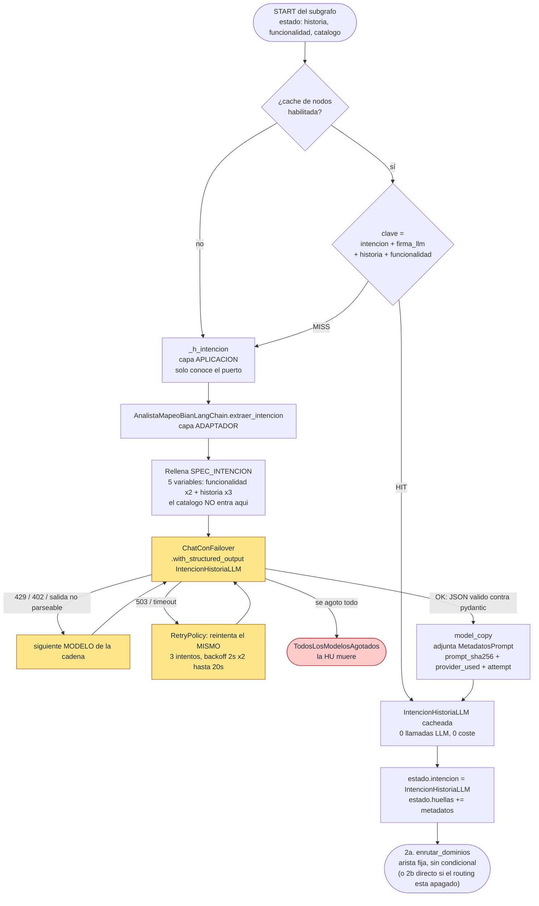

# Nodo 1 — `extraer_intencion` `[LLM]`

> **En una frase:** lee la Historia de Usuario en crudo y la convierte en **listas atómicas de
> negocio** (verbos, objetos, resultados, dependencias, trazabilidad). **No nombra ni un solo
> Service Domain.**

Es el único nodo que ve la historia "limpia", sin BIAN de por medio. Todo lo que produce aquí
se convierte en la **verdad de referencia** que los nodos 8 y 9 usan después para contradecir al
propio LLM:

- `business_actions` es contra lo que `determinar_degradaciones` / `determinar_promociones_por_accion`
  contrastan el `accion_objeto` que el evaluador le atribuyó a un candidato. Si el SD dice que
  hace algo que la historia nunca declaró como acción, se degrada.
- `business_objects` es el **checklist de datos requeridos** del nodo 9: cada dato tiene que
  acabar cubierto por una operación, en un BQ personalizado, o declarado como no cubierto.

Por eso este nodo tiene que ser **descriptivo y conservador**: si aquí se cuela un verbo que la
historia no ejecuta, las tres redes de seguridad de más abajo dejan de funcionar.

---

## 1. Dónde vive

| Pieza | Archivo | Línea |
|---|---|---|
| Handler del nodo (capa aplicación) | `src/aplicacion/servicios/mapear_historias_service_domain.py` | `510` (`_h_intencion`) |
| Registro en el grafo + caché + retry | `src/aplicacion/servicios/mapear_historias_service_domain.py` | `1895` |
| Puerto (contrato abstracto) | `src/aplicacion/puertos/analista_mapeo.py` | `31` (`extraer_intencion`) |
| Adaptador LLM (implementación) | `src/adaptadores/salida/analista_mapeo_langchain.py` | `319` |
| Prompt | `src/adaptadores/salida/prompts_mapeo.py` | `62`–`101` (`SPEC_INTENCION`) |
| Modelo de salida | `src/dominio/historias.py` | `253` (`IntencionHistoriaLLM`) |
| Modelos de entrada | `src/dominio/historias.py` | `85` (`FuncionalidadMacro`), `106` (`HistoriaUsuario`) |

Identidad del prompt: **`prompt_id = "mapeo.intencion"`, `prompt_version = "1.0.0"`**.

---

## 2. Contrato de entrada

El nodo lee **2 claves** del `EstadoHistoria` (`src/aplicacion/servicios/estado_historia.py`).
Ignora `catalogo` a propósito: en este paso BIAN no existe todavía.

| Clave del estado | Tipo | De dónde viene | Para qué se usa |
|---|---|---|---|
| `historia` | `HistoriaUsuario` | `LectorHistoriasPort.leer_historias(--directorio-hu)`, un archivo `.txt` por HU | Es el texto a interpretar |
| `funcionalidad` | `FuncionalidadMacro` | `LectorHistoriasPort.leer_funcionalidad(--funcionalidad)`, el JSON macro | Contexto transversal: la misma HU significa cosas distintas bajo otra funcionalidad |

### `HistoriaUsuario`

| Campo | Tipo | Significado |
|---|---|---|
| `archivo` | `str` | Nombre del archivo de origen, con extensión. Es la **clave** de la HU en todo el pipeline |
| `titulo` | `str` | Título legible, derivado del nombre de archivo |
| `contenido` | `str` | Texto completo: Como/Quiero/Para + escenarios Dado/Cuando/Entonces |

### `FuncionalidadMacro`

| Campo | Tipo | Significado |
|---|---|---|
| `funcionalidad_macro` | `str` | Nombre de la funcionalidad macro. Obligatorio |
| `detalle` | `str` | Contexto adicional. Si viene vacío, el prompt recibe `"(sin detalle adicional)"` |

> `FuncionalidadMacro.desde_dict()` tolera alias en el JSON de entrada: `funcionalidad_macro`,
> `funcionalidad`, `nombre`, `macro`, `titulo`, `name` para el nombre; `detalle`, `descripcion`,
> `detail`, `description`, `contexto`, `resumen` para el detalle.

---

## 3. Contrato de salida

El handler devuelve un `dict` que LangGraph fusiona con el estado:

```python
{
    "intencion": IntencionHistoriaLLM,   # se ESCRIBE (pisa el valor anterior)
    "huellas":  [MetadatosPrompt, ...],  # se ACUMULA (reducer = operator.add)
}
```

### `IntencionHistoriaLLM` campo a campo

| Campo | Tipo | Qué debe contener | Quién lo consume después |
|---|---|---|---|
| `resumen_funcional` | `str` | 1-2 frases: qué capacidad de negocio pide la HU | Prompt del nodo 2; sale como `razonamiento` en el JSON final |
| `capacidades_funcionales` | `list[str]` | Capacidades distinguibles, frases cortas | Consulta del retrieval híbrido y del reranker (nodo 4) |
| `business_actions` | `list[str]` | **Verbos** de negocio que la HU EJECUTA, en infinitivo, uno por elemento | Nodos 2, 3, 5, 7 y — crítico — `determinar_degradaciones` y `determinar_promociones_por_accion` del nodo 8 |
| `business_objects` | `list[str]` | Objetos de negocio que administra o produce | Nodos 2, 3, 5, 7 y el **checklist `<datos_requeridos>`** del nodo 9 |
| `outcomes` | `list[str]` | Resultados observables al terminar cada escenario | Nodos 2 y 7; consulta de retrieval |
| `external_dependencies` | `list[str]` | Lo que la HU **solo consume** como precondición: auth, permisos, riesgo, auditoría, notificación, proveedor externo | Nodos 2 y 3: obliga a que esos SD entren como candidatos aunque sean dependencias |
| `traceability_ids` | `list[str]` | `HU-...`, `SC-01`, `BR-...`, `NFR-...`. Si la HU numera escenarios sin prefijo, el prompt obliga a `SC-01`, `SC-02`... | Nodo 5 (`ownership_traceability` / `dependency_traceability`) |
| `assumptions` | `list[str]` | Supuestos que hizo el modelo | Se arrastran al JSON final |
| `gaps` | `list[str]` | Evidencia que falta | JSON final |
| `unresolved_questions` | `list[str]` | Preguntas abiertas | JSON final |
| `metadatos` | `MetadatosPrompt \| None` | Huella reproducible. **Nunca participa en ninguna decisión** | `huellas_prompts` del JSON final |

Todas las listas tienen `default_factory=list`: **un modelo que no devuelve un campo produce una
lista vacía, no un error**. Eso es deliberado, pero significa que una intención vacía se propaga
en silencio hasta el nodo 9 y allí sí se nota (checklist de datos vacío → `data_coverage_rate` null).

---

## 4. Ejemplo REAL de entrada

Fuente: `tests/resources/cuentas_menores/`.

**`historia`** (archivo `HU-Actualizar cuentas de menores.txt`, recortado):

```text
Como   usuario menor de edad o usuario asociado a cuenta menor,
Quiero  que mis datos personales solo sean visibles y no editables,
Para      cumplir las restricciones de gestión definidas para cuentas de menores.

Escenario 1. Visualización de datos en cuenta menor
Dado      que el usuario tiene una cuenta de menor de edad
Cuando    ingresa a la pantalla de datos personales,
Entonces  el sistema una pantalla con los siguientes elementos: Ver diseño
  ... Número celular: Visualización del número registrado (no editable).
  ... Correo electrónico: Visualización del correo registrado (no editable).
  ... Mensaje: "Solo {{nombre-tutor}} puede cambiar tus datos de contacto
      llamando a nuestro Call Center al 02 400 9000."

Escenario 2. Restricción de edición
Dado      que el usuario pertenece a una cuenta menor,
Cuando    visualiza número celular o correo electrónico,
Entonces  el sistema no permita editar dichos datos

Escenario 3. Mensaje informativo
Dado      que el usuario de cuenta menor ingresa a datos personales,
Cuando    los campos se muestran como no editables,
Entonces  el sistema presente un mensaje informativo explicativo de la restricción.

Nota: El nombre del tutor será enviado por BE.
```

**`funcionalidad`** (`funcionalidad-actualizacion-datos-personales.json`):

```json
{
  "funcionalidad_macro": "Actualización de datos personales",
  "detalle": "Permitir que el cliente actualice su número celular y correo electrónico desde la aplicación móvil, utilizando validaciones existentes y Smart Token como mecanismo de seguridad, asegurando trazabilidad y notificación de los cambios realizados."
}
```

> Fíjate en la tensión que este par introduce a propósito: la **funcionalidad macro habla de
> actualizar**, la **historia solo permite visualizar**. Es exactamente el tipo de contaminación
> de contexto que el nodo 8 tiene que atrapar más abajo.

---

## 5. Ejemplo REAL de salida

Salida literal del nodo en esa corrida (`historias[0].intencion` del JSON de resultado):

```json
{
  "resumen_funcional": "Permitir que usuarios con cuenta de menor visualicen sus datos personales sin posibilidad de editarlos y muestren un mensaje informativo indicando que solo el tutor puede modificarlos.",
  "capacidades_funcionales": [
    "Visualizar datos personales de una cuenta menor",
    "Restringir la edición de número celular y correo electrónico para cuentas menores",
    "Presentar mensaje informativo sobre la restricción de edición",
    "Obtener el nombre del tutor desde el backend"
  ],
  "business_actions": [
    "visualizar datos personales",
    "restringir edición de datos de contacto",
    "presentar mensaje informativo"
  ],
  "business_objects": [
    "cuenta de menor",
    "datos personales",
    "número celular",
    "correo electrónico",
    "nombre del tutor"
  ],
  "outcomes": [
    "Pantalla de datos personales muestra nombre completo, identificación, foto y datos de contacto en modo solo lectura",
    "El sistema impide cualquier intento de edición del número celular y del correo electrónico",
    "Se muestra un mensaje informativo indicando que solo el tutor puede cambiar los datos de contacto y proporcionando el número de Call Center",
    "El nombre del tutor es obtenido del backend y se inserta en el mensaje informativo"
  ],
  "external_dependencies": [
    "Backend (BE) para obtener nombre del tutor",
    "Smart Token como mecanismo de seguridad",
    "Sistema de autenticación/autoridad de identidad para determinar que el usuario es menor"
  ],
  "traceability_ids": [
    "HU-Actualizar cuentas de menores", "SC-01", "SC-02", "SC-03"
  ],
  "assumptions": [
    "El usuario está autenticado y su rol de menor es conocido",
    "El backend siempre devuelve el nombre del tutor",
    "Smart Token es validado previamente por la capa de seguridad",
    "La UI puede renderizar campos en modo solo lectura"
  ],
  "gaps": [
    "Detalle de cómo se valida e integra el Smart Token en la aplicación móvil",
    "Comportamiento del sistema si el backend no devuelve el nombre del tutor"
  ],
  "unresolved_questions": [],
  "metadatos": {
    "prompt_id": "mapeo.intencion",
    "prompt_version": "1.0.0",
    "prompt_sha256": "b1e294c51943a0c47a267c88004bcd3e7de5fb637db9ddcf4ccc0d1af0e02e73",
    "nodo": "extraer_intencion",
    "historia": "HU-Actualizar cuentas de menores.txt",
    "model": "groq:openai/gpt-oss-120b -> groq:openai/gpt-oss-20b -> gemini:gemini-3.6-flash -> ...",
    "provider_used": "groq",
    "model_used": "openai/gpt-oss-120b",
    "attempt": 1,
    "temperature": 0.0,
    "catalog_sha256": "ddb7d1907fa5c7a4ed265006d93eec1d68c84cc76b89ae63be77650fabcfcaac",
    "evidence_snapshot_id": ""
  }
}
```

### Cómo leer este ejemplo

- **`business_actions` NO incluye "actualizar".** Correcto: la HU solo visualiza y restringe.
  Ese dato es el que, tres nodos más abajo, permite degradar un SD que se auto-atribuya
  "actualizar número de celular".
- **`"nombre del tutor"` está en `business_objects`.** Ese único elemento es lo que obliga al
  nodo 9 a anclar `RetrieveAssociations` además de `RetrieveReference` — es el caso que fija la
  E2E `tests/e2e/test_e2e_cuentas_menores.py`.
- **`attempt: 1` y `provider_used: "groq"`**: este nodo lo resolvió el primer modelo de la cadena.
  Es el nodo más fácil del pipeline (prompt pequeño, sin catálogo).

---

## 6. Paso a paso de la ejecución

1. **LangGraph entra al nodo** `extraer_intencion` desde `START` del subgrafo. El estado ya trae
   `historia`, `funcionalidad` y `catalogo`, puestos por el `Send` del outer graph.
2. **Se consulta la caché de nodos** (solo si `cache_nodos_habilitado: true`). La clave es
   `"intencion:" + sha_corto(firma_llm, historia, funcionalidad)`, donde `firma_llm` es la cadena
   de modelos + el `catalog_sha256`. Si hay HIT → se devuelve el resultado guardado y **no hay
   llamada LLM**. Si hay MISS → sigue.
3. **`_h_intencion` llama al puerto**, no al modelo:
   `self._analista.extraer_intencion(estado["historia"], estado["funcionalidad"])`.
   La capa de aplicación no sabe que existe LangChain (lo verifica
   `tests/unit_test/test_arquitectura_hexagonal.py`).
4. **El adaptador arma la cadena**: `SPEC_INTENCION.template | chat.with_structured_output(IntencionHistoriaLLM)`,
   envuelta en `_CadenaMedida`, que cronometra la llamada y deja `TIEMPO_LLM nodo=mapeo.intencion tardo=X.Xs`
   en el log.
5. **Se rellenan las 5 variables del prompt** — y solo esas 5:

   | Variable | Valor |
   |---|---|
   | `funcionalidad_macro` | `funcionalidad.funcionalidad_macro` |
   | `funcionalidad_detalle` | `funcionalidad.detalle` o `"(sin detalle adicional)"` |
   | `historia_archivo` | `historia.archivo` |
   | `historia_titulo` | `historia.titulo` |
   | `historia_contenido` | `historia.contenido` completo, **sin recortar** |

6. **`ChatConFailover` invoca el modelo** pidiendo salida estructurada contra el esquema pydantic.
   Recorre `routing.llm_priority` y, dentro de cada proveedor, sus modelos en orden.
7. **Pydantic valida la respuesta.** Si no parsea, el failover lo trata como fallo de ese modelo y
   pasa al siguiente (no revienta la corrida).
8. **Se adjunta la huella**: `out.model_copy(update={"metadatos": self._huella(...)})`. La huella
   pregunta al **mismo** chat que resolvió el nodo, no al de por defecto, para no reportar el
   proveedor equivocado cuando hay cadena por nodo (`routing.llm_priority_por_nodo`).
9. **El handler devuelve** `{"intencion": ..., "huellas": [metadatos]}`. `huellas` está anotado
   con `operator.add`, así que se concatena; `intencion` se sobrescribe.
10. **Arista fija** al nodo siguiente. No hay condicional: este nodo siempre continúa, incluso
    si devolvió listas vacías. A quién continúa depende del flag de routing:
    `extraer_intencion → enrutar_dominios` con `routing_jerarquico_habilitado: true` (el default
    de `config.yaml`), o `extraer_intencion → generar_candidatos` con el flag apagado. **El nodo 1
    en sí no cambia**: mismo prompt, misma entrada, misma salida, mismos consumidores.

---

## 7. Diagrama de flujo



---

## 8. El prompt exacto

### Mensaje `system` (`_SIS_INTENCION`)

```text
<rol>
Eres analista funcional de banca. Interpretas UNA Historia de Usuario y extraes su intención
de negocio en listas atómicas. En este paso NO se nombra ningún BIAN Service Domain ni se
toma ninguna decisión de arquitectura.
</rol>

<procedimiento>
1. `resumen_funcional`: 1-2 frases sobre qué capacidad de negocio pide la historia.
2. `capacidades_funcionales`: capacidades de negocio distinguibles (frases cortas).
3. `business_actions`: verbos de negocio concretos que la historia EJECUTA (p. ej. "actualizar",
   "activar", "registrar"). Un verbo por elemento, en infinitivo.
4. `business_objects`: objetos de negocio que la historia administra o produce.
5. `outcomes`: resultados observables al terminar cada escenario.
6. `external_dependencies`: sistemas, factores o servicios que la historia SOLO consume como
   precondición (autenticación, permisos, riesgo, auditoría, notificación, proveedor externo).
7. `traceability_ids`: identificadores citados o derivables (HU-.../SC-..., BR-..., NFR-...).
   Si la historia numera escenarios sin prefijo, usa "SC-01", "SC-02"... en orden.
8. `assumptions` / `gaps` / `unresolved_questions`: supuestos hechos, evidencia que falta y
   preguntas abiertas. Vacío si no aplica.
</procedimiento>

<restricciones>
- Fuente única: SOLO el contenido de este mensaje. Prohibido usar Internet, conocimiento
  externo o tu memoria sobre BIAN. Si algo no está en el mensaje, para esta tarea no existe.
- Copia LITERAL los nombres (Service Domain, operationId, schema). Nunca inventes, traduzcas
  ni "corrijas" un nombre.
- No des razonamiento paso a paso. Da una justificación breve y verificable: qué evidencia
  concreta lo sostiene y qué evidencia lo contradice.
- Si falta evidencia para decidir, NO adivines: regístralo en `gaps` y devuelve el estado
  más conservador. Escribe los supuestos en `assumptions`.
</restricciones>
```

### Mensaje `human` (`_HUM_INTENCION`)

```text
<funcionalidad_macro>
{funcionalidad_macro}
{funcionalidad_detalle}
</funcionalidad_macro>

<historia archivo="{historia_archivo}" titulo="{historia_titulo}">
{historia_contenido}
</historia>

Devuelve la estructura pedida: resumen_funcional, capacidades_funcionales, business_actions,
business_objects, outcomes, external_dependencies, traceability_ids, assumptions, gaps,
unresolved_questions.
```

### Por qué el prompt es así

- **Contexto cerrado en XML** (`<historia>`, `<funcionalidad_macro>`): delimita qué es dato y qué
  es instrucción.
- **`business_actions` separado de `external_dependencies`** desde el primer nodo. Toda la
  taxonomía de ownership del pipeline descansa en esa distinción; si se mezclaran aquí, ningún
  nodo posterior podría recuperarla.
- **Sin razonamiento paso a paso**: se pide justificación verificable, no cadena de pensamiento.
- **Prompt pequeño** (solo la HU + la funcionalidad, sin catálogo): por eso este nodo casi nunca
  cae al failover y por eso **nunca** lanza `PeticionDemasiadoGrande`.

---

## 9. Caché, reintentos y failover

| Mecanismo | Configuración | Comportamiento en este nodo |
|---|---|---|
| **Caché de nodos** | `cache_nodos_habilitado`, `cache_nodos_ruta`, `cache_nodos_ttl` | Clave = `intencion` + firma de la corrida (cadena de modelos + `catalog_sha256`) + `historia` + `funcionalidad`. Cambiar de modelo o de catálogo **invalida** la entrada |
| **RetryPolicy del nodo** | fija en código (`_RETRY`) | 3 intentos, `initial_interval=2.0`, `backoff_factor=2.0`, `max_interval=20.0`. Solo reintenta si `_es_transitorio`: 503, 429, `UNAVAILABLE`, `RESOURCE_EXHAUSTED`, `INTERNAL`, `DEADLINE` |
| **Failover entre modelos** | `routing.llm_priority` + `providers.<n>.llm.models` | 429 / 402 / "no disponible" / salida no parseable → siguiente modelo. 503 / timeout → reintenta el mismo y luego avanza |
| **Cadena propia por nodo** | `routing.llm_priority_por_nodo["mapeo.intencion"]` | Vacío por defecto. Este nodo lo resuelve cualquier modelo: es el mejor candidato para pinnear el modelo **más barato** de la cadena |
| **Checkpointer** | `durabilidad: sync\|async` | Si la corrida muere después de este nodo, `--reanudar <thread_id>` **no** vuelve a pagar esta llamada |
| **Presupuesto declarado** | `providers.<n>.llm.models[].max_input_tokens` | Se comprueba igual antes de llamar, pero aquí nunca descarta a nadie: el prompt es de unos pocos miles de tokens y cabe en el presupuesto más pequeño de la cadena |
| **`PeticionDemasiadoGrande`** | — | **No aplica**: este nodo no usa `_invocar_reduciendo` porque no manda catálogo |

`_RETRY` tiene una salvaguarda explícita: si la excepción es `TodosLosModelosAgotados`,
`_es_transitorio` devuelve `False`. Reintentar el nodo entero cuando el failover ya recorrió toda
la cadena solo multiplica el gasto.

---

## 10. Modos de fallo

| Síntoma | Causa | Dónde se ve |
|---|---|---|
| `business_actions` vacío | El modelo devolvió el campo vacío; pydantic lo acepta (`default_factory=list`) | No hay incidencia propia. Se manifiesta en el nodo 8 (ninguna degradación/promoción por acción puede dispararse) y en el 9 (`data_coverage_rate: null`) |
| Un verbo de la **funcionalidad macro** se cuela en `business_actions` | Contaminación de contexto: la macro dice "actualizar", la HU solo visualiza | Es el fallo más caro del nodo. Lo atrapan `determinar_degradaciones` (nodo 8) y la regresión `TestGrafoMapeoDegradacionOwnership` |
| `TodosLosModelosAgotados` | Se agotó toda la cadena de failover | La HU entera falla; la corrida sigue con las demás |
| Intención plausible pero genérica | Modelo débil | No hay detección automática. Señal indirecta: candidatos del nodo 2 poco específicos |

---

## 11. Cómo ejecutarlo y verificarlo aislado

### Ver solo este nodo, sin gastar cuota

```bash
cd /home/super/Desktop/angel_dir/generacion_contrato_bian
.venv/bin/python -m src mapear-historias \
  --hu ./HU \
  --func ./ejemplos/funcionalidad-actualizacion-datos-personales.json \
  --dir ./salida --proveedor fake --sin-timestamp
# -> salida/mapeo-historias-service-domains.json  ->  historias[0].intencion
```

### Con LLM real y ver qué modelo respondió

```bash
.venv/bin/python -m src mapear-historias --hu ./HU \
  --func ./ejemplos/funcionalidad-actualizacion-datos-personales.json \
  --dir ./salida 2>&1 | grep "TIEMPO_LLM nodo=mapeo.intencion"
```

### Inspeccionar la intención de una corrida ya hecha

```bash
.venv/bin/python -c "
import json,sys
d=json.load(open(sys.argv[1]))
for h in d['historias']:
    i=h['intencion']
    print(h['archivo'])
    print('  actions:', i['business_actions'])
    print('  objects:', i['business_objects'])
    print('  deps:   ', i['external_dependencies'])
" tests/resources/cuentas_menores/mapeo-historias-service-domains.json
```

### Tests que cubren este nodo

```bash
.venv/bin/python -m unittest discover -s tests -v   # suite completa, determinista, sin red
```

Las regresiones que dependen directamente de la salida de este nodo:

- `tests/unit_test/test_grafo_mapeo.py::TestGrafoMapeoDegradacionOwnership` — `business_actions`
  como árbitro de la degradación de ownership.
- `tests/unit_test/test_grafo_mapeo.py::TestGrafoMapeoCoberturaDatosRequeridos` —
  `business_objects` como checklist de datos requeridos.

---

## 12. Siguiente nodo

[`02a-enrutar-dominios.md`](02a-enrutar-dominios.md) — el primero que ve BIAN, aunque todavía no
un Service Domain: elige Business Domains sobre la taxonomía usando la intención que este nodo
acaba de extraer. Con `routing_jerarquico_habilitado: false` el siguiente es directamente
[`02b-generar-candidatos.md`](02b-generar-candidatos.md), documentado en su versión previa al
routing en [`historico/02-generar-candidatos.md`](historico/02-generar-candidatos.md).
