# Nodo 2a — `enrutar_dominios` `[LLM + determinista]` — v1 (2026-09-20)

> **En una frase:** antes de mirar ni un solo Service Domain, decide **en qué zonas de la
> taxonomía BIAN se va a buscar** (router por LLM) **y añade los Service Domains que el propio
> modelo BIAN señala como dueños de las clases que la historia necesita** (canal determinista).
> **El LLM no nombra ningún Service Domain. El canal determinista sí, pero no decide nada
> contractual: solo garantiza que 2b los vea.**

Es la primera de las dos etapas del **routing jerárquico**. El paso de candidatos tomaba una
decisión de 341 vías leyendo roles truncados; acotar a ~30-80 SD permite mostrarlos **enteros**
(rol sin recortar + `examples_of_use` + `features`) en el nodo 2b.

Lo que cambió respecto a la versión anterior ([`historico/02a-enrutar-dominios.md`](historico/02a-enrutar-dominios.md)):

| | Antes (2026-09-17) | Ahora (v1) |
|---|---|---|
| Quién elige | Solo el router LLM | Router LLM **+** canal de propiedad de clases BOM |
| Modo de fallo caro | El dominio del propietario no se elige → el SD es invisible para 2b | El propietario entra igual si define una clase que la historia necesita (`ROUTING_PROPIETARIO_DE_CLASE_BOM`) |
| Paso 1 del canal | — | Recuperación híbrida de **clases** (BM25 + embeddings, RRF) sobre `docs/entity.json` |
| Salida nueva | — | `candidatos_por_clase` (SD + clase + BQ + nota del enum + canal que la propuso) |

Tres cosas que este nodo **NO** hace:

1. **No elige el Service Domain del contrato.** El router elige zonas; el canal propone dueños de
   clases. Quién es el propietario del DATO de la historia lo decide la evaluación (nodos 5-8).
2. **No decide nada contractual.** No hay ownership, ni score de confianza, ni `SELECTED`.
3. **No filtra a ciegas.** Un nombre de dominio que no resuelve no filtra nada; si ninguno
   resuelve, se sigue con los 341. Enrutar mal debe costar tokens, nunca candidatos.

**Flags.** El nodo existe solo con `routing_jerarquico_habilitado: true` (con el flag apagado ni
se registra en el grafo). El canal de propiedad se activa con `entidades_bom_habilitado: true`
(ON desde el 2026-09-20); sus canales del paso 1 son `entidades_canales` (`[bm25, vectorial]`), el
tope de propietarios que puede añadir es `entidades_max_candidatos` (10), el top-k de clases por
canal `entidades_top_k_clases` (12) y el `k` de la fusión `entidades_rrf_k` (20).

---

## 1. Dónde vive

| Pieza | Archivo | Línea |
|---|---|---|
| Handler del nodo (capa aplicación) | `src/aplicacion/servicios/mapear_historias_service_domain.py` | `550` (`_h_enrutar`) |
| Canal de propiedad: paso 1 + pasos 2-4 | ídem | `585` (`_candidatos_por_clase`) |
| Rescate de propietarios al catálogo enrutado | ídem | `638` (`_rescatar_propietarios`) |
| Recorte determinista por dominios | ídem | `675` (`_filtrar_por_dominios`) |
| Registro en el grafo (condicional) + caché + retry | ídem | `2146`–`2156` |
| Aristas | ídem | `2241`–`2242` |
| Puerto del router (**no abstracto**, §10) | `src/aplicacion/puertos/analista_mapeo.py` | `37` (`enrutar_dominios`) |
| Adaptador LLM del router | `src/adaptadores/salida/analista_mapeo_langchain.py` | `346` |
| Formateo de la taxonomía | ídem | `138` (`formatear_taxonomia`) |
| Prompt del router | `src/adaptadores/salida/prompts_mapeo.py` | `159` (`SPEC_ENRUTAMIENTO`) |
| Puerto del catálogo de clases | `src/aplicacion/puertos/catalogo_entidades.py` | `CatalogoEntidadesBianPort` |
| Adaptador de `entity.json` | `src/adaptadores/salida/catalogo_entidades_json.py` | `CatalogoEntidadesJson` |
| Puerto de recuperación de clases | `src/aplicacion/puertos/recuperador_clases.py` | `RecuperadorClasesPort` |
| Canal disperso (BM25 sobre clases) | `src/adaptadores/salida/recuperador_clases_bm25.py` | `RecuperadorClasesBM25` |
| Canal denso (embeddings sobre clases) | `src/adaptadores/salida/recuperador_clases_vectorial.py` | `RecuperadorClasesVectorial` |
| Regla de propiedad y fusión (dominio puro) | `src/dominio/entidades_bian.py` | `58` `tokenizar_consulta` · `132` `_nota_de_enum` · `169` `clases_requeridas` · `215` `candidatos_por_propiedad` · `289` `es_artefacto_del_metamodelo` · `301` `ConsultaClases` · `330` `documento_de_clase` · `367` `documentos_indexables` · `386` `clases_requeridas_desde_rankings` |
| Modelos de salida | `src/dominio/historias.py` | `278` `EnrutamientoDominiosLLM` · `311` `EvidenciaClaseBom` · `338` `CandidatoClaseBom` |
| Cableado de canales | `src/configuracion/contenedor.py` | `_recuperadores_clases` |
| Flags | `config.yaml` → `mapear_historias.routing_jerarquico_habilitado`, `entidades_*` | — |

Identidad del prompt del router: **`prompt_id = "mapeo.enrutamiento"`, `prompt_version = "1.0.0"`**.
El canal de propiedad **no tiene prompt**: cero llamadas LLM.

---

## 2. Contrato de entrada

Lee **4 claves** del `EstadoHistoria`:

| Clave | Tipo | De dónde viene | Quién la usa dentro del nodo |
|---|---|---|---|
| `historia` | `HistoriaUsuario` | Lector de HU | Router (texto completo) · incidencias (nombre del archivo) |
| `funcionalidad` | `FuncionalidadMacro` | JSON de funcionalidad | Router (solo el nombre) |
| `intencion` | `IntencionHistoriaLLM` | **Nodo 1** | Router: `resumen_funcional`, `business_actions`, `business_objects`, `outcomes`, `external_dependencies`. **Canal de propiedad: SOLO `business_objects`** |
| `catalogo` | `list[EntradaCatalogo]` | `CatalogoJson.cargar()` (341 SD) | Router: se deriva la taxonomía (5 áreas + 36 dominios). Recorte y rescate: índice por nombre |

Fuera del estado, el canal de propiedad lee **`docs/entity.json`** a través del puerto
(2.668 clases de los diagramas BOM y Control Record de BIAN R14; se carga una vez por proceso).

### Por qué el canal usa solo `business_objects`

El canal responde *"qué clases del BOM necesita la historia"*. Las acciones y capacidades no son
clases. Medido en la corrida real del E2E 1 (2026-09-20): con acciones + capacidades en la
consulta ("pantalla", "avatar", "navegar", "menú Perfil") el canal denso se iba a clases de
perfil, sesión y dispositivo, y el dueño del dato caía del top-10 (posición 11); solo con los
objetos, posición 5.

---

## 3. Contrato de salida

```python
{
    "enrutamiento":         EnrutamientoDominiosLLM,     # se ESCRIBE  (LLM)
    "catalogo_enrutado":    list[EntradaCatalogo],       # se ESCRIBE  (código: recorte + rescate)
    "candidatos_por_clase": list[CandidatoClaseBom],     # se ESCRIBE  (código, sin LLM)
    "huellas":              [MetadatosPrompt, ...],      # se ACUMULA  (1 huella: el router)
    "incidencias":          [dict, ...],                 # se ACUMULA
}
```

### `EnrutamientoDominiosLLM` (lo que dice el LLM)

| Campo | Tipo | Qué contiene |
|---|---|---|
| `business_domains` | `list[str]` | Business Domains por la acción/objeto principal |
| `dependency_domains` | `list[str]` | Uno por cada `external_dependency` |
| `rationale` | `str` | Una frase por dominio |
| `assumptions` / `gaps` | `list[str]` | Supuestos y capacidades sin dominio |
| `todos()` | método | Unión sin duplicar, en orden |

### `CandidatoClaseBom` (lo que dice el modelo BIAN)

| Campo | Tipo | Qué contiene |
|---|---|---|
| `service_domain` | `str` | Un SD que **define** al menos una clase requerida |
| `score` | `float` | Suma de los pesos de sus clases (escala RRF: top-1 de un canal = 1.0) |
| `evidencias[]` | `EvidenciaClaseBom` | Una por clase que lo sostiene, ver abajo |
| `bqs()` | método | Behavior Qualifiers citados, sin duplicar |

### `EvidenciaClaseBom`

| Campo | Qué contiene |
|---|---|
| `clase` | Nombre exacto de la clase en `entity.json` |
| `bq` / `control_record` | `notes.BQ` / `notes.ControlRecord` de la ocurrencia dueña. **Lo más cerca de una operación que llega este nodo**; el `operationId` es del paso 9 |
| `motivos` | Qué canal la propuso y en qué posición: `["bm25#1", "vectorial#2"]` |
| `enum` / `valores_enum` | El enum con el que la clase tipifica el dato (`ContactPointTypeValues`: `Electronic Address`, `Phone Number`…) |
| `atributos_adicionales` | Atributos de la clase que NO son el enum: los que **guardan** el valor |
| `nota` | Paso 4 en prosa: *"SOLO tipifica… no guarda el valor"* o *"tipifica… Y guarda N atributo(s)"* |
| `compartida_con` | Otros SD que **también** definen la clase (ambigüedad del modelo, no se esconde) |
| `importada_en` | Hasta 6 SD que la importan (`Extensible`), para contexto |

### Incidencias que emite

| `motivo` | Cuándo | Efecto |
|---|---|---|
| `ROUTING_DOMINIO_NO_RESUELTO` | El LLM nombró un dominio que no está en la taxonomía | Ninguno: no filtra nada |
| `ROUTING_SIN_DOMINIOS` | Ningún dominio resolvió | Catálogo completo (341) |
| `ROUTING_PROPIETARIO_DE_CLASE_BOM` | Un dueño del canal no estaba en el catálogo enrutado | Se **añade** ese SD (no su dominio entero) |

### Lo que llega al JSON final

En cada `HistoriaConServiceDomains`: `enrutamiento`, `service_domains_visibles` (cuántos SD vio
2b) y **`candidatos_por_clase`** completo. En `parametros`: `entidades_bom_activo` y
`entidades_canales`. Métricas: `routing_*`.

---

## 4. Cómo funciona el canal de propiedad de clases BOM

La pregunta que resuelve NO es *"¿qué Service Domain habla de esto?"* (eso ya lo intentan BM25 y
el vectorial sobre el texto del SD) sino **"¿quién es el DUEÑO de la clase que la historia
necesita?"**. La respuesta está en el propio modelo BIAN y es binaria.

### La regla (pasos 2-4)

Una misma clase aparece en decenas de diagramas BOM: en el del SD que la **define** y en el de
todos los que solo la **referencian**. `entity.json` los distingue con una nota del diagrama:

```text
Party  en Party Reference Data Directory  notes={'BQ': 'Reference', ...}                         6 atributos
Party  en Location Data Management        notes={'Extensible': 'no',
                                                 'BOMDiagram': 'Party Reference Data Directory BOM Diagram'}  0 atributos
```

- La ocurrencia **sin** `notes.Extensible` es la del dueño (`OcurrenciaClase.es_dueno`). La que
  la lleva es una caja importada, con puntero al diagrama de quien sí la define.
- Solo cuentan diagramas **BOM**: `Extensible` no existe en los de Control Record.
- Un **enum no es candidato**: tipifica, no es un objeto de negocio. Sus valores cuentan como
  evidencia de la clase que lo usa.
- Fuera del corpus las **40 cajas del metamodelo** (`X_SD_Operations`, `X_Instantiation`,
  `X_Invocation`, `X_Reporting`, `X_ Analytics Object`): tienen dueño pero cero atributos y cero
  descripción, y eran la mitad del ruido del canal denso (`es_artefacto_del_metamodelo`).
- **Paso 4, la nota del enum** (`_nota_de_enum`): si la clase tiene un atributo cuyo tipo es un
  enum, se dice si **solo tipifica** (sin más atributos: no guarda el valor) o si **además guarda**
  N atributos con valor. `Contact Point` dice que un Party tiene un contacto de tipo `Electronic
  Address`; `Phone Address` guarda `Phone Number`. Sin esa distinción los dos SD parecen aportar lo
  mismo.
- **Dueños múltiples no reparten** (desde v1): si dos SD definen la clase, cada uno recibe el
  peso entero y la evidencia lo anota en `compartida_con`. Repartir dejaba fuera al correcto
  (`Contact Point` a 0.5 para Legal Entity Directory y 0.5 para Party Reference Data Directory,
  cortado por el tope). El coste: una clase con 4 dueños arrastra 4 SD (ver §12).

### Paso 1: qué clases pide la historia (recuperación híbrida)

| Canal | Índice | Consulta que lee | Sin red |
|---|---|---|---|
| `diccionario` | ninguno: `CLASES_BOM_POR_TERMINO` (1 término ES → N términos EN) sobre nombre + atributos + valores de enum | `ConsultaClases.terminos` | sí |
| `bm25` | `IndiceBM25` sobre el **documento de la clase** (`documento_de_clase`: nombre + definición del modelo genérico + propiedades + atributos de las ocurrencias dueñas + valores de sus enums + BQ; **nunca el nombre del SD**) — 1.190 documentos | `ConsultaClases.terminos` (traducidos) | sí |
| `vectorial` | `InMemoryVectorStore` sobre ese mismo documento, `qwen3-embedding:8b` (Ollama), cacheado en `.cache/clases-bom.vectorstore.<modelo>.<firma>.json` (~139 MB) | `ConsultaClases.texto` (español, sin traducir) | no |

Los rankings se fusionan con **RRF** (`clases_requeridas_desde_rankings`, `k=20`): el peso de
cada clase es su score RRF reescalado para que el top-1 de un canal valga 1.0, y `motivos` guarda
`canal#posición`. Con un solo canal (`[diccionario]`) no hay fusión y se usan los pesos
originales del diccionario.

**Por qué `[bm25, vectorial]` y no el diccionario.** Medido en `hu_real` (n=6, frase curada):
`bom-dic` MRR 0.206 · `bom-rrf` (bm25+vec) **0.560** · `bom-rrf3` (los tres) baja. El diccionario
mete `Party` por "cliente" en todas las HU y aplana el ranking. Con la **intención real** del
nodo 1 (n=3): `bom-rrf` MRR 0.714, positivo en 1·1·7. Ver
`scripts/evaluate_retrieval/README.md`.

### Del canal al catálogo (`_rescatar_propietarios`)

Por cada `CandidatoClaseBom` (hasta `entidades_max_candidatos`), si su SD no está ya en el
catálogo enrutado, **se añade ese SD** —no su Business Domain entero: la atribución es por clase y
por SD, abrir el dominio metería decenas de SD sin evidencia— con incidencia
`ROUTING_PROPIETARIO_DE_CLASE_BOM`. Los que ya estaban no generan incidencia.

---

## 5. Paso a paso de la ejecución

1. **Entrada desde el nodo 1** por arista fija (solo existe con `routing_jerarquico_habilitado`).
2. **Caché de nodos** (si `cache_nodos_habilitado`). Clave:
   `"enrutamiento:" + sha_corto(firma_llm, historia, funcionalidad, intencion)`. ⚠️ La clave
   **no incluye** `entidades_canales` ni `entidades_max_candidatos`: cambiar la configuración del
   canal con la caché caliente reutiliza la salida anterior. Borra `.cache/nodos-langgraph/` si
   cambias esos flags entre corridas.
3. **Router**: `_h_enrutar` llama a `self._analista.enrutar_dominios(historia, funcionalidad,
   intencion, catalogo)`. El adaptador formatea la taxonomía (5 áreas + 36 dominios, ~3.3k
   tokens, documentación completa sin recortar), invoca `SPEC_ENRUTAMIENTO | chat.with_structured_output(EnrutamientoDominiosLLM)`
   (~4.7k tokens; le cabe a toda la cadena, Groq incluido) y adjunta la huella.
4. **Recorte determinista** (`_filtrar_por_dominios`): cada nombre de `enr.todos()` se normaliza y
   se busca en los Business Domains reales del catálogo. Nombre que no resuelve → incidencia
   `ROUTING_DOMINIO_NO_RESUELTO`, no filtra. Ninguno resuelve → `ROUTING_SIN_DOMINIOS`, catálogo
   completo. Si no, `catalogo_enrutado` = SD de los dominios aceptados.
5. **Canal de propiedad** (`_candidatos_por_clase`), solo si hay catálogo de entidades y tope > 0:
   1. `ConsultaClases.desde_textos(intencion.business_objects)` → `texto` (unión de los objetos)
      y `terminos` (traducidos al BOM con `tokenizar_consulta`).
   2. Si no hay recuperadores → `clases_requeridas(terminos)` (diccionario, pesos originales).
      Si los hay → un ranking por canal (`recuperar(consulta, top_k)`; el diccionario se suma si
      está en `entidades_canales`); **un canal que lanza excepción se registra en el log y se
      fusiona sin él**, nunca tumba el nodo.
   3. `clases_requeridas_desde_rankings` fusiona (RRF), descarta lo que no es candidata (sin
      dueño, enum, artefacto del metamodelo) y corta al `top_k`.
   4. `candidatos_por_propiedad`: cada clase vota con su peso entero por cada SD que la define;
      por cada voto se arma la `EvidenciaClaseBom` (BQ, enum, atributos adicionales, nota,
      `compartida_con`, `importada_en`). Ordena por score desc y corta al tope.
6. **Rescate** (`_rescatar_propietarios`): añade al catálogo enrutado los SD del canal que
   faltaban, con incidencia.
7. **Log**: `HU 'X' -> enrutada a N dominio(s) [...]: M de 341 Service Domains visibles | propiedad de clase BOM: SD1, SD2...`
8. **Devuelve** `enrutamiento`, `catalogo_enrutado`, `candidatos_por_clase`, `huellas`, `incidencias`.
9. **Arista fija** `enrutar_dominios → generar_candidatos`.

---

## 6. Diagrama de flujo

```mermaid
flowchart TD
    A(["1. extraer_intencion<br/>estado.intencion listo"]) --> F{"routing_jerarquico_habilitado?"}
    F -- "false: el nodo NI SE REGISTRA" --> SALTO(["2b con los 341<br/>y el rol recortado"])
    F -- "true" --> B{"cache de nodos?<br/>clave: firma_llm + historia<br/>+ funcionalidad + intencion"}
    B -- "HIT" --> Z["salida cacheada del nodo"]
    B -- "MISS" --> C["_h_enrutar<br/>capa APLICACION"]

    %% ── Router LLM ──
    C --> D["analista.enrutar_dominios"]
    D --> E["formatear_taxonomia<br/>5 Business Areas + 36 Business Domains<br/>documentation COMPLETA · ~3.3k tokens"]
    E --> G["ChatConFailover<br/>with_structured_output EnrutamientoDominiosLLM<br/>~4.7k tokens"]
    G -- "429 / 402 / no parseable" --> G1["siguiente MODELO"]
    G1 --> G
    G -- "503 / timeout" --> G2["RetryPolicy: mismo modelo, 3 intentos"]
    G2 --> G
    G -- "OK + huella" --> H["business_domains + dependency_domains"]

    %% ── Recorte determinista ──
    H --> I["_filtrar_por_dominios<br/>DETERMINISTA"]
    I --> J{"por cada nombre:<br/>existe en la taxonomia real?"}
    J -- "no" --> K["incidencia ROUTING_DOMINIO_NO_RESUELTO<br/>NO filtra nada"]
    J -- "si" --> L["dominio aceptado"]
    K --> M{"quedo algun dominio?"}
    L --> M
    M -- "no" --> N["incidencia ROUTING_SIN_DOMINIOS<br/>catalogo_enrutado = los 341"]
    M -- "si" --> O["catalogo_enrutado =<br/>SD de los dominios aceptados"]

    %% ── Canal de propiedad de clases BOM ──
    N --> P{"entidades_bom_habilitado<br/>y tope > 0?"}
    O --> P
    P -- "no" --> W
    P -- "si" --> Q["ConsultaClases.desde_textos<br/>SOLO intencion.business_objects<br/>texto (ES) + terminos (BOM, EN)"]
    Q --> R{"hay recuperadores<br/>de clases?"}
    R -- "no" --> R0["clases_requeridas<br/>diccionario, pesos originales"]
    R -- "si" --> S["por cada canal:<br/>diccionario / bm25(terminos) / vectorial(texto)<br/>top-k clases"]
    S --> S1{"canal lanza<br/>excepcion?"}
    S1 -- "si" --> S2["log warning<br/>se fusiona SIN ese canal"]
    S1 -- "no" --> S3["ranking del canal"]
    S2 --> T
    S3 --> T["clases_requeridas_desde_rankings<br/>RRF k=20 · peso = score*(k+1)<br/>motivos = canal#posicion"]
    T --> T1{"por cada clase fusionada:<br/>tiene dueno no-enum<br/>y no es artefacto del metamodelo?"}
    T1 -- "no" --> T2["descartada"]
    T1 -- "si" --> T3["ClaseRequerida"]
    T2 --> U
    T3 --> U["candidatos_por_propiedad<br/>por cada clase, por cada SD que la DEFINE<br/>(ocurrencia BOM sin Extensible)"]
    R0 --> U
    U --> U1["voto con el peso ENTERO<br/>+ EvidenciaClaseBom:<br/>BQ · enum · atributos_adicionales<br/>nota (solo tipifica / guarda valor)<br/>compartida_con · importada_en"]
    U1 --> U2["ordenar por score desc<br/>cortar a entidades_max_candidatos"]
    U2 --> V["_rescatar_propietarios"]
    V --> V1{"por cada candidato:<br/>su SD ya esta en<br/>catalogo_enrutado?"}
    V1 -- "si" --> V3["nada"]
    V1 -- "no" --> V2["ANADIR el SD (no su dominio)<br/>incidencia ROUTING_PROPIETARIO_DE_CLASE_BOM"]
    V2 --> W
    V3 --> W["log: N dominios · M SD visibles<br/>| propiedad de clase BOM: ..."]
    W --> X["devuelve enrutamiento · catalogo_enrutado<br/>candidatos_por_clase · huellas · incidencias"]
    Z --> X
    X --> Y(["2b. generar_candidatos<br/>ve catalogo_enrutado ENTERO"])

    classDef llm fill:#fde68a,stroke:#b45309,color:#1f2937
    classDef det fill:#bbf7d0,stroke:#15803d,color:#1f2937
    classDef red fill:#bfdbfe,stroke:#1d4ed8,color:#1f2937
    classDef bom fill:#e9d5ff,stroke:#7e22ce,color:#1f2937
    class G,G1,G2 llm
    class I,J,L,M,O det
    class K,N,S2,V2 red
    class Q,R,R0,S,S1,S3,T,T1,T2,T3,U,U1,U2,V,V1,V3 bom
```



Colores: amarillo = LLM · verde = determinista del router · azul = incidencias/degradación ·
morado = canal de propiedad de clases BOM (sin LLM).

---

## 7. Ejemplo de entrada (REAL, 2026-09-20)

> ✅ **Medido.** Corrida real con LLM (`groq:openai/gpt-oss-120b`, primer modelo de la cadena)
> sobre `tests/resources/datos_personales/` (E2E 1, HU "Crear pantalla de datos personales"),
> detenida tras el nodo 2a. Archivos: `salida/2026-09-20_nodo2a-debug-v2/`
> (`salida-nodo2a-datos-personales.json` + `debug.log`).

### `intencion` que llegó del nodo 1 (extracto de los campos que este nodo usa)

```json
{
  "resumen_funcional": "Permitir al cliente visualizar y editar sus datos de contacto (número celular y correo electrónico) desde la pantalla de datos personales ...",
  "business_actions": ["acceder", "visualizar", "mostrar", "navegar"],
  "business_objects": [
    "pantalla de datos personales",
    "información personal del cliente",
    "información de contacto del cliente",
    "número celular",
    "dirección de correo electrónico",
    "avatar del usuario"
  ],
  "external_dependencies": [
    "autenticación del usuario",
    "Smart Token para validación de seguridad",
    "servicio de validaciones de datos de contacto",
    "sistema de trazabilidad de cambios",
    "sistema de notificación de cambios"
  ]
}
```

### Lo que ve el router (mensaje `human`, taxonomía abreviada)

```text
<funcionalidad_macro>Actualización de datos personales</funcionalidad_macro>
<historia archivo="HU-Crear pantalla de datos personales.txt" ...>Como cliente quiero ver mis datos personales ...</historia>
<intencion_funcional>
resumen: Permitir al cliente visualizar y editar sus datos de contacto ...
business_actions: acceder; visualizar; mostrar; navegar
business_objects: pantalla de datos personales; información personal del cliente; información de contacto del cliente; número celular; dirección de correo electrónico; avatar del usuario
outcomes: ...
external_dependencies: autenticación del usuario; Smart Token ...; servicio de validaciones ...; sistema de trazabilidad ...; sistema de notificación de cambios
</intencion_funcional>
<taxonomia_bian total_areas="5" total_dominios="36">
- Business Area "Sales and Service" :: ...
  - Business Domain "Customer Management" (15 SD) :: ...
  - Business Domain "Cross Channel" (12 SD) :: ...
... [41 líneas, ~3.3k tokens]
</taxonomia_bian>
```

### Lo que ve el canal de propiedad (la `ConsultaClases`)

```text
texto    (canal vectorial): "pantalla de datos personales. información personal del cliente. información de contacto del cliente. número celular. dirección de correo electrónico. avatar del usuario"
terminos (canal bm25)     : address avatar cell contact customer data electronic email informacion mail mobile numero party personal phone screen user
```

---

## 8. Ejemplo de salida (REAL, misma corrida)

Tiempo del nodo: **4,0 s** (router 1 llamada LLM + embedding de la consulta).

### `enrutamiento` (LLM)

```json
{
  "business_domains": ["Customer Management", "Channel Specific", "Cross Channel"],
  "dependency_domains": ["Cross Channel", "IT Management", "Operational Services"],
  "rationale": "Customer Management cubre la visualización y edición de la información personal y de contacto del cliente; Channel Specific cubre la navegación y presentación de la pantalla dentro de la app; Cross Channel cubre la autenticación del usuario y el acceso multicanal. Las dependencias externas se asignan a Cross Channel (autenticación), IT Management (gestión del Smart Token) y Operational Services (servicio de validación de datos).",
  "assumptions": ["Se asume que la autenticación de usuarios se gestiona dentro del dominio Cross Channel ...", "..."],
  "gaps": [
    "No se identifica un dominio específico para la trazabilidad/auditoría de los cambios de datos de contacto",
    "No se cubre un dominio para notificaciones al cliente tras la actualización de datos"
  ]
}
```

### `catalogo_enrutado`

**83 de 341** Service Domains: los de los 5 dominios resueltos (Customer Management, Channel
Specific, Cross Channel, IT Management, Operational Services) **más 7 rescatados** por el canal.
Entre los visibles: Party Reference Data Directory (por Customer Management), Party
Authentication, Customer Access Entitlement, Session Dialogue, Contact Handler, Contact Routing.

### `candidatos_por_clase` (canal de propiedad, sin LLM) — los 10

| # | Service Domain | Score | Clases que lo sostienen (canal#pos) | Nota del enum (paso 4) |
|---|---|---|---|---|
| 1 | Location Data Management | 4.19 | `Phone Address` (bm25#4, vectorial#8) · `Electronic Address` (bm25#5) · `Location Usage` (bm25#3) · `Location Involvement` (bm25#6) | `Phone Address` tipifica con `PhoneAddressTypeValues` (PhoneNumber, FaxNumber, MobileNumber) **Y guarda** `Phone Number` · `Electronic Address` tipifica con `ElectronicAddressTypeValues` (EmailAddress, URLAddress…) **Y guarda** 1 atributo |
| 2 | Contact Handler | 3.93 | `Customer Contact` (bm25#11, vectorial#3) · `Contact Involvement` (bm25#8, vectorial#7) · `Customer Contact Session` (vectorial#6) | `Contact Involvement` **SOLO tipifica** con `ContactInvolvementTypeValues` |
| 3 | Contact Routing | 2.40 | `Customer Contact` · `Customer Contact Session` (`compartida_con: Contact Handler`) | — |
| 4 | Legal Entity Directory | 1.95 | `Contact Point` (bm25#1, vectorial#2) · `compartida_con: [Party Reference Data Directory]` | `Contact Point` **SOLO tipifica** con `ContactPointTypeValues` (Electronic Address, Postal Address, Phone Number, SocialNetworkAddress): no guarda el valor |
| 5 | Party Reference Data Directory | 1.95 | `Contact Point` **BQ `Reference`** (bm25#1, vectorial#2) · `compartida_con: [Legal Entity Directory]` | ídem |
| 6 | Party Routing Profile | 1.00 | `Party Routing Profile` (vectorial#1) | — |
| 7 | Correspondence | 0.95 | `Correspondence` (bm25#2) · `compartida_con: [Document Directory, Savings Account, Term Deposit]` | tipifica con `CorrespondenceTypeValues` **Y guarda** 4 atributos |
| 8 | Document Directory | 0.95 | `Correspondence` | ídem |
| 9 | Savings Account | 0.95 | `Correspondence` | — (ocurrencia sin atributos) |
| 10 | Term Deposit | 0.95 | `Correspondence` | — (ocurrencia sin atributos) |

Un candidato tal cual sale en el JSON:

```json
{
  "service_domain": "Party Reference Data Directory",
  "score": 1.95,
  "evidencias": [
    {
      "clase": "Contact Point",
      "bq": "Reference",
      "control_record": "",
      "motivos": ["bm25#1", "vectorial#2"],
      "enum": "ContactPointTypeValues",
      "valores_enum": ["Electronic Address", "Postal Address", "Phone Number", "SocialNetworkAddress"],
      "atributos_adicionales": [],
      "compartida_con": ["Legal Entity Directory"],
      "importada_en": [],
      "nota": "'Contact Point' SOLO tipifica con el enum ContactPointTypeValues (Electronic Address, Postal Address, Phone Number, SocialNetworkAddress): sin atributos adicionales, no guarda el valor"
    }
  ]
}
```

### `incidencias` (7, todas `ROUTING_PROPIETARIO_DE_CLASE_BOM`, `decision: ADDED`)

Location Data Management (4.19) · Legal Entity Directory (1.95) · Party Routing Profile (1.0) ·
Correspondence (0.95) · Document Directory (0.95) · Savings Account (0.95) · Term Deposit (0.95).
Party Reference Data Directory, Contact Handler y Contact Routing **no** generan incidencia: ya
estaban en el catálogo enrutado.

### `huellas`

Una: `prompt_id mapeo.enrutamiento`, `prompt_version 1.0.0`, `nodo enrutar_dominios`,
`model groq:openai/gpt-oss-120b -> ... -> ollama:qwen3.8:27b-q8_0` (la cadena completa; respondió
el primero), `temperature 0.0`, `catalog_sha256` del landscape.

### Lectura de esta salida (sin sesgo hacia ningún SD)

- **En el eje del dato, el canal responde Location Data Management.** En BIAN las clases que
  **guardan** el teléfono y el correo (`Phone Address`, `Electronic Address`) las define Location
  Data Management. `Contact Point`, en Party Reference Data Directory, **solo tipifica**: lo dice
  la nota del paso 4. Quién es el propietario del contrato lo decidirán los nodos 5-8 con la
  evidencia de la Semantic API; este nodo solo garantiza que ambos estén sobre la mesa.
- **Contact Handler / Contact Routing son ruido de traducción**: "información de contacto" →
  `contact`, y `Customer Contact` en BIAN es la interacción con el centro de contacto.
- **Correspondence entró por "correo"** → `mail`, que aparece en el documento de la clase. Con 4
  dueños y sin reparto, arrastró Savings Account y Term Deposit (ocurrencias vacías, ver §12).
- **Party Routing Profile** lo trae solo el canal vectorial (#1): "información personal del
  cliente" ≈ *"profile of current customer status data"*.

---

## 9. El prompt exacto del router

Sin cambios respecto a la versión anterior: ver
[`historico/02a-enrutar-dominios.md` §8](historico/02a-enrutar-dominios.md). Resumen de por qué
es así: el `<alcance>` declara la asimetría del error (*"ante la duda, INCLUYE"*, 3-6 dominios),
el `<procedimiento>` recorre las `external_dependencies` una por una, y no tiene escalones de
degradación porque la taxonomía son ~3.3k tokens fijos.

---

## 10. Detalles de diseño que no son obvios

- **El método del puerto del router no es abstracto**: devuelve un enrutamiento vacío por
  defecto → el filtro cae al catálogo completo. Enrutar es una estrategia, no un requisito.
- **El nodo existe o no existe**: con el flag apagado `g.add_node` no se llama.
- **El enrutamiento entra en la clave de caché del nodo 2b**: un routing distinto no reutiliza
  candidatos calculados sobre otros dominios.
- **El canal de propiedad no ve el router ni el router ve el canal.** Son independientes: el
  canal se calcula sobre la intención, no sobre los dominios elegidos, y su resultado se suma al
  catálogo enrutado. Por eso puede rescatar lo que el router perdió.
- **El canal da `SD + BQ`, nunca una operación.** `entity.json` y el Service Landscape no
  tienen `operationId`/`path`/`method`; eso es del paso 9 contra `docs/bian-cache/`.
- **Los canales son puertos** (`RecuperadorClasesPort`): el servicio no sabe si hay BM25,
  embeddings o Qdrant detrás. `contenedor._recuperadores_clases` los cablea según
  `entidades_canales`; el vectorial es best-effort (sin proveedor de embeddings utilizable se
  omite con aviso, y la corrida sigue con BM25).
- **Frontera hexagonal**: la regla de propiedad, la fusión y la nota del enum viven en
  `src/dominio/entidades_bian.py` (solo stdlib + dominio). Lo fija
  `test_arquitectura_hexagonal.py`.

---

## 11. Caché, reintentos y failover

| Mecanismo | Configuración | Comportamiento |
|---|---|---|
| Caché de nodos | `cache_nodos_habilitado` | Clave = `enrutamiento` + firma de la corrida + `historia` + `funcionalidad` + `intencion`. **No incluye la config del canal** (§5 paso 2) |
| RetryPolicy | `_RETRY` | 3 intentos sobre transitorios del router |
| Failover | `routing.llm_priority` | ~4.7k tokens: le cabe a toda la cadena |
| Índice vectorial de clases | `.cache/clases-bom.vectorstore.<modelo>.<firma>.json` | Se construye una vez (1.190 docs, minutos con Ollama remoto) y se invalida si cambia el corpus o el modelo. Desechable |
| Canal vectorial caído | — | Excepción capturada en `_candidatos_por_clase`: log warning, se fusiona sin él |
| Sin `entity.json` | — | El adaptador avisa y el canal no aporta candidatos; el nodo es el de siempre |

---

## 12. Modos de fallo

| Síntoma | Causa | Qué pasa / quién lo compensa |
|---|---|---|
| El dominio del propietario no se elige | Fallo caro del router | **Lo compensa el canal** si el SD define una clase que la historia necesita. Si no (evidencia del SD es una operación, no una clase), siguen el nodo 3 (`missing_candidates`) y `preparar_candidatos` (resuelve contra los 341) |
| El canal no encuentra al dueño del dato | Consulta pobre (`business_objects` vagos) o clase del dato fuera de `top_k` | El router sigue debajo. Vigilar `candidatos_por_clase` vacío o sin la clase esperada |
| El canal arrastra SD por una clase compartida | Clase con N dueños vota N veces con el peso entero (`Correspondence` → Savings Account, Term Deposit) | Coste: ~189 tokens por SD en 2b, nunca un candidato perdido. Medido: 488 de las 909 ocurrencias dueñas de clases compartidas están **vacías** (0 atributos, sin BQ/CR); una regla que no cuente una ocurrencia vacía como definición cuando otro dueño sí tiene sustancia está **pendiente de decidir** |
| Ruido de traducción | "contacto" → `contact` (centro de contacto) · "correo" → `mail` (`Correspondence`) | El diccionario `CLASES_BOM_POR_TERMINO` es 1→N y no desambigua. Revisar entradas, no añadir redes |
| Nombre de dominio inventado | Alucinación del router | `ROUTING_DOMINIO_NO_RESUELTO`; no filtra nada |
| Ningún dominio resuelve | Salida vacía del router | `ROUTING_SIN_DOMINIOS`; catálogo completo |
| Caché caliente tras cambiar `entidades_*` | Clave sin la config del canal | Salida vieja. Borrar `.cache/nodos-langgraph/` |

### Qué vigilar

| Métrica / campo | Dónde | Qué significa |
|---|---|---|
| `routing_dominios_por_hu` · `routing_sd_visibles_por_hu` | `metricas` | Discriminación del router y tamaño del catálogo de 2b |
| `routing_dominios_no_resueltos` · `routing_fallback_catalogo_completo` | `metricas` | El router inventa / no resuelve |
| Incidencias `ROUTING_PROPIETARIO_DE_CLASE_BOM` | `incidencias` | Cuánto rescata el canal. Si son siempre los mismos SD irrelevantes, es ruido del paso 1 |
| `candidatos_por_clase[].evidencias[].nota` | JSON por HU | Si el dueño del dato "SOLO tipifica", el valor vive en otro SD |
| **`historias_sin_contrato`** | `metricas` | **La alarma real** |

---

## 13. Cómo ejecutarlo y verificarlo aislado

### Corrida real hasta el nodo 2a (LLM real, 2 llamadas)

El script usado para los ejemplos de §7-§8 construye el caso de uso exactamente como el E2E
(`crear_caso_uso_mapeo(cargar_settings())`), ejecuta `_h_intencion` y `_h_enrutar` sobre
`tests/resources/datos_personales/` y vuelca el dict devuelto por 2a. Está en
`salida/2026-09-20_nodo2a-debug-v2/debug.log` (cabecera) y se reproduce así:

```bash
cd /home/super/Desktop/angel_dir/generacion_contrato_bian
.venv/bin/python - <<'EOF'
import json
from pathlib import Path
from src.configuracion.contenedor import crear_caso_uso_mapeo
from src.configuracion.settings import cargar_settings
datos = Path("tests/resources/datos_personales"); func = next(datos.glob("funcionalidad-*.json"))
s = crear_caso_uso_mapeo(cargar_settings())
estado = {"historia": s._lector.leer_historias(str(datos))[0],
          "funcionalidad": s._lector.leer_funcionalidad(str(func)),
          "catalogo": s._catalogo.cargar()}
estado.update(s._h_intencion(estado))              # nodo 1 (LLM)
salida = s._h_enrutar(estado)                        # nodo 2a (LLM + canal)
print(json.dumps({
    "enrutamiento": salida["enrutamiento"].model_dump(exclude={"metadatos"}),
    "catalogo_enrutado": [e.service_domain for e in salida["catalogo_enrutado"]],
    "candidatos_por_clase": [c.model_dump() for c in salida["candidatos_por_clase"]],
    "incidencias": salida["incidencias"],
}, ensure_ascii=False, indent=2))
EOF
```

### Solo el canal de propiedad, sin LLM (repite el paso 1 con una intención dada)

```bash
.venv/bin/python - <<'EOF'
from src.configuracion.contenedor import crear_caso_uso_mapeo
from src.configuracion.settings import cargar_settings
from src.dominio.historias import IntencionHistoriaLLM
s = crear_caso_uso_mapeo(cargar_settings())
i = IntencionHistoriaLLM(resumen_funcional="", business_objects=["número celular", "dirección de correo electrónico"])
for c in s._candidatos_por_clase(i):
    print(c.service_domain, c.score, [(e.clase, e.bq, e.motivos, e.compartida_con) for e in c.evidencias])
EOF
```

### Benchmark de recuperación del canal (sin LLM)

```bash
# frase curada del corpus dorado (n=6) y business_objects REALES del nodo 1 (n=3)
.venv/bin/python scripts/evaluate_retrieval/evaluate.py --tipo hu_real --consulta frase     --canales rrf-bm25,bom-dic,bom-bm25,bom-vec,bom-rrf,rrf-bm25+bom-rrf
.venv/bin/python scripts/evaluate_retrieval/evaluate.py --tipo hu_real --consulta intencion --canales rrf-bm25,bom-dic,bom-bm25,bom-vec,bom-rrf,rrf-bm25+bom-rrf
```

### Tests deterministas

```bash
.venv/bin/python -m unittest discover -s tests -p "test_routing_jerarquico.py" -v   # 15: router + rescate
.venv/bin/python -m unittest discover -s tests -p "test_entidades_bian.py" -v       # 9: regla de propiedad
.venv/bin/python -m unittest discover -s tests -p "test_entidades_hibrido.py" -v    # 15: paso 1 híbrido, fusión, canales
```

Los que fijan las propiedades importantes:

- `TestRoutingNuncaPierdeCandidatos` — enrutar mal cuesta tokens, nunca candidatos.
- `TestPropiedadDeClaseRescataAlPropietario::test_el_propietario_entra_aunque_su_dominio_no_se_enrutara`
  y `::test_queda_auditable_en_el_json_con_su_bq_y_la_nota_del_enum`.
- `TestFusionDeRankings::test_lo_que_no_tiene_dueno_no_entra_aunque_un_canal_lo_proponga`.
- `TestDocumentoDeClase::test_las_cajas_del_metamodelo_no_son_clases_de_negocio`.
- `TestNodo2aConCanalesDeClases::test_un_canal_caido_no_tumba_el_nodo`.

---

## 14. Nodos vecinos

- ← [`01-extraer-intencion.md`](01-extraer-intencion.md) — le da la intención; sus
  `business_objects` son la consulta del canal de propiedad.
- → [`02b-generar-candidatos.md`](02b-generar-candidatos.md) — recibe `catalogo_enrutado` (dominios
  del router + propietarios rescatados) y lo ve entero.
- Versión anterior: [`historico/02a-enrutar-dominios.md`](historico/02a-enrutar-dominios.md).
