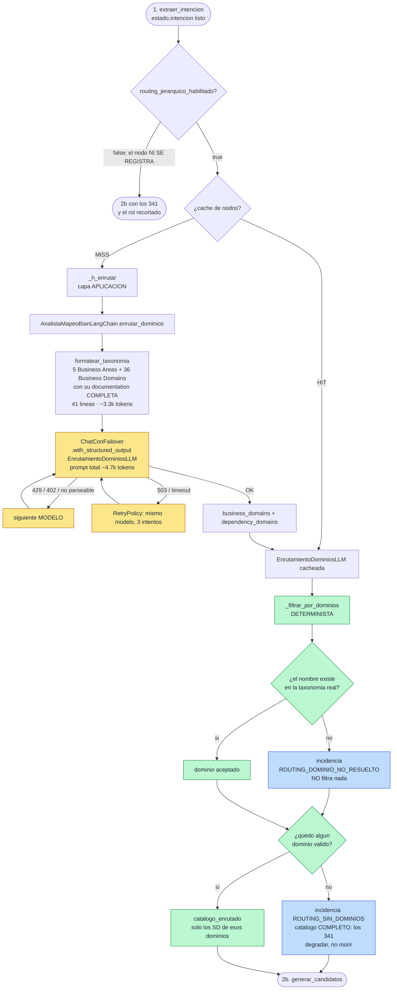

# Nodo 2a — `enrutar_dominios` `[LLM]`

> **En una frase:** antes de mirar ni un solo Service Domain, decide **en qué Business Domains de
> la taxonomía BIAN se va a buscar**. **No nombra ningún Service Domain.**

Es la primera de las dos etapas del **routing jerárquico**, y existe para resolver un problema muy
concreto del paso anterior: el nodo de candidatos tomaba **una decisión de 341 vías leyendo roles
truncados**. Justo la información que necesita para discriminar es la que el recorte borraba.

La tesis del nodo, y conviene no confundirla:

> **La ganancia no es mirar menos. Es poder mostrarlo todo de los que quedan.**
>
> Hoy, con 341 SD en un prompt, el `service_role` va cortado a 600 chars (26 SD afectados) y
> `examples_of_use` / `features` **no se mandan nunca** — justo el vocabulario con el que habla
> una Historia de Usuario. Acotando a ~30 SD, todo eso cabe entero.

Tres cosas que este nodo **NO** hace:

1. **No elige Service Domains.** Elige zonas de la taxonomía.
2. **No decide nada contractual.** No hay ownership, ni score, ni confianza.
3. **No filtra.** Devuelve nombres; el recorte real lo hace código determinista que desconfía de
   él (ver §5).

**Solo existe si `routing_jerarquico_habilitado: true`.** Con el flag apagado el nodo ni se
registra en el grafo, y la arista va directa de `extraer_intencion` a `generar_candidatos`.

---

## 1. Dónde vive

| Pieza | Archivo | Línea |
|---|---|---|
| Handler del nodo (capa aplicación) | `src/aplicacion/servicios/mapear_historias_service_domain.py` | `520` (`_h_enrutar`) |
| Filtrado determinista | `src/aplicacion/servicios/mapear_historias_service_domain.py` | `548` (`_filtrar_por_dominios`) |
| Registro en el grafo (condicional) + caché + retry | `src/aplicacion/servicios/mapear_historias_service_domain.py` | `2011` |
| Aristas condicionales | `src/aplicacion/servicios/mapear_historias_service_domain.py` | `2103`–`2108` |
| Puerto (**no abstracto**, ver §9) | `src/aplicacion/puertos/analista_mapeo.py` | `37` (`enrutar_dominios`) |
| Adaptador LLM | `src/adaptadores/salida/analista_mapeo_langchain.py` | `346` |
| Formateo de la taxonomía | `src/adaptadores/salida/analista_mapeo_langchain.py` | `138` (`formatear_taxonomia`) |
| Prompt | `src/adaptadores/salida/prompts_mapeo.py` | `109`–`160` (`SPEC_ENRUTAMIENTO`) |
| Modelo de salida | `src/dominio/historias.py` | `278` (`EnrutamientoDominiosLLM`) |
| Flag | `config.yaml` → `mapear_historias.routing_jerarquico_habilitado` | — |

Identidad del prompt: **`prompt_id = "mapeo.enrutamiento"`, `prompt_version = "1.0.0"`**.

---

## 2. Contrato de entrada

Lee **4 claves** del `EstadoHistoria`:

| Clave del estado | Tipo | De dónde viene | Para qué se usa |
|---|---|---|---|
| `historia` | `HistoriaUsuario` | Lector de HU | Texto completo, sin recortar |
| `funcionalidad` | `FuncionalidadMacro` | JSON de funcionalidad | Solo el **nombre**; el `detalle` no entra |
| `intencion` | `IntencionHistoriaLLM` | **Nodo 1** | Sus 5 listas son la consulta real contra la taxonomía |
| `catalogo` | `list[EntradaCatalogo]` | `CatalogoJson.cargar()` | **No se manda tal cual**: de él se deriva la taxonomía |

### Qué campos de `intencion` entran

Los mismos cinco que el nodo de candidatos: `resumen_funcional`, `business_actions`,
`business_objects`, `outcomes` y `external_dependencies`. Esta última es **la razón de ser** de
`dependency_domains` (ver §4).

### Qué se le manda del catálogo: solo la taxonomía

`formatear_taxonomia(catalogo)` deduplica los 341 SD en **5 Business Areas + 36 Business Domains**
con la `documentation` que el propio landscape publica de cada nodo de la jerarquía:

```text
- Business Area "Business Support" :: This Business Area spans a wide range of general business management and support activities that may be found in any commercial business and that are therefore not specific to Banking. ...
  - Business Domain "Buildings Equipment and Facilities" (7 SD) :: This Business Domain covers all activities associated with the acquisition, administration, operation and maintenance of buildings and non-IT equipment ...
  - Business Domain "Business Command and Control" (6 SD) :: This Business Domain contains the range of capabilities associated with the organizational command and control structure of the enterprise. ...
```

Son **41 líneas, 13.307 chars ≈ 3.326 tokens**, y son la **documentación completa**, no un
resumen: el nodo más largo de la jerarquía mide 490 chars y el tope de recorte es 600, así que hoy
**no se trunca nada**. Ese es el punto: este nodo decide con información entera.

El número de SD por dominio `(7 SD)` no es decorativo — le dice al modelo cuánto abre cada rama.

---

## 3. Contrato de salida

```python
{
    "enrutamiento":      EnrutamientoDominiosLLM,   # se ESCRIBE
    "catalogo_enrutado": list[EntradaCatalogo],     # se ESCRIBE  (lo calcula el CÓDIGO, no el LLM)
    "huellas":           [MetadatosPrompt, ...],    # se ACUMULA
    "incidencias":       [dict, ...],               # se ACUMULA
}
```

### `EnrutamientoDominiosLLM`

| Campo | Tipo | Qué contiene | Quién lo consume |
|---|---|---|---|
| `business_domains` | `list[str]` | Business Domains elegidos por la **acción / objeto** de la historia | `_filtrar_por_dominios` |
| `dependency_domains` | `list[str]` | Business Domains elegidos por una **`external_dependency`** (auth, permisos, riesgo, auditoría, notificación) | idem |
| `rationale` | `str` | Una frase por dominio: qué lo motiva | JSON final |
| `assumptions` / `gaps` | `list[str]` | Supuestos y capacidades sin dominio visible | JSON final |
| `metadatos` | `MetadatosPrompt \| None` | Huella reproducible | `huellas_prompts` |
| `todos()` | método | Unión sin duplicados **conservando el orden**. Es lo que filtra | `_filtrar_por_dominios` |

**Por qué dos listas y no una.** Medido sobre los tres casos E2E reales: los candidatos de una HU
abarcan **3, 4 y 5 Business Domains** y hasta **4 Business Areas**, y el patrón es siempre el
mismo — el propietario cae en 1-2 dominios (`Customer Management`,
`Document Management and Archive`) mientras las dependencias viven dispersas en `Cross Channel`,
`External Agency` y `Account Management`. **Un router que solo persiga al propietario las pierde
todas.** Separarlas obliga al modelo a recorrer las dependencias una por una en vez de
"acordarse" de ellas.

### Y en el resultado final

`HistoriaConServiceDomains` gana dos campos, así que el enrutamiento queda auditable en el JSON:

- `enrutamiento` — el objeto completo;
- `service_domains_visibles` — **cuántos SD vio el nodo 2b** (341 sin routing).

---

## 4. Ejemplo de entrada

Mismo caso que el resto de la carpeta (`tests/resources/cuentas_menores/`). El mensaje `human`
una vez rellenado, con la taxonomía abreviada:

```text
<funcionalidad_macro>Actualización de datos personales</funcionalidad_macro>

<historia archivo="HU-Actualizar cuentas de menores.txt" titulo="Actualizar cuentas de menores">
Como   usuario menor de edad o usuario asociado a cuenta menor,
Quiero  que mis datos personales solo sean visibles y no editables,
...
Nota: El nombre del tutor será enviado por BE.
</historia>

<intencion_funcional>
resumen: Permitir que usuarios con cuenta de menor visualicen sus datos personales sin posibilidad de editarlos ...
business_actions: visualizar datos personales; restringir edición de datos de contacto; presentar mensaje informativo
business_objects: cuenta de menor; datos personales; número celular; correo electrónico; nombre del tutor
outcomes: Pantalla de datos personales muestra nombre completo, identificación, foto y datos de contacto en modo solo lectura; ...
external_dependencies: Backend (BE) para obtener nombre del tutor; Smart Token como mecanismo de seguridad; Sistema de autenticación/autoridad de identidad para determinar que el usuario es menor
</intencion_funcional>

<taxonomia_bian total_areas="5" total_dominios="36">
- Business Area "Business Support" :: This Business Area spans a wide range of general business management ...
  - Business Domain "Document Management and Archive" (4 SD) :: This Business Domain provides central document management capabilities - covering bulk mailing (in and out bound) ...
- Business Area "Sales and Service" :: ...
  - Business Domain "Customer Management" (15 SD) :: ...
  - Business Domain "Cross Channel" (12 SD) :: ...
... [41 líneas en total, ~3.3k tokens]
</taxonomia_bian>

Devuelve 'business_domains' (por la acción/objeto), 'dependency_domains' (por cada
external_dependency), 'rationale', 'assumptions' y 'gaps'. Nombres EXACTOS de la taxonomía.
```

**Prompt completo medido: 18.741 chars → 4.686 tokens.**

---

## 5. Ejemplo de salida

> ⚠️ **Este ejemplo es CONSTRUIDO, no medido.** A día de hoy no existe ninguna corrida con LLM
> real contra el routing jerárquico: se implementó y se validó con la suite determinista y con el
> proveedor `fake`, y las E2E con modelo real están pendientes. Lo que sigue muestra la **forma**
> esperada y los dominios que los tres casos E2E demuestran que hacen falta, no lo que dijo un
> modelo. La única salida real disponible es la del stub `fake`, al final de esta sección.

```json
{
  "business_domains": ["Customer Management"],
  "dependency_domains": ["Cross Channel", "Document Management and Archive"],
  "rationale": "Customer Management administra los datos de referencia de la parte (nombre, identificación, contacto) y la relación menor-tutor que la pantalla muestra. Cross Channel cubre la dependencia de autenticación y del perfil de acceso que determina que el usuario es menor. Document Management and Archive cubre el canal por el que se comunicaría al tutor.",
  "assumptions": ["El 'Backend (BE)' que envía el nombre del tutor no es un Service Domain BIAN sino un sistema del banco."],
  "gaps": ["La presentación del mensaje informativo es responsabilidad de la capa de UI; ningún Business Domain la cubre."],
  "metadatos": {
    "prompt_id": "mapeo.enrutamiento",
    "prompt_version": "1.0.0",
    "nodo": "enrutar_dominios",
    "historia": "HU-Actualizar cuentas de menores.txt",
    "temperature": 0.0,
    "catalog_sha256": "ddb7d1907fa5c7a4ed265006d93eec1d68c84cc76b89ae63be77650fabcfcaac"
  }
}
```

Con esos 3 dominios, el nodo 2b vería **30 de los 341** Service Domains — y los vería **enteros**.

### La salida real disponible hoy: el stub `fake`

```
HU 'HU-Actualizar_cuentas_de_menores.txt' -> enrutada a 3 dominio(s)
   [Market Operations, Payments, Finance]: 27 de 341 Service Domains visibles
```

El `fake` elige por hash, no por semántica — para eso está. Lo que demuestra no es que acierte,
sino que **el cableado funciona**: tres dominios elegidos, 27 SD visibles, cero incidencias.

---

## 6. Paso a paso de la ejecución

1. **Entrada desde el nodo 1** por arista fija (solo existe si el flag está encendido).
2. **Caché de nodos** (si está habilitada). Clave:
   `"enrutamiento:" + sha_corto(firma_llm, historia, funcionalidad, intencion)`.
3. **`_h_enrutar` llama al puerto**: `self._analista.enrutar_dominios(historia, funcionalidad, intencion, catalogo)`.
4. **El adaptador** deriva el número de áreas y dominios del propio catálogo, formatea la
   taxonomía e invoca `SPEC_ENRUTAMIENTO.template | chat.with_structured_output(EnrutamientoDominiosLLM)`.
   **No usa `_invocar_reduciendo`**: no tiene escalones y no los necesita (ver §8).
5. **Se adjunta la huella** y vuelve al handler.
6. **`_filtrar_por_dominios` recorta — y aquí el código desconfía del modelo.** Es determinista:

   ```python
   reales = {normalizar(e.business_domain): ... for e in catalogo}
   for nombre in enr.todos():
       if normalizar(nombre) in reales: elegidos.add(...)
       else: incidencia ROUTING_DOMINIO_NO_RESUELTO      # no filtra nada
   if not elegidos:
       incidencia ROUTING_SIN_DOMINIOS
       return list(catalogo)                              # los 341, como siempre
   return [e for e in catalogo if normalizar(e.business_domain) in elegidos]
   ```

   La regla que implementa: **enrutar mal debe costar tokens, nunca candidatos.**
7. **Se registra en el log** qué dominios se eligieron y cuántos SD quedan visibles:

   ```
   HU 'X.txt' -> enrutada a 3 dominio(s) [A, B, C]: 30 de 341 Service Domains visibles
   ```

8. **El handler devuelve** `enrutamiento`, `catalogo_enrutado`, `huellas` e `incidencias`.
9. **Arista fija** `enrutar_dominios → generar_candidatos`.

---

## 7. Diagrama de flujo



---

## 8. El prompt exacto

### Mensaje `system` (`_SIS_ENRUTAMIENTO`)

```text
<rol>
Eres arquitecto senior de BIAN (Service Landscape Release 14). Antes de mirar ningún Service
Domain concreto, decides qué zonas de la taxonomía BIAN pueden contenerlos.
</rol>

<alcance>
Esta es la PRIMERA de dos etapas. Tu salida no elige Service Domains: elige en qué Business
Domains se va a buscar. Un dominio que no elijas NO se mirará después, así que el error caro
aquí es dejar fuera un dominio que hacía falta, no incluir uno de más.
Por eso: ante la duda, INCLUYE. Elige al menos 3 Business Domains y no más de 6.
</alcance>

<procedimiento>
1. Lee `business_actions` y `business_objects`: ¿qué Business Domain describe administrar ese
   objeto o ejecutar esa acción? Van en `business_domains`.
2. Lee `external_dependencies` una por una (autenticación, permisos, riesgo, auditoría,
   notificación, proveedor externo, documentos). Cada una vive casi siempre en OTRO Business
   Domain -- y a menudo en otra Business Area- que la acción principal. Van en
   `dependency_domains`. Dejarlas fuera es el fallo más frecuente de este paso.
3. Copia los nombres EXACTOS de `<taxonomia_bian>`. Un nombre que no esté ahí no existe.
4. `rationale`: una frase por dominio elegido, diciendo qué acción/objeto/dependencia lo motiva.
5. `gaps`: capacidades de la historia para las que no ves ningún Business Domain.
</procedimiento>

<restricciones>
  [el bloque _ANTIALUCINACION común: fuente única, copia literal de nombres,
   sin razonamiento paso a paso, no adivinar]
</restricciones>
```

### Por qué el prompt es así

- **El `<alcance>` declara la asimetría del error**, que es lo único que importa en un router:
  un falso positivo cuesta ~189 tokens en el nodo siguiente; un falso negativo cuesta el
  Service Domain entero. Por eso dice literalmente *"ante la duda, INCLUYE"*.
- **El mínimo de 3 dominios** sale de medir los casos reales (3, 4 y 5 dominios). El máximo de 6
  evita que el router degenere en "elijo casi todo", que anularía la ganancia.
- **El paso 2 del procedimiento recorre las dependencias una por una** en vez de pedirlas en
  bloque: es el fallo que la evidencia señala como más probable.
- **No tiene escalones de degradación.** La taxonomía son ~3.3k tokens fijos, un orden de
  magnitud por debajo del catálogo. Si esto no cupiera, no cabría nada.

---

## 9. Detalles de diseño que no son obvios

### El método del puerto **no** es abstracto

`AnalistaMapeoBianPort.enrutar_dominios` tiene implementación por defecto y devuelve un
enrutamiento vacío:

```python
def enrutar_dominios(self, historia, funcionalidad, intencion, catalogo) -> EnrutamientoDominiosLLM:
    return EnrutamientoDominiosLLM()
```

Porque **enrutar es una estrategia, no un requisito del puerto**. Un adaptador que no la
implemente devuelve vacío, el filtro cae al catálogo completo y el pipeline se comporta como
siempre. Lo fija `test_routing_jerarquico.py::test_un_puerto_que_no_enruta_devuelve_vacio`.

### El nodo existe o no existe — no se "salta"

Con el flag apagado no hay un nodo que se evite en tiempo de ejecución: `g.add_node` no llega a
llamarse y la arista va directa. El grafo compilado vuelve a tener 10 nodos.

### El enrutamiento entra en la clave de caché del nodo 2b

```python
lambda e: self._clave("candidatos", e["historia"], e["funcionalidad"],
                      e.get("intencion"), e.get("enrutamiento"))
```

Sin eso, un routing distinto reutilizaría candidatos calculados sobre otros dominios.

---

## 10. Caché, reintentos y failover

| Mecanismo | Configuración | Comportamiento en este nodo |
|---|---|---|
| **Caché de nodos** | `cache_nodos_habilitado` | Clave = `enrutamiento` + firma de la corrida + `historia` + `funcionalidad` + `intencion` |
| **RetryPolicy** | `_RETRY` (fija) | 3 intentos sobre transitorios; nunca sobre `TodosLosModelosAgotados` |
| **Failover** | `routing.llm_priority` | Con ~4.7k tokens **le cabe a toda la cadena, Groq incluido** (presupuesto 12k) |
| **Presupuesto por modelo** | `max_input_tokens` | No descarta a nadie a este tamaño |
| **Degradación por tamaño** | — | **No aplica**: sin escalones a propósito |

---

## 11. Modos de fallo

| Síntoma | Causa | Qué pasa / quién lo compensa |
|---|---|---|
| **El dominio del propietario no se elige** | El fallo caro del nodo | Ese SD es invisible para 2b. Lo compensan parcialmente el nodo 3 (`missing_candidates`, ve el índice de los 341) y `preparar_candidatos` (resuelve contra los 341). La red pendiente está en `implementacion_pendiente.md` §10 |
| **Se olvidan las dependencias** | El modelo ignora `dependency_domains` | Mismo efecto, acotado a auth/logs/fraude. Es lo que el paso 2 del procedimiento intenta evitar |
| Nombre de dominio inventado | Alucinación pese a la restricción | Incidencia `ROUTING_DOMINIO_NO_RESUELTO`; **no filtra nada**. Métrica: `routing_dominios_no_resueltos` |
| Ningún dominio resuelve | Salida vacía o toda inventada | Incidencia `ROUTING_SIN_DOMINIOS` y **catálogo completo**. Métrica: `routing_fallback_catalogo_completo`. No se pierde nada; solo se paga el prompt grande |
| Elige demasiados dominios | Router conservador de más | Se pierde la ganancia de tokens; la escalera de 2b sigue debajo como red |
| `TodosLosModelosAgotados` | Cadena agotada | La HU falla. Improbable a 4.7k tokens |

### Qué vigilar

| Métrica | Dónde | Qué significa |
|---|---|---|
| `routing_dominios_por_hu` | `metricas` | Media de dominios elegidos. Si sube hacia 6, el router no está discriminando |
| `routing_sd_visibles_por_hu` | `metricas` | Media de SD que vio 2b. Compárala con 341 |
| `routing_dominios_no_resueltos` | `metricas` | El modelo inventa nombres → arreglar el prompt, no añadir redes |
| `routing_fallback_catalogo_completo` | `metricas` | Coste, no pérdida |
| **`historias_sin_contrato`** | `metricas` | **La alarma real.** Si sube al encender routing, el router está perdiendo candidatos |

---

## 12. Cómo ejecutarlo y verificarlo aislado

### Ver la taxonomía tal como la ve el modelo

```bash
cd /home/super/Desktop/angel_dir/generacion_contrato_bian
.venv/bin/python -c "
from src.adaptadores.salida.catalogo_json import CatalogoJson
from src.adaptadores.salida.analista_mapeo_langchain import formatear_taxonomia
cat = CatalogoJson('docs/BIAN_Service_Landscape_V14.0_Matrix_View.json').cargar()
t = formatear_taxonomia(cat)
print(t)
print('---', len(t), 'chars ~', len(t)//4, 'tokens,', t.count(chr(10))+1, 'lineas')
"
```

### Corrida offline con routing (sin API)

```bash
.venv/bin/python -m src mapear-historias --hu ./HU \
  --func ./ejemplos/funcionalidad-actualizacion-datos-personales.json \
  --dir ./salida --proveedor fake --sin-timestamp 2>&1 | grep "enrutada a"
```

### Comparar con y sin routing

```bash
# apagar temporalmente sin tocar config.yaml no es posible: es un flag del yaml.
# Cambia `routing_jerarquico_habilitado` a false y vuelve a correr; compara:
.venv/bin/python -c "
import json,sys
d=json.load(open(sys.argv[1]))
print('routing activo:', d['parametros']['routing_jerarquico_activo'])
print({k:v for k,v in d['metricas'].items() if k.startswith('routing')})
for h in d['historias']:
    print(h['archivo'], '->', h['enrutamiento']['business_domains'],
          '+', h['enrutamiento']['dependency_domains'],
          '=', h['service_domains_visibles'], 'SD visibles')
" ./salida/mapeo-historias-service-domains.json
```

### Tests

```bash
.venv/bin/python -m unittest discover -s tests -p "test_routing_jerarquico.py" -v
```

12 tests. Los que fijan las propiedades importantes:

- `test_2a_ve_los_341_y_2b_solo_el_dominio_enrutado`
- `test_un_dominio_inexistente_queda_como_incidencia`
- `test_sin_ningun_dominio_resoluble_se_usa_el_catalogo_completo`
- `test_un_candidato_de_otro_dominio_se_resuelve_igual` — la red estructural
- `test_con_el_flag_apagado_no_hay_nodo_2a`

---

## 13. Nodos vecinos

- ← [`01-extraer-intencion.md`](01-extraer-intencion.md) — le da la intención,
  que es la consulta real contra la taxonomía.
- → [`02b-generar-candidatos.md`](02b-generar-candidatos.md) — recibe el catálogo acotado y, por
  fin, puede mostrarlo entero.
