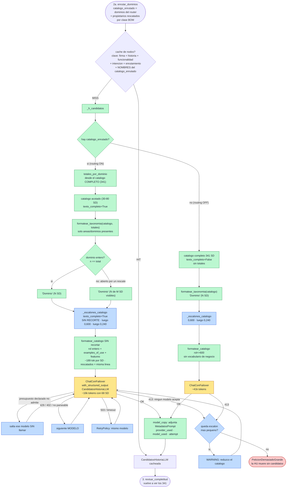

# Nodo 2b — `generar_candidatos` `[LLM, fan-out]` — v1 (2026-09-20, tanda 1-2-3)

> **En una frase:** mira el catálogo de Service Domains **que le dejó el nodo 2a** y propone
> cuáles podrían participar. Es una **PISTA, no una decisión**, y explícitamente **no** se
> considera exhaustiva.

Mismo `prompt_id`, mismo modelo de salida y mismos consumidores que siempre. Lo que cambió el
2026-09-20 no es el nodo sino **lo que recibe**: desde que 2a tiene el canal de propiedad de
clases BOM, `catalogo_enrutado` ya no son solo "los SD de los dominios que eligió el router",
sino esos **más los propietarios rescatados**, que pueden venir de dominios que el router no
abrió. Eso obligó a dos ajustes en 2b, ninguno en el prompt:

| | Antes (2026-09-17, [`historico/02b-generar-candidatos.md`](historico/02b-generar-candidatos.md)) | Ahora (v1) |
|---|---|---|
| Qué hay en `catalogo_enrutado` | Todos los SD de los Business Domains enrutados | Eso **+** los SD que definen una clase BOM que la historia necesita (`ROUTING_PROPIETARIO_DE_CLASE_BOM`) |
| Bloque `<taxonomia_bian>` | `"Dominio" (N SD)` con N = SD del dominio (siempre entero) | `"Dominio" (N SD)` si el dominio está entero; **`(N de M SD visibles)`** si 2a lo abrió a medias por un rescate |
| Clave de caché | firma + historia + funcionalidad + intención + enrutamiento LLM | eso **+ los nombres del `catalogo_enrutado`** (el enrutamiento LLM ya no describe solo lo que ve 2b) |
| Tokens del prompt | ~9.2k con 3 dominios / 30 SD | **~16-21k con 68-88 SD** en una sola llamada; **1.2k-5.8k por grupo** con el fan-out |
| Forma del nodo | Una llamada con todo el catálogo enrutado | **Fan-out `Send`** (`candidatos_por_dominio_habilitado`, ON): una llamada por Business Domain enrutado + una por los propietarios rescatados, y `fusionar_candidatos` **[determinista]** une (§4b) |
| Prompt | `mapeo.candidatos` 1.1.0 | 1.1.0 (una llamada) · 1.2.0 (+`<propietarios_bom>`) · **1.3.0 (grupo)** · 1.3.1 (grupo + evidencia) |
| Consulta del canal de 2a | `business_objects` | **`intencion.datos`** (nodo 1, prompt `mapeo.intencion` 1.1.0) |

Tres cosas que este nodo **NO** hace, a propósito:

1. **No clasifica el rol contractual.** No dice si un SD es propietario o dependencia.
2. **No puntúa confianza.** Ninguna señal numérica suya entra al score final.
3. **No cierra la lista.** El nodo 3 la completa contra el índice global de los **341**, el nodo 4
   puede añadir por retrieval, y el nodo 5 evalúa uno a uno contra evidencia oficial.

Y una que tampoco hace **todavía**: no ve la evidencia del canal de propiedad (`candidatos_por_clase`:
clase, BQ, nota del enum). Los propietarios rescatados le llegan como una línea más del catálogo,
indistinguible de las demás. Pasarle esa evidencia es una decisión pendiente (ver §12).

---

## 1. Dónde vive

| Pieza | Archivo | Línea |
|---|---|---|
| Handler del nodo (capa aplicación) | `src/aplicacion/servicios/mapear_historias_service_domain.py` | `722` (`_h_candidatos`) |
| Registro en el grafo + caché + retry | `src/aplicacion/servicios/mapear_historias_service_domain.py` | `2188` |
| Puerto | `src/aplicacion/puertos/analista_mapeo.py` | `53` (`generar_candidatos`) |
| Adaptador LLM | `src/adaptadores/salida/analista_mapeo_langchain.py` | `393` |
| Formateo del catálogo | `src/adaptadores/salida/analista_mapeo_langchain.py` | `97` (`formatear_catalogo`) |
| Formateo de la taxonomía (con totales) | `src/adaptadores/salida/analista_mapeo_langchain.py` | `138` (`formatear_taxonomia`) |
| Escalera de degradación | `src/adaptadores/salida/analista_mapeo_langchain.py` | `262` (`_escalones_catalogo`) y `294` (`_invocar_reduciendo`) |
| Constante "sin recorte" | `src/adaptadores/salida/analista_mapeo_langchain.py` | `53` (`_SIN_RECORTE`) |
| Prompt | `src/adaptadores/salida/prompts_mapeo.py` | `223` (`SPEC_CANDIDATOS`) |
| Modelos de salida | `src/dominio/historias.py` | `353` (`CandidatoServiceDomainLLM`), `363` (`CandidatosHistoriaLLM`) |

Identidad del prompt: **`prompt_id = "mapeo.candidatos"`, `prompt_version = "1.1.0"`**. El
template no cambió en v1: lo que cambia es el contenido del bloque `<taxonomia_bian>` y del
catálogo, y ambos quedan registrados por HU en `enrutamiento`, `service_domains_visibles` y
`candidatos_por_clase` del JSON de salida.

---

## 2. Contrato de entrada

Lee **5 claves** del `EstadoHistoria`:

| Clave | Tipo | De dónde viene | Para qué |
|---|---|---|---|
| `historia` | `HistoriaUsuario` | Lector de HU | Texto completo |
| `funcionalidad` | `FuncionalidadMacro` | JSON de funcionalidad | Solo el nombre |
| `intencion` | `IntencionHistoriaLLM` | Nodo 1 | `resumen_funcional`, `business_actions`, `business_objects`, `outcomes`, `external_dependencies` |
| **`catalogo_enrutado`** | `list[EntradaCatalogo]` | **Nodo 2a**: dominios del router **+ propietarios rescatados** | Si existe, es el catálogo que se manda, **sin recortar** |
| `catalogo` | `list[EntradaCatalogo]` | `CatalogoJson.cargar()` (341) | Respaldo sin routing, y **fuente de los totales por dominio** para la taxonomía |

El handler:

```python
enrutado = estado.get("catalogo_enrutado")
extra = {}
if enrutado:
    totales = {}                       # Business Domain -> nº REAL de SD en el landscape
    for e in estado["catalogo"]:
        if e.business_domain:
            totales[e.business_domain] = totales.get(e.business_domain, 0) + 1
    extra = {"texto_completo": True, "totales_por_dominio": totales}
cand = self._analista.generar_candidatos(
    estado["historia"], estado["funcionalidad"], estado["intencion"],
    enrutado or estado["catalogo"], **extra,
)
```

Los dos kwargs **solo viajan con routing**: un adaptador (o un doble de test) que no enrute
nunca los recibe, así que la firma vieja sigue valiendo.

### Qué campos de `intencion` entran

`resumen_funcional`, `business_actions`, `business_objects`, `outcomes`, `external_dependencies`.
**No** entran `capacidades_funcionales`, `traceability_ids`, `assumptions`, `gaps`,
`unresolved_questions`. (El canal de propiedad de 2a, en cambio, usa **solo** `business_objects`.)

---

## 3. Lo que ve: catálogo sin recortar y taxonomía honesta

`formatear_catalogo` emite una línea por SD:

```text
- "Nombre" · Area > Domain · [patrón / asset] :: SERVICE_ROLE | EXAMPLES_OF_USE + FEATURES
```

Con `texto_completo`, ambos topes valen `_SIN_RECORTE` (10⁹): rol entero y vocabulario de negocio
entero, ~189 tokens por SD. Un propietario rescatado se formatea **igual** que uno enrutado; en
la corrida de hoy, Issued Device Administration entró por rescate y su línea fue:

```text
- "Issued Device Administration" · Operations and Execution > Operational Services · [Allocate / Issued Device] :: This service domain administers the inventory management and allocation/issuance for all issued devices and materials (e.g. cards). This covers credit/debit cards and can include other identification/authentication devices such as keychain fobs. it also handles virtual token inventory such as passwords, secret questions and biometric records (signatures, voice/image). An aspect of the administration includes maintaining device reference details and states such as operating system ...
```

### La taxonomía dice cuánto ve de cada rama

`formatear_taxonomia(catalogo, totales_por_dominio)` se calcula sobre el catálogo **ya
acotado**, así que solo trae las áreas y dominios presentes. Con los totales del landscape, un
dominio abierto a medias lo dice:

```text
- Business Area "Business Support" :: This Business Area spans a wide range of general business management and support activities that may be found in ...
  - Business Domain "IT Management" (13 SD) :: This Business Domain includes the wide range of IT system operation, development and deployment activit ...
  - Business Domain "Document Management and Archive" (2 de 4 SD visibles) :: This Business Domain provides central document management capabilities - ...
- Business Area "Risk and Compliance" :: This Business Area covers the analysis and management of business risk, covering group treasury, asset and li ...
  - Business Domain "Regulations and Compliance" (7 SD) :: This Business Domain covers the interpretation support, compliance assurance and regulatory ...
- Business Area "Sales and Service" :: This business area covers all marketing, business development, customer management and sales and servicing acti ...
  - Business Domain "Channel Specific" (17 SD) :: This business domain includes a mixture of service domains that provide the management, configuratio ...
  - Business Domain "Cross Channel" (11 SD) :: This business domain contains the collection of Service Domains that handle the customer interaction ac ...
  - Business Domain "Customer Management" (15 SD) :: Ability to define, control, predict, process, organize, present, and analyze all aspects of infor ...
- Business Area "Reference Data" :: The Business Area Reference Data contains all categories of managed business reference information, covering subje ...
  - Business Domain "Party" (2 SD) :: This Business Domain covers the different party/customer reference information that is maintained by the bank fo ...
- Business Area "Operations and Execution" :: This business area includes the full range of product fulfillment activities for wholesale and retail ba ...
  - Business Domain "Operational Services" (1 de 20 SD visibles) :: This Business Domain brings together a number of general back office services that ...
```

Antes de v1, "Operational Services" salía como `(1 SD)` —le decía al modelo que el dominio es
diminuto cuando lo que pasa es que solo ve una parte—. Lo fija
`test_routing_jerarquico.py::TestTaxonomiaConDominiosAbiertosAMedias`.

---

## 4. Contrato de salida

```python
{
    "candidatos": CandidatosHistoriaLLM,   # se ESCRIBE
    "huellas":   [MetadatosPrompt, ...],   # se ACUMULA
}
```

| Campo de `CandidatosHistoriaLLM` | Qué contiene | Quién lo consume |
|---|---|---|
| `candidatos[]` | `service_domain` (copia literal), `rationale`, `supporting_intent` | Nodo 3 (completitud) y nodo 4 (resuelve el nombre contra los **341** con `resolver_nombre_sd`; si no resuelve → `NAME_UNRESOLVED`) |
| `coverage_notes` | Capacidades u objetos sin SD aparente | JSON final |
| `assumptions` / `gaps` | Supuestos y huecos | JSON final |
| `metadatos` | Huella (`prompt_id`, `prompt_sha256`, `provider_used`, `model_used`, `attempt`…) | `huellas_prompts` |

---

## 4b. El fan-out (`candidatos_por_dominio_habilitado`)

Con routing, `_fan_out_grupos_candidatos` (arista condicional tras 2a) parte `catalogo_enrutado`
en grupos y emite un `Send("generar_candidatos_grupo", ...)` por grupo:

- **un grupo por Business Domain enrutado** (los SD de ese dominio), y
- **un grupo con los propietarios rescatados** por el canal de clases BOM (`sd_rescatados`), que
  es el **único** que recibe `<propietarios_bom>` si `evidencia_bom_en_candidatos` está en true.

Cada llamada ve ~15 SD (1.2k-5.8k tokens), cabe en toda la cadena de failover y corre en
paralelo (`concurrencia_candidatos`). **Grupos pequeños** (`candidatos_grupo_min_sd: 3`): un
dominio con menos SD que eso no va solo —medido, "Party" (2 SD) proponía "lo menos irrelevante"
aun con el prompt de grupo—; los pequeños se juntan entre sí y, si siguen siendo pocos, con el
grupo grande más pequeño. `fusionar_candidatos` (`src/dominio/fusion_candidatos.py`) une por
nombre normalizado, en orden de aparición, **etiqueta `gaps`/`coverage_notes`/`assumptions` con
`[grupo]`** y **descarta las notas de un grupo que no propuso nada** (solo pueden hablar de lo que
le falta al grupo, no a la historia). Sin routing no hay grupos y el nodo de una sola llamada
sigue ahí. El bloque `<propietarios_bom>` **omite las clases sin sustancia** (sin BQ, CR, nota ni
atributos): medido, "define Party Routing Profile" a secas bastó para que 2b lo propusiera.

### El prompt de grupo (1.3.0 / 1.3.1) existe porque la primera corrida lo pidió

Con el prompt de una llamada (1.1.0) repartido en grupos, medido en el E2E 1:

- **cada grupo se sentía obligado a proponer algo**: IT Management propuso Systems Operations,
  Systems Administration y Platform Operations para una pantalla de datos personales; Channel
  Specific, eBranch Management y eBranch Operations. La fusión llegó a 12-14 candidatos, cada
  uno una llamada LLM en el nodo 5;
- **cada grupo reportaba como `gap` que faltaba el dueño del dato**, porque no veía el resto del
  catálogo (15 gaps, 16 coverage_notes tras la unión).

El 1.3.x añade `<alcance_catalogo>` (nombre del grupo, cuántos SD, "otros grupos se evalúan en
paralelo") y una regla al `<procedimiento>`: **vacío es una respuesta válida**, y lo que no está
en este grupo no es un hueco. Con él, en la corrida definitiva **3 de 7 grupos devolvieron
vacío** (IT Management, Operational Services, Party) y la fusión bajó a 7-8 candidatos. Los
gaps siguen hablando "de este grupo": por eso la fusión los etiqueta.

### Medido en el E2E 1 (4 corridas, misma HU, 2026-09-20)

| Corrida | Prompt | Grupos | Tokens/grupo | 2b total | Candidatos | Vacíos | Rescatados propuestos |
|---|---|---|---|---|---|---|---|
| fan-out, sin evidencia | 1.1.0 | 5 | 1.2k-4.5k | 108 s | 12 | 0 | LDM, Issued Device Administration (2 de 4) |
| fan-out, con evidencia | 1.1.0 / 1.2.0 | 7 | 1.2k-5.8k | 72 s | 14 | 1 | LDM, Correspondence (2 de 5) |
| **fan-out grupo, sin evidencia** | **1.3.0** | 7 | 1.2k-5.8k | 78 s | **8** | **3** | LDM, Correspondence (2 de 5) |
| **fan-out grupo, con evidencia** | **1.3.0 / 1.3.1** | 4 | 1.2k-4.5k | **23 s** | **7** | 0 | LDM (1 de 4) |
| *(referencia: una llamada, antes de la tanda)* | 1.1.0 | 1 | 19-21k | 43-99 s | 4-5 | — | 0 de 4 · 1 de 3 |

**Segunda tanda** (umbral de rescate, frases, grupos pequeños, notas de grupos vacíos fuera,
bloque solo con sustancia), 3 corridas más:

| Corrida | Grupos | 2b total | Rescatados (2a) | Candidatos | Grupo de rescatados propuso |
|---|---|---|---|---|---|
| T2 sin evidencia #1 | 5 | 39 s | LDM | **4** | vacío (1 SD, sin explicación) |
| T2 sin evidencia #2 | 4 | 41 s | LDM + 3 SD de tarjetas (`PaymentCardType`, por el token `number`; corregido) | 9 | vacío |
| T2 con evidencia #1 | 5 | 28 s | LDM | 13 (Gemini 3.5 Flash **Lite** atendió 3 grupos y propuso ancho) | **LDM** ("número celular", "correo electrónico") |

Lo que fija la segunda tanda: los rescates bajaron de 4-5 a **1** (Location Data Management) en 2
de 3 corridas; los grupos vacíos ya no meten gaps; **el grupo de rescatados solo propone a LDM
cuando ve `<propietarios_bom>`** (hoy 3 de 3 con evidencia, 2 de 4 sin ella, y los dos fallos
fueron con el grupo reducido a 1-4 SD sin explicación) → `evidencia_bom_en_candidatos` pasa a
**true**. Lo que sigue variando es el modelo que atiende cada grupo: cuando Gemini 3.5 Flash Lite
entra por 503 del Flash, propone 5-6 por grupo (Contact Handler, Service Directory, Servicing
Order...); Groq 120B/20B y Gemini 3.5 Flash proponen 1-2.

Los tiempos son con Groq 120B en límite de tasa y Gemini 3.6 Flash sin cuota diaria: cada grupo
que cayó a Gemini 3.5 pagó 12-45 s de reintentos por 503; los que resolvió Groq 20B/120B tardaron
1.5-3 s. Con cuota, el fan-out entero cabe en menos de 10 s.

Lo que sí cambió de forma estable en las 4 corridas:

- **`datos` del nodo 1 nombró siempre "número celular" y "correo electrónico"** (4 de 4), y con
  eso el canal de 2a puso **Location Data Management #1** con `Phone Address` + `Electronic
  Address` las 4 veces. Antes de la tanda dependía de cómo agrupara `business_objects` (1 de 2).
- **El grupo de rescatados propuso Location Data Management en 4 de 4** (con y sin el bloque).
  En las dos corridas de una sola llamada no salió nunca. Party Reference Data Directory salió
  en 4 de 4 por el grupo Customer Management. Los dos dueños del dato llegan ahora a evaluación.
- Ruido que queda: **Contact Handler** (ambigüedad de "contacto"), **eBranch Operations** y
  **Legal Entity Directory** por "lo menos irrelevante" en grupos pequeños aun con el 1.3.0, y
  rescates que vienen **solo del canal vectorial** en posiciones 5-6 (Suitability Checking,
  Market Information Management, Counterparty Administration). Segunda tanda.

---

## 5. Ejemplo de entrada (REAL, 2026-09-20)

> ✅ **Medido.** Corrida real con LLM sobre `tests/resources/datos_personales/` (E2E 1, HU
> "Crear pantalla de datos personales"), nodos 1 → 2a → 2b, detenida tras 2b. Archivos en
> `salida/2026-09-20_nodo2b-debug-v3/`: `entrada-nodo2b-human.txt` (el mensaje `human`
> completo, 63,932 caracteres ≈ 15,983 tokens), `salida-nodo2b.json`,
> `contexto.json` (intención, enrutamiento, tiempos).

### Lo que dejaron los nodos anteriores

**Nodo 1** — `business_objects`: ["Pantalla de datos personales", "Información personal del cliente", "Información de contacto del cliente (número celular, correo electrónico)", "Avatar del usuario", "Botón de retroceso"] ·
`business_actions`: ["acceder", "visualizar", "seleccionar"] ·
`external_dependencies`: ["Autenticación de usuario en la APP", "Smart Token como mecanismo de seguridad", "Validaciones existentes para número celular y correo electrónico"].

**Nodo 2a** — router: ["Customer Management", "Channel Specific", "IT Management"] + dependencias
["Cross Channel", "IT Management", "Regulations and Compliance"]. Rescatados por el canal de propiedad:
["Party Routing Profile", "Legal Entity Directory", "Issued Device Administration", "Correspondence", "Document Directory"]. **`catalogo_enrutado` = 68 SD.**

### El mensaje `human` (catálogo abreviado)

```text
<funcionalidad_macro>Actualización de datos personales</funcionalidad_macro>

<historia archivo="HU-Crear pantalla de datos personales.txt" titulo="Crear pantalla de datos personales">
Como       usuario autenticado en la APP
Quiero     acceder a una pantalla de datos personales
Para       visualizar mi información básica y mis datos de contacto, y poder acceder a la edición de mi número de celular y correo electrónico.
[Escenario 1 completo: título, botón de retroceso, avatar, nombre, identificación, celular con flecha a HU 794525, correo con flecha a HU 794679]
</historia>

<intencion_funcional>
resumen: Permitir al cliente visualizar y editar su número celular y correo electrónico desde la pantalla de datos personales en la app móvil....
business_actions: acceder; visualizar; seleccionar
business_objects: Pantalla de datos personales; Información personal del cliente; Información de contacto del cliente (número celular, correo electrónico); Avatar del usuario; Botón de retroceso
outcomes: ...
external_dependencies: Autenticación de usuario en la APP; Smart Token como mecanismo de seguridad; Validaciones existentes para número celular y correo electrónico
</intencion_funcional>

<taxonomia_bian>
[las 13 líneas de arriba, con la documentación completa de cada área y dominio]
</taxonomia_bian>

<catalogo_bian fuente="docs/BIAN_Service_Landscape_V14.0_Matrix_View.json" total="68">
- "Party Reference Data Directory" · Sales and Service > Customer Management · [Catalog / Party Reference Data] :: The party reference data directory service domain maintains a potentially wide range of party reference data that might be used in any interaction between the bank and the party including relationship development, sales/marketing, servicing and product delivery. This can include general reference and contact details, party associations, demographic details and some servicing preferences. Different information may be maintained for different party types such as individuals, corporates, partners | Party reference details are accessed to pre-populate an application form for a new product opportunity with a customer Maintain party reference information Maintain party demographic indicators Maintain party roles, associations and relationships Maintain customer bank contacts
... [68 líneas así, ~189 tokens cada una]
</catalogo_bian>

Devuelve 'candidatos' (service_domain EXACTO del catálogo, rationale, supporting_intent),
'coverage_notes', 'assumptions', 'gaps'.
```

---

## 6. Ejemplo de salida (REAL, misma corrida)

Respondió **`gemini:gemini-3.5-flash` en el intento 5**, tras 98.8 s: con ~16k tokens
el presupuesto declarado de Groq (12k) lo saltó sin llamar, y `gemini-3.6-flash` devolvió 503
cuatro veces antes de ceder al siguiente modelo.

```json
{
  "candidatos": [
    {
      "service_domain": "Party Reference Data Directory",
      "rationale": "Este dominio mantiene la información de referencia y contacto de los clientes (individuos), incluyendo detalles demográficos, nombre completo, número de identificación y datos de contacto como número celular y correo electrónico, los cuales son requeridos para visualización en la pantalla de datos personales.",
      "supporting_intent": [
        "visualizar",
        "Información personal del cliente",
        "Información de contacto del cliente (número celular, correo electrónico)"
      ]
    },
    {
      "service_domain": "Party Authentication",
      "rationale": "La historia de usuario especifica que el usuario debe estar autenticado en la APP para acceder a la pantalla de datos personales, lo cual es cubierto por este dominio que maneja la confirmación de identidad y permisos de acceso.",
      "supporting_intent": [
        "acceder",
        "Autenticación de usuario en la APP"
      ]
    },
    {
      "service_domain": "Issued Device Administration",
      "rationale": "Este dominio administra inventarios de tokens virtuales, contraseñas y registros biométricos, lo cual se relaciona directamente con la dependencia externa de 'Smart Token' como mecanismo de seguridad para la sesión o transacciones del usuario.",
      "supporting_intent": [
        "Smart Token como mecanismo de seguridad"
      ]
    },
    {
      "service_domain": "Customer Workbench",
      "rationale": "Este dominio maneja la operación y distribución de aplicaciones residentes en dispositivos de clientes (como la APP móvil de Produbanco) y permite al cliente mantener configuraciones para gobernar su propio entorno de acceso.",
      "supporting_intent": [
        "Pantalla de datos personales",
        "Botón de retroceso"
      ]
    }
  ],
  "coverage_notes": [
    "La visualización y edición del 'Avatar del usuario' (iniciales o imagen de perfil) no tiene un Service Domain explícito en el catálogo proporcionado que maneje recursos multimedia o imágenes de perfil de usuario directamente, aunque podría considerarse parte de Party Reference Data Directory de forma genérica.",
    "Los elementos específicos de la interfaz de usuario (como el 'Botón de retroceso' o 'Indicador visual (flecha)') son componentes de diseño de la aplicación móvil y no corresponden directamente a la lógica de negocio de un Service Domain de BIAN."
  ],
  "assumptions": [
    "Se asume que la consulta de los datos personales (nombre, identificación, celular, correo) se realiza en tiempo real consumiendo el Service Domain 'Party Reference Data Directory'.",
    "Se asume que la validación de la sesión activa del usuario en la APP móvil es provista por 'Party Authentication' en conjunto con 'Issued Device Administration' para la verificación del Smart Token."
  ],
  "gaps": [
    "No se detalla en esta HU el flujo de actualización/guardado de los datos (celular y correo), ya que la HU redirige a otras historias específicas (HU 794525 y HU 794679). Por lo tanto, no se incluyen dominios de actualización de datos en esta fase."
  ]
}
```

### Cómo leer esta salida

- **4 candidatos, 1 de ellos venido del rescate de 2a.** Issued Device
  Administration no estaba en ningún dominio enrutado: entró por el canal de propiedad (define
  la clase `Device`) y 2b lo eligió para la dependencia del Smart Token. Es el circuito completo
  funcionando: 2a rescata, 2b propone, y los nodos 5-8 decidirán si es propietario o dependencia.
- **Los otros 4 rescatados no fueron propuestos** (Party Routing Profile, Legal Entity Directory,
  Correspondence, Document Directory). El coste fue ~189 tokens cada uno, no un candidato perdido:
  2b propone ancho y el filtro determinista corta después.
- **Location Data Management no estaba sobre la mesa.** El canal de 2a no lo rescató en esta
  corrida (los `business_objects` de hoy agruparon celular y correo en un solo objeto, y las clases
  `Phone Address`/`Electronic Address` no llegaron al tope), y su Business Domain (Party) no fue
  enrutado. Es la varianza del nodo 1 propagándose: la misma HU produjo hoy tres intenciones
  distintas en tres corridas.
- **`gaps` es correcto y útil**: el modelo notó que la HU solo visualiza y redirige la edición a
  otras historias, así que no propuso dominios de actualización.
- **`coverage_notes`** deja fuera lo que es UI pura (avatar, botón de retroceso). Bien.

---

## 7. Paso a paso de la ejecución

1. **Entrada desde el nodo 2a** (o desde el 1 si `routing_jerarquico_habilitado: false`).
2. **Caché de nodos.** Clave: `"candidatos:" + sha_corto(firma_llm, historia, funcionalidad,
   intencion, enrutamiento, [nombres del catalogo_enrutado])`. Los nombres entran porque el
   enrutamiento LLM ya no basta para describir qué vio este nodo.
3. **`_h_candidatos` elige el catálogo**: `catalogo_enrutado` si existe, si no el completo. Con
   routing calcula los totales por dominio sobre `catalogo` y pasa `texto_completo=True` +
   `totales_por_dominio`.
4. **El adaptador calcula `formatear_taxonomia(catalogo, totales)`** una vez, fuera del bucle de
   escalones.
5. **`_escalones_catalogo(texto_completo=True)`** antepone el escalón sin recorte:
   `[(10⁹, 10⁹), (0, 600), (0, 240)]`.
6. **`_invocar_reduciendo`** invoca con el primer escalón. `ChatConFailover` salta sin llamar a
   los modelos cuyo `max_input_tokens` no admite el prompt (hoy: los dos de Groq).
7. **Si saltara `PeticionDemasiadoGrande`**, baja al escalón `(0, 600)` y luego `(0, 240)`.
8. **Se adjunta la huella** y se devuelve `candidatos` + `huellas`.
9. **Arista fija** `generar_candidatos → revisar_completitud`.

---

## 8. Diagrama de flujo



---

## 9. El prompt exacto

Sin cambios respecto a la versión anterior (`mapeo.candidatos` 1.1.0): ver
[`historico/02b-generar-candidatos.md` §10](historico/02b-generar-candidatos.md). El `<alcance>`
pide incluir todo candidato plausible sin clasificar rol ni puntuar confianza; el
`<procedimiento>` recorre acciones/objetos, usa `<taxonomia_bian>` para descartar áreas y
desambiguar nombres parecidos, e incluye los SD de las `external_dependencies`.

---

## 10. Caché, reintentos y failover

| Mecanismo | Configuración | Comportamiento |
|---|---|---|
| Caché de nodos | `cache_nodos_habilitado` | Clave = `candidatos` + firma + historia + funcionalidad + intención + enrutamiento + **nombres del catálogo enrutado** |
| RetryPolicy | `_RETRY` | 3 intentos sobre transitorios |
| Presupuesto declarado | `max_input_tokens` | Con ~16k tokens salta los dos modelos de Groq (12k) sin llamar; con 30 SD (~9k) le cabía a toda la cadena |
| Failover | `routing.llm_priority` | Hoy: Gemini 3.6 Flash 503 ×4 → Gemini 3.5 Flash respondió (intento 5, 99 s) |
| Degradación por tamaño | `rol_max_chars`, `cag_*` | Escalones `(0,600)` y `(0,240)` debajo del sin-recorte |

---

## 11. Modos de fallo

| Síntoma | Causa | Quién lo compensa |
|---|---|---|
| El SD correcto no está en el catálogo | 2a no lo enrutó **y** el canal de propiedad no lo rescató (su evidencia es una operación, no una clase; o la clase no llegó al tope) | Nodo 3 (`missing_candidates`, ve los 341) y `preparar_candidatos` (resuelve contra los 341) |
| El SD está y el modelo no lo propone | Falso negativo dentro del catálogo | Igual: nodo 3, retrieval híbrido, `deteccion_omitidos.py` |
| Un rescatado irrelevante se propone | 2b no distingue rescatados de enrutados | Lo corta la evaluación (nodo 5) y la clasificación. Coste: una llamada LLM |
| Prompt crece con los rescates | Cada SD añadido son ~189 tokens; 5 rescatados ≈ 1k | Presupuesto por modelo salta a los que no caben; escalera debajo |
| `service_domain` inventado | Alucinación | `NAME_UNRESOLVED` en el nodo 4 |
| Demasiados candidatos | El prompt lo pide | Tope `max_candidatos_hu` en el nodo 4 (`TRUNCATED_BY_MAX_CANDIDATOS_HU`) |
| Caché caliente tras cambiar `entidades_*` | Otros rescatados → otro catálogo | **Ya no pasa**: los nombres del catálogo enrutado están en la clave |

---

## 12. Pendiente de decidir

- **`evidencia_bom_en_candidatos` está ON desde la segunda tanda** (3 de 3 con el bloque frente
  a 2 de 4 sin él, ver §4b). Seguir midiendo con `bom_rescatados_propuestos_rate`; si aparece un
  rescatado sin sustancia propuesto por culpa del bloque, el filtro de `formatear_propietarios_bom`
  es el sitio donde mirar.
- **Modelo por grupo.** Gemini 3.5 Flash Lite (entra cuando el Flash da 503) propone 5-6 por
  grupo; Groq y Gemini 3.5 Flash, 1-2. Opción: excluir el Lite de `mapeo.candidatos` o un tope de
  candidatos por grupo en la fusión.
- **Rescates solo-vectorial**: un umbral mínimo de score o exigir dos canales antes de rescatar
  (Suitability Checking, Market Information Management, Counterparty Administration entraron con
  0.8 desde una sola posición 5-6 del canal denso).
- **"Contacto" por frase**: "datos/información de contacto" → Contact Point + Address; hoy
  Contact Handler sigue entrando por el grupo Cross Channel.
- **Grupos pequeños** (Party, 2 SD) siguen proponiendo "lo menos irrelevante" a veces aun con el
  1.3.0. Opción: no lanzar grupo para dominios con < 3 SD y sumarlos al grupo vecino.
- La varianza del nodo 1 bajó en el eje del dato gracias a `datos`, pero `business_objects` y
  `external_dependencies` siguen cambiando entre corridas y con ellos el router de 2a (3 a 5
  dominios, 32 a 88 SD visibles).

---

## 13. Cómo ejecutarlo y verificarlo aislado

### Corrida real hasta 2b con el mensaje `human` exacto (3 llamadas LLM)

```bash
cd /home/super/Desktop/angel_dir/generacion_contrato_bian
.venv/bin/python - <<'PY'
import json
from pathlib import Path
from src.configuracion.contenedor import crear_caso_uso_mapeo
from src.configuracion.settings import cargar_settings
from src.adaptadores.salida.analista_mapeo_langchain import formatear_catalogo, formatear_taxonomia, _SIN_RECORTE, _lista
from src.adaptadores.salida.prompts_mapeo import _HUM_CANDIDATOS
datos = Path("tests/resources/datos_personales"); func = next(datos.glob("funcionalidad-*.json"))
s = crear_caso_uso_mapeo(cargar_settings())
h = s._lector.leer_historias(str(datos))[0]; f = s._lector.leer_funcionalidad(str(func))
estado = {"historia": h, "funcionalidad": f, "catalogo": s._catalogo.cargar()}
estado.update(s._h_intencion(estado)); estado.update(s._h_enrutar(estado))      # nodos 1 y 2a
i, cat = estado["intencion"], estado["catalogo_enrutado"]
totales = {}
for e in estado["catalogo"]:
    totales[e.business_domain] = totales.get(e.business_domain, 0) + 1
human = _HUM_CANDIDATOS.format(
    funcionalidad_macro=f.funcionalidad_macro, historia_archivo=h.archivo, historia_titulo=h.titulo,
    historia_contenido=h.contenido, intencion_resumen=i.resumen_funcional or "(sin resumen)",
    intencion_actions=_lista(i.business_actions), intencion_objects=_lista(i.business_objects),
    intencion_outcomes=_lista(i.outcomes), intencion_dependencies=_lista(i.external_dependencies),
    catalogo_total=len(cat), catalogo=formatear_catalogo(cat, _SIN_RECORTE, _SIN_RECORTE),
    taxonomia_bian=formatear_taxonomia(cat, totales))
print(human)                                                                    # lo que ve 2b
print(json.dumps(s._h_candidatos(estado)["candidatos"].model_dump(), ensure_ascii=False, indent=2))
PY
```

### Ver solo la taxonomía con dominios a medias (sin LLM)

```bash
.venv/bin/python - <<'PY'
from src.adaptadores.salida.catalogo_json import CatalogoJson
from src.adaptadores.salida.analista_mapeo_langchain import formatear_taxonomia
cat = CatalogoJson("docs/BIAN_Service_Landscape_V14.0_Matrix_View.json").cargar()
tot = {}
for e in cat: tot[e.business_domain] = tot.get(e.business_domain, 0) + 1
parcial = [e for e in cat if e.service_domain in ("Savings Account", "Party Reference Data Directory")]
print(formatear_taxonomia(parcial, tot))
PY
```

### Tests

```bash
.venv/bin/python -m unittest discover -s tests -p "test_routing_jerarquico.py" -v   # 19
.venv/bin/python -m unittest discover -s tests -p "test_cache_nodos.py" -v          # 5
```

Los que fijan lo nuevo de v1:

- `TestTaxonomiaConDominiosAbiertosAMedias::test_un_dominio_parcial_dice_cuantos_ve_de_cuantos`
- `TestTaxonomiaConDominiosAbiertosAMedias::test_2b_recibe_los_totales_solo_con_routing`
- `TestCacheDelNodo2aIncluyeElCanal::test_otro_tope_del_canal_vuelve_a_ejecutar_2a`

---

## 14. Nodos vecinos

- ← [`02a-enrutar-dominios-v1.md`](02a-enrutar-dominios-v1.md) — le deja `catalogo_enrutado`
  (router + propietarios rescatados) y `candidatos_por_clase`, que 2b todavía no lee.
- → [`03-revisar-completitud.md`](03-revisar-completitud.md) — recibe los candidatos y vuelve a
  ver el índice de los 341.
- Versión anterior: [`historico/02b-generar-candidatos.md`](historico/02b-generar-candidatos.md).
