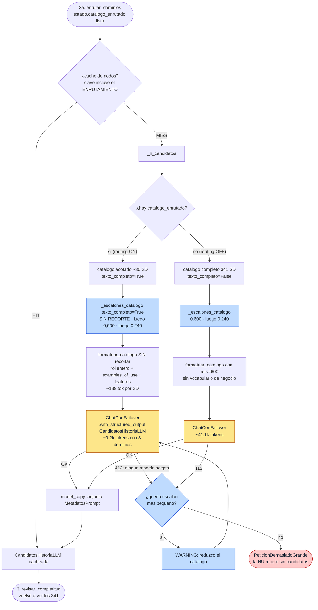

# Nodo 2b — `generar_candidatos` `[LLM]`

> **En una frase:** mira el catálogo de Service Domains y propone cuáles podrían participar. Es
> una **PISTA, no una decisión**, y explícitamente **no** se considera exhaustiva.

Es el mismo nodo de siempre — mismo `prompt_id`, mismo modelo de salida, mismos consumidores —,
pero desde el routing jerárquico **lo que ve ha cambiado por completo**:

| | Antes (nodo 2 monolítico) | Ahora (2b, con routing) |
|---|---|---|
| Service Domains en el prompt | **341** | ~30 (los de los dominios enrutados) |
| `service_role` | recortado a **600 chars** (26 SD mutilados) | **entero** |
| `examples_of_use` + `features` | **nunca se mandan** | **se mandan** |
| Bloque `<taxonomia_bian>` | las 36 ramas | solo las ramas enrutadas |
| Tokens del prompt | **41.108** | **9.152** (3 dominios / 30 SD) |
| Escalera de degradación | necesaria (2 escalones) | innecesaria; queda debajo como red |

La documentación del nodo tal y como era antes sigue disponible en
[`historico/02-generar-candidatos.md`](historico/02-generar-candidatos.md), y **sigue siendo
válida con `routing_jerarquico_habilitado: false`**.

Tres cosas que este nodo **NO** hace, a propósito:

1. **No clasifica el rol contractual.** No dice si un SD es propietario o dependencia.
2. **No puntúa confianza.** Ninguna señal numérica suya entra al score final.
3. **No cierra la lista.** El nodo 3 la completa contra el índice global de los **341**, el nodo 4
   puede añadir más por retrieval, y el nodo 5 evalúa uno a uno contra evidencia oficial.

El prompt le dice literalmente: *"incluye todo candidato PLAUSIBLE; no te limites a 3-8"*. **Un
falso positivo aquí cuesta una llamada LLM en el nodo 5. Un falso negativo puede costar la
historia entera.**

---

## 1. Dónde vive

| Pieza | Archivo | Línea |
|---|---|---|
| Handler del nodo (capa aplicación) | `src/aplicacion/servicios/mapear_historias_service_domain.py` | `583` (`_h_candidatos`) |
| Registro en el grafo + caché + retry | `src/aplicacion/servicios/mapear_historias_service_domain.py` | `2022` |
| Puerto | `src/aplicacion/puertos/analista_mapeo.py` | `53` (`generar_candidatos`) |
| Adaptador LLM | `src/adaptadores/salida/analista_mapeo_langchain.py` | `381` |
| Formateo del catálogo | `src/adaptadores/salida/analista_mapeo_langchain.py` | `97` (`formatear_catalogo`) |
| Escalera de degradación | `src/adaptadores/salida/analista_mapeo_langchain.py` | `250` (`_escalones_catalogo`) y `282` (`_invocar_reduciendo`) |
| Constante "sin recorte" | `src/adaptadores/salida/analista_mapeo_langchain.py` | `53` (`_SIN_RECORTE`) |
| Prompt | `src/adaptadores/salida/prompts_mapeo.py` | `166`–`224` (`SPEC_CANDIDATOS`) |
| Modelos de salida | `src/dominio/historias.py` | `311` (`CandidatoServiceDomainLLM`), `321` (`CandidatosHistoriaLLM`) |

Identidad del prompt: **`prompt_id = "mapeo.candidatos"`, `prompt_version = "1.1.0"`**.

> El prompt **no cambió** al introducir el routing: el texto sirve igual para un catálogo de 341
> que para uno de 30, y el bloque antialucinación ya prohíbe nombrar lo que no está en el mensaje.
> Lo que cambia es su *contenido*. Qué catálogo vio realmente cada corrida queda registrado en
> `historias[].enrutamiento` y `historias[].service_domains_visibles` del JSON de salida.

---

## 2. Contrato de entrada

Lee **5 claves** del `EstadoHistoria`:

| Clave del estado | Tipo | De dónde viene | Para qué se usa |
|---|---|---|---|
| `historia` | `HistoriaUsuario` | Lector de HU | Texto completo, sin recortar |
| `funcionalidad` | `FuncionalidadMacro` | JSON de funcionalidad | Solo el **nombre**; el `detalle` no |
| `intencion` | `IntencionHistoriaLLM` | **Nodo 1** | Sus 5 listas son la consulta real contra el catálogo |
| **`catalogo_enrutado`** | `list[EntradaCatalogo]` | **Nodo 2a** | **Si existe, es el catálogo que se manda** |
| `catalogo` | `list[EntradaCatalogo]` | `CatalogoJson.cargar()` | Respaldo: se usa solo si no hay enrutado |

El handler:

```python
enrutado = estado.get("catalogo_enrutado")
cand = self._analista.generar_candidatos(
    estado["historia"], estado["funcionalidad"], estado["intencion"],
    enrutado or estado["catalogo"],
    **({"texto_completo": True} if enrutado else {}),
)
```

El kwarg `texto_completo` **solo viaja cuando hubo routing**. Es deliberado: un adaptador (o un
doble de test) que no enrute nunca lo recibe, así que la firma vieja sigue siendo válida.

### Qué campos de `intencion` entran

| Campo | ¿Entra? | Variable |
|---|---|---|
| `resumen_funcional` | sí | `intencion_resumen` |
| `business_actions` | sí | `intencion_actions` |
| `business_objects` | sí | `intencion_objects` |
| `outcomes` | sí | `intencion_outcomes` |
| `external_dependencies` | sí | `intencion_dependencies` |
| `capacidades_funcionales`, `traceability_ids`, `assumptions`, `gaps`, `unresolved_questions` | **no** | — |

---

## 3. Lo que cambia de verdad: el catálogo sin recortar

`formatear_catalogo` emite una línea por SD:

```
- "Nombre" · Area > Domain · [patrón / asset] :: SERVICE_ROLE↤rol_max_chars | EJEMPLOS+FEATURES↤chars_negocio
```

Con `texto_completo`, ambos topes valen `_SIN_RECORTE` (10⁹), así que **no se corta nada**. Mismo
Service Domain, antes y ahora:

**Antes — nodo 2 con los 341 (`rol_max_chars=600`, sin vocabulario de negocio), 613 chars:**
```text
- "Party Reference Data Directory" · Sales and Service > Customer Management · [Catalog / Party Reference Data] :: The party reference data directory service domain maintains a potentially wide range of party reference data that might be used in any interaction between the bank and the party including relationship development, sales/marketing, servicing and product delivery. This can include general reference and contact details, party associations, demographic details and some servicing preferences. Different information may be maintained for different party types such as individuals, corporates, partners
```

**Ahora — 2b con el catálogo acotado, 894 chars:**
```text
- "Party Reference Data Directory" · Sales and Service > Customer Management · [Catalog / Party Reference Data] :: [...el mismo rol entero...] | Party reference details are accessed to pre-populate an application form for a new product opportunity with a customer Maintain party reference information Maintain party demographic indicators Maintain party roles, associations and relationships Maintain customer bank contacts
```

Lo que aparece tras el `|` —`examples_of_use` + `features`— **no lo veía nadie**: con
`cag_habilitado: false` nunca se mandaba, y es justo el vocabulario con el que habla una Historia
de Usuario ("pre-populate an application form", "maintain party roles, associations and
relationships"). Una HU rara vez repite el rol formal; sí menciona el escenario.

Coste: **~189 tokens por Service Domain** con todo incluido.

### El bloque `<taxonomia_bian>` también llega acotado

`formatear_taxonomia(catalogo)` se calcula sobre el catálogo **ya filtrado**, así que solo trae las
Business Areas y Business Domains presentes. De 41 líneas / 3.3k tokens a unas pocas.

---

## 4. Presupuesto, medido sobre el landscape real

Con la HU real de `cuentas_menores`, prompt completo (system + human + taxonomía + catálogo + HU +
intención):

| Escenario | SD en el prompt | Tokens |
|---|---|---|
| **Sin routing** (flag apagado) | 341 | **41.108** |
| Routing, 1 dominio | 15 | **5.301** |
| Routing, 3 dominios | 30 | **9.152** |
| Routing, 5 dominios | 55 | **13.881** |

Sumando el nodo 2a (4.686 tokens), el paso de candidatos completo cuesta **13.838 tokens** con 3
dominios frente a los 41.108 de antes. A ese tamaño **Groq vuelve a caber** (presupuesto 12k):
con el prompt de 341 SD estaba estructuralmente excluido, porque el suelo de la escalera eran
31.363 tokens.

---

## 5. Contrato de salida

```python
{
    "candidatos": CandidatosHistoriaLLM,   # se ESCRIBE
    "huellas":   [MetadatosPrompt, ...],   # se ACUMULA
}
```

### `CandidatosHistoriaLLM`

| Campo | Tipo | Qué contiene | Quién lo consume |
|---|---|---|---|
| `candidatos` | `list[CandidatoServiceDomainLLM]` | Los SD propuestos | Nodos 3 y 4 |
| `coverage_notes` | `list[str]` | Capacidades u objetos sin SD aparente | JSON final |
| `assumptions` / `gaps` | `list[str]` | Supuestos y huecos | JSON final |
| `metadatos` | `MetadatosPrompt \| None` | Huella reproducible | `huellas_prompts` |

### `CandidatoServiceDomainLLM`

| Campo | Tipo | Qué contiene | Uso |
|---|---|---|---|
| `service_domain` | `str` | Nombre del SD, **copia literal** | El nodo 4 lo resuelve con `resolver_nombre_sd` **contra los 341**; si no resuelve → incidencia `NAME_UNRESOLVED` |
| `rationale` | `str` | Justificación breve | Informativo |
| `supporting_intent` | `list[str]` | Qué `business_action` / `business_object` lo sugiere | Viaja hasta el prompt del nodo 5 |

---

## 6. Ejemplo de entrada

El mensaje `human` con el catálogo acotado a `Customer Management`, `Cross Channel` y
`Document Management and Archive` (abreviado):

```text
<funcionalidad_macro>Actualización de datos personales</funcionalidad_macro>

<historia archivo="HU-Actualizar cuentas de menores.txt" titulo="Actualizar cuentas de menores">
Como   usuario menor de edad o usuario asociado a cuenta menor, ...
Nota: El nombre del tutor será enviado por BE.
</historia>

<intencion_funcional>
resumen: Permitir que usuarios con cuenta de menor visualicen sus datos personales ...
business_actions: visualizar datos personales; restringir edición de datos de contacto; presentar mensaje informativo
business_objects: cuenta de menor; datos personales; número celular; correo electrónico; nombre del tutor
outcomes: ...
external_dependencies: Backend (BE) para obtener nombre del tutor; Smart Token ...
</intencion_funcional>

<taxonomia_bian>
- Business Area "Sales and Service" :: ...
  - Business Domain "Customer Management" (15 SD) :: ...
  - Business Domain "Cross Channel" (12 SD) :: ...
- Business Area "Business Support" :: ...
  - Business Domain "Document Management and Archive" (4 SD) :: ...
</taxonomia_bian>

<catalogo_bian fuente="docs/BIAN_Service_Landscape_V14.0_Matrix_View.json" total="30">
- "Party Reference Data Directory" · Sales and Service > Customer Management · [Catalog / Party Reference Data] :: [rol ENTERO] | [examples_of_use + features ENTEROS]
... [30 líneas, ~189 tokens cada una]
</catalogo_bian>

Devuelve 'candidatos' (service_domain EXACTO del catálogo, rationale, supporting_intent),
'coverage_notes', 'assumptions', 'gaps'.
```

---

## 7. Ejemplo de salida

En la corrida real de referencia (**sin routing**, es la única con LLM real disponible) el nodo
propuso **4 Service Domains**, los que aparecen en el JSON con `origen_candidato: "llm"`:

```json
{
  "candidatos": [
    {"service_domain": "Party Reference Data Directory", "rationale": "...", "supporting_intent": ["visualizar datos personales", "nombre del tutor"]},
    {"service_domain": "Customer Access Entitlement",   "rationale": "...", "supporting_intent": ["restringir edición de datos de contacto"]},
    {"service_domain": "Customer Relationship Management", "rationale": "...", "supporting_intent": ["cuenta de menor"]},
    {"service_domain": "Party Authentication",          "rationale": "...", "supporting_intent": ["autenticación / usuario menor"]}
  ],
  "coverage_notes": ["La presentación del mensaje informativo es responsabilidad de la UI."],
  "metadatos": {
    "prompt_id": "mapeo.candidatos", "prompt_version": "1.0.0",
    "provider_used": "gemini", "model_used": "gemini-3.5-flash", "attempt": 4,
    "temperature": 0.0
  }
}
```

> ⚠️ Los **4 nombres de SD** y los `metadatos` son literales de la corrida real. Los textos de
> `rationale` y `supporting_intent` están **reconstruidos**: el JSON no persiste la respuesta
> cruda de este nodo. Y `prompt_version: "1.0.0"` porque esa corrida es anterior a la `1.1.0`.
>
> **No existe todavía ninguna corrida con LLM real y routing encendido.**

### Cómo leer el ejemplo

- **`attempt: 4`.** Los tres primeros modelos no resolvieron el nodo: consecuencia directa del
  prompt de ~40k tokens. Con routing ese prompt baja a ~9k y esos intentos dejan de pagarse.
- **`Party Authentication` entra aunque sea una dependencia** — el prompt lo exige. Y es
  exactamente por lo que el nodo 2a tiene `dependency_domains`: su Business Domain
  (`Cross Channel`) **no** es el del propietario.
- **3 de los 4 acabaron `descartados`**. Normal: este nodo propone ancho, los deterministas cortan.

---

## 8. Paso a paso de la ejecución

1. **Entrada desde el nodo 2a** (o desde el 1 si el flag está apagado).
2. **Caché de nodos.** Clave: `"candidatos:" + sha_corto(firma_llm, historia, funcionalidad, intencion, enrutamiento)`.
   El **enrutamiento entra en la clave** porque decide qué catálogo ve este nodo.
3. **`_h_candidatos` elige el catálogo**: `catalogo_enrutado` si existe, si no el completo, y
   pasa `texto_completo=True` solo en el primer caso.
4. **El adaptador calcula `formatear_taxonomia(catalogo)`** una vez, fuera del bucle de escalones.
5. **`_escalones_catalogo(texto_completo=True)`** antepone el escalón sin recorte:
   `[(10⁹, 10⁹), (0, 600), (0, 240)]`. Sin routing son los dos de siempre.
6. **`_invocar_reduciendo`** invoca con el primer escalón. Con ~9k tokens entra a la primera y los
   otros dos ni se construyen.
7. **Si saltara `PeticionDemasiadoGrande`** (router que elige media taxonomía, o modelo muy
   pequeño), baja al escalón `(0, 600)` y luego a `(0, 240)`. La red sigue ahí.
8. **Se adjunta la huella** y se devuelve.
9. **Arista fija** `generar_candidatos → revisar_completitud`.

---

## 9. Diagrama de flujo



---

## 10. El prompt exacto

### Mensaje `system` (`_SIS_CANDIDATOS`)

```text
<rol>
Eres arquitecto senior de BIAN (Service Landscape Release 14). Dada la intención funcional ya
extraída de una historia, propones qué BIAN Service Domains del catálogo podrían participar.
</rol>

<alcance>
Esta lista es una PISTA para el paso de evaluación, NO una decisión y NO se considera
exhaustiva. Un paso posterior la completa contra el índice global y confirma con evidencia
oficial. Por eso: incluye todo candidato PLAUSIBLE (propietario o dependencia consumida); no
te limites a 3-8; no clasifiques todavía el rol contractual; no puntúes confianza.
</alcance>

<procedimiento>
- Para cada `business_action` y `business_object` busca en `<catalogo_bian>` los Service
  Domains cuyo Service Role describa esa acción o administre ese objeto.
- `<taxonomia_bian>` define qué cubre cada Business Area / Business Domain de la jerarquía que
  lleva cada línea del catálogo. Úsala para descartar áreas que no tienen que ver con la
  historia y para no confundir dos Service Domains de nombre parecido en dominios distintos.
- Incluye también los Service Domains que cubren las `external_dependencies` (guard de auth,
  permisos, riesgo, auditoría, notificación): se evaluarán como dependencia, pero deben entrar.
- `supporting_intent`: qué business_action / business_object concreto sugiere ese candidato.
- `coverage_notes`: capacidades u objetos de la historia que NO parecen tener Service Domain.
- `assumptions` / `gaps`: supuestos y huecos de evidencia.
</procedimiento>

<restricciones>
  [el bloque _ANTIALUCINACION común]
</restricciones>
```

### El orden de los bloques sigue siendo mejorable

La parte variable (funcionalidad, historia, intención) va arriba y el bloque estático (taxonomía +
catálogo) abajo. Ese orden impide la caché de prefijo del proveedor y deja la HU lejos de la
posición de recencia. Invertirlo gana en ambos ejes y cuesta solo subir `prompt_version`.
**Sigue sin hacerse**: es trabajo pendiente, no una decisión de diseño.

Con routing el argumento pierde algo de fuerza —el bloque estático ya no son 36.4k tokens sino
~9k, y además **cambia entre HU**, así que el prefijo común es menor—, pero el eje de recencia
sigue igual de válido.

---

## 11. Caché, reintentos y failover

| Mecanismo | Configuración | Comportamiento en este nodo |
|---|---|---|
| **Caché de nodos** | `cache_nodos_habilitado` | Clave = `candidatos` + firma + `historia` + `funcionalidad` + `intencion` + **`enrutamiento`** |
| **RetryPolicy** | `_RETRY` | 3 intentos sobre transitorios |
| **Failover** | `routing.llm_priority` | Con ~9.2k tokens le cabe a **toda** la cadena. Sin routing, 4 modelos quedaban excluidos |
| **Presupuesto declarado** | `max_input_tokens` | Con routing no descarta a nadie; sin routing salta los 2 de Groq y 2 de OpenRouter |
| **Degradación por tamaño** | `cag_*`, `rol_max_chars` | Sigue disponible como red bajo el escalón sin recorte |
| **`texto_completo`** | derivado del routing | Antepone `(10⁹, 10⁹)` a la escalera |

---

## 12. Modos de fallo

| Síntoma | Causa | Quién lo compensa |
|---|---|---|
| **El SD correcto no se propone porque su dominio no se enrutó** | Fallo del nodo 2a, no de este | Nodo 3 (`missing_candidates`, ve los 341) y `preparar_candidatos` (resuelve contra los 341). Red pendiente: `implementacion_pendiente.md` §10 |
| **Falso negativo dentro de los dominios enrutados** | El catálogo está, el modelo no lo eligió | Igual que antes: nodo 3, retrieval híbrido y `deteccion_omitidos.py` |
| `service_domain` inventado o traducido | Alucinación | Incidencia `NAME_UNRESOLVED` en el nodo 4; el candidato se descarta, no se adivina |
| **Demasiados** candidatos | El prompt lo pide | Tope `max_candidatos_hu: 14` en el nodo 4; lo que sobra queda como `TRUNCATED_BY_MAX_CANDIDATOS_HU` y suma a `candidate_drop_rate` |
| `PeticionDemasiadoGrande` tras todos los escalones | Ningún modelo acepta ni el mínimo | La HU muere sin candidatos. Muy improbable con routing |

---

## 13. Cómo ejecutarlo y verificarlo aislado

### Ver el catálogo tal como lo ve el nodo, con y sin routing

```bash
cd /home/super/Desktop/angel_dir/generacion_contrato_bian
.venv/bin/python -c "
from src.adaptadores.salida.catalogo_json import CatalogoJson
from src.adaptadores.salida.analista_mapeo_langchain import formatear_catalogo, _SIN_RECORTE
cat = CatalogoJson('docs/BIAN_Service_Landscape_V14.0_Matrix_View.json').cargar()
doms = ['Customer Management', 'Cross Channel', 'Document Management and Archive']
sub = [e for e in cat if e.business_domain in doms]
completo = formatear_catalogo(sub, _SIN_RECORTE, _SIN_RECORTE)
recortado = formatear_catalogo(cat, 600, 0)
print(f'2b con routing : {len(sub):>3} SD -> {len(completo):>7} chars ~{len(completo)//4:>6} tok')
print(f'nodo 2 sin el  : {len(cat):>3} SD -> {len(recortado):>7} chars ~{len(recortado)//4:>6} tok')
print(completo.split(chr(10))[0][:400])
"
```

### Ver los escalones que se usan en cada modo

```bash
.venv/bin/python -c "
from src.adaptadores.salida.analista_mapeo_langchain import AnalistaMapeoBianLangChain as A
class C:
    def with_structured_output(self, s, **k): return None
a = A(C(), rol_max_chars=600, cag_chars_por_sd=0)
print('sin routing :', a._escalones_catalogo())
print('con routing :', a._escalones_catalogo(texto_completo=True))
"
```

### Ver qué modelo resolvió el nodo en una corrida

```bash
.venv/bin/python -c "
import json,sys
d=json.load(open(sys.argv[1]))
for h in d['huellas_prompts']:
    if h['prompt_id']=='mapeo.candidatos':
        print(h['historia'], '->', h['provider_used'], h['model_used'], 'intento', h['attempt'])
" tests/resources/cuentas_menores/mapeo-historias-service-domains.json
```

### Tests

```bash
.venv/bin/python -m unittest discover -s tests -p "test_routing_jerarquico.py" -v
.venv/bin/python -m unittest discover -s tests -p "test_cag_catalogo.py" -v
```

Los que fijan lo propio de este nodo:

- `test_routing_jerarquico.py::test_2b_recibe_texto_completo`
- `test_routing_jerarquico.py::test_2a_ve_los_341_y_2b_solo_el_dominio_enrutado`
- `test_cag_catalogo.py::test_con_texto_completo_el_primer_escalon_no_recorta_nada`
- `test_cag_catalogo.py::test_el_texto_completo_incluye_el_vocabulario_de_negocio`

---

## 14. Nodos vecinos

- ← [`02a-enrutar-dominios.md`](02a-enrutar-dominios.md) — decide qué catálogo ve este nodo.
- ← [`historico/02-generar-candidatos.md`](historico/02-generar-candidatos.md) — cómo era este
  mismo nodo con los 341 SD; sigue vigente con el flag apagado.
- → [`03-revisar-completitud.md`](03-revisar-completitud.md) — corrige el mayor riesgo de este
  nodo, el falso negativo, volviendo a mirar **los 341**.
