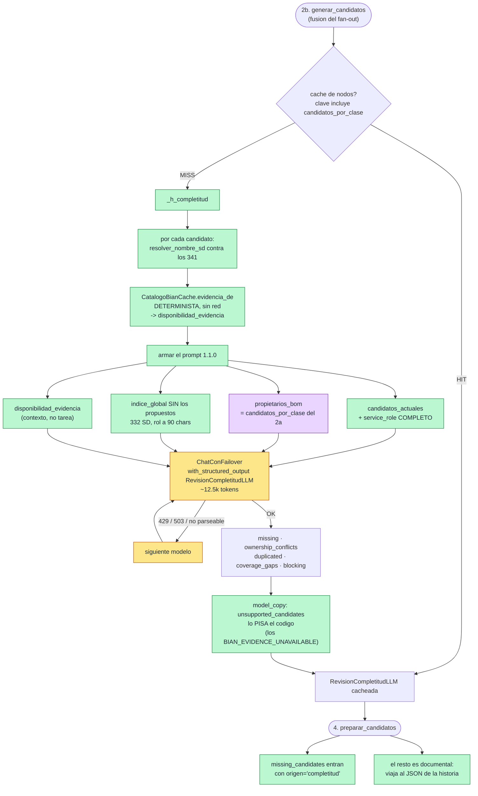

# Nodo 3 — `revisar_completitud` `[LLM + determinista]` — v1 (2026-09-20)

> **En una frase:** vuelve a mirar el catálogo **entero** —ahora sabiendo qué se propuso y con la
> evidencia de clases del BOM en la mano— y dice **qué falta, qué se pisa y quién se disputa un
> objeto**. No decide ownership ni genera contratos.

Su razón de existir es una desconfianza escrita en el propio prompt: *"la lista inicial de
candidatos de un LLM NO demuestra completitud por sí sola"*. Con el routing jerárquico y el
fan-out su papel creció: el nodo 2b ve solo los Service Domains de los dominios enrutados, y
**este es el único paso que sigue mirando los 341**.

"Completitud" aquí es **cobertura, no corrección**: no dice si un candidato es el correcto, dice
si está todo lo que hay que mirar.

## Qué cambió en v1 (prompt `mapeo.completitud` 1.0.0 → 1.1.0)

La v1 nace de una medición: con el prompt 1.0.0, sobre los 9 candidatos del nodo 2b del E2E 1, el
nodo devolvió **cero en todos sus campos** y costó 51 s. Lo único que produjo
(`unsupported_candidates`) ya lo sabía el código antes de llamar.

| | 1.0.0 | 1.1.0 |
|---|---|---|
| Evidencia para juzgar propiedad | ninguna | **`<propietarios_bom>`**: `candidatos_por_clase` del nodo 2a — qué SD DEFINE cada clase y si **solo tipifica** el dato o **guarda el valor** |
| Candidatos actuales | nombre + `supporting_intent` | **+ `service_role` completo** y su jerarquía Area > Domain |
| Índice global | los 341, rol a 90 chars | **los no propuestos** (332 hoy), rol a 90 chars |
| `unsupported_candidates` | lo devolvía el LLM | **lo escribe el código** desde la caché de evidencia |
| Métricas | ninguna | `completitud_candidatos_aportados` / `_seleccionados` / `_conflictos_detectados` |

Cuatro cosas que **NO** hace:

1. **No decide ownership.** Señala un conflicto; quién es el propietario lo deciden los nodos 5-8.
2. **No confirma nada.** `missing_candidates` es una sospecha que confirma el paso de evidencia.
3. **No descarta candidatos.** Todo lo que señala se evalúa igual. Solo puede AÑADIR.
4. **No degrada su prompt.** No tiene escalera; con ~12.5k tokens no la necesita.

---

## 1. Dónde vive

| Pieza | Archivo | Línea |
|---|---|---|
| Handler (capa aplicación) | `src/aplicacion/servicios/mapear_historias_service_domain.py` | `909` (`_h_completitud`) |
| Registro en el grafo + caché + retry | `src/aplicacion/servicios/mapear_historias_service_domain.py` | `2440` |
| Consumidor de `missing_candidates` | `src/aplicacion/servicios/mapear_historias_service_domain.py` | `1057` (`_h_preparar`) |
| Puerto | `src/aplicacion/puertos/analista_mapeo.py` | `84` |
| Adaptador LLM | `src/adaptadores/salida/analista_mapeo_langchain.py` | `511` |
| Candidatos con rol completo | `src/adaptadores/salida/analista_mapeo_langchain.py` | `216` (`formatear_candidatos_para_revision`) |
| Índice global filtrado | `src/adaptadores/salida/analista_mapeo_langchain.py` | `241` (`_formatear_indice_global`, parámetro `excluir`) |
| Bloque de evidencia BOM | `src/adaptadores/salida/analista_mapeo_langchain.py` | `186` (`formatear_propietarios_bom`, compartido con 2b) |
| Prompt | `src/adaptadores/salida/prompts_mapeo.py` | `364` (`SPEC_COMPLETITUD`) |
| Modelo de salida | `src/dominio/historias.py` | `382` (`RevisionCompletitudLLM`) |
| Fuente de `disponibilidad_evidencia` | `src/adaptadores/salida/catalogo_bian_cache.py` | `evidencia_de(...)` |

Identidad: **`prompt_id = "mapeo.completitud"`, `prompt_version = "1.3.0"`** (1.1.0 añadió la
evidencia BOM y los roles completos; 1.2.0 la señal cruda; 1.3.0 arregló los campos de hallazgos).

---

## 2. Contrato de entrada

Lee **5 claves** del `EstadoHistoria` y añade un bloque que calcula el código:

| Clave | De dónde viene | Para qué |
|---|---|---|
| `historia` | Lector de HU | Texto completo |
| `intencion` | Nodo 1 | `business_actions`, `business_objects`, `external_dependencies` |
| `candidatos` | **Nodo 2b** (fusión del fan-out) | Los candidatos a revisar, con su rol completo |
| `candidatos_por_clase` | **Nodo 2a** | `<propietarios_bom>`: la evidencia con la que se juzga un conflicto |
| `catalogo` | `CatalogoJson` (341) | Índice global, **menos** los ya propuestos |
| *(derivado)* `disponibilidad_evidencia` | `CatalogoBianCache.evidencia_de` | `CACHED_VERIFIED` / `VERIFIED` / `BIAN_EVIDENCE_UNAVAILABLE` por candidato |

---

## 3. Contrato de salida

```python
{"revision_completitud": RevisionCompletitudLLM, "huellas": [MetadatosPrompt, ...]}
```

| Campo | Quién lo produce | Qué hace después |
|---|---|---|
| `missing_candidates` | LLM | **Lo único que cambia el flujo**: entra al nodo 4 con `origen="completitud"` y se evalúa como un candidato más |
| `unsupported_candidates` | **código** | Documental: los candidatos sin evidencia oficial |
| `ownership_conflicts` | LLM (con `<propietarios_bom>`) | Documental, viaja al JSON |
| `duplicated_responsibilities` | LLM (con los roles completos) | Documental |
| `coverage_gaps` | LLM | Se acumula en los `gaps` de la historia |
| `blocking_codes` | LLM | Se acumula en los `blocking_codes` de la historia |
| `review_summary` | LLM | Documental |

---

## 4. Certificación (E2E 1, LLM real, 2026-09-20)

> ✅ **Medido.** Misma entrada en las dos corridas: los 9 candidatos del nodo 2b de
> `salida/2026-09-20_nodo2b-actual/`. Salidas en `salida/2026-09-20_nodo3-actual/` (1.0.0) y
> `salida/2026-09-20_nodo3-v110/` (1.1.0). Respondió `gemini-3.5-flash` en ambas.

| | 1.0.0 | 1.1.0 |
|---|---|---|
| Prompt | ~10,941 tok | ~12,538 tok |
| Tiempo | 51.5 s | 58.2 s |
| `missing_candidates` | **0** | **3** |
| `ownership_conflicts` | **0** | **1** |
| `duplicated_responsibilities` | **0** | **1** |
| `coverage_gaps` | 0 | 2 |
| `blocking_codes` | 0 | 1 (`BIAN-SCOPE-009`) |

Lo que detectó con 1.1.0 y no veía con 1.0.0:

- **El conflicto de propiedad real de la historia**: `Location Data Management, Party Reference
  Data Directory, Legal Entity Directory [Contact Point / Phone Address / Electronic Address]`.
  Es exactamente la disputa que el canal del 2a venía señalando desde su evidencia: `Contact
  Point` (PRDD y Legal Entity Directory) **solo tipifica** el dato, `Phone Address` y `Electronic
  Address` (Location Data Management) **guardan el valor**.
- **El duplicado evidente**: `eBranch Operations` cubre lo mismo que `eBranch Management`. Con el
  nombre solo no se veía; con el `service_role` entero, sí.
- Dos `coverage_gaps` concretos (Smart Token y el módulo de validación de contacto) y el
  `BIAN-SCOPE-009`.

Coste de la mejora: **+1.6k tokens y +7 s**.

### Hallazgo: el nodo 3 deshace el umbral de rescate del 2a

Los 3 `missing_candidates` que añadió —Issued Device Administration, Document Directory,
Correspondence— son **exactamente candidatos que el canal del 2a propuso y que el umbral de
rescate bloqueó** (score 0.84-0.91, un solo canal; el umbral pide ≥1.0 o ≥2 canales):

| SD | score del canal | canales | ¿rescatado por 2a? | ¿añadido por el nodo 3? |
|---|---|---|---|---|
| Issued Device Administration | 0.84 | bm25 | no | **sí** |
| Document Directory | 0.91 | bm25 | no | **sí** |
| Correspondence | 0.91 | bm25 | no | **sí** |

La causa es que `<propietarios_bom>` lleva **todo** `candidatos_por_clase`, no solo lo rescatado.
El nodo 3 lo lee como catálogo de sugerencias y las repesca. **Es una decisión de producto
pendiente**, con tres salidas posibles:

1. **Dejarlo así.** El nodo 3 es la segunda oportunidad y juzga con más contexto que el umbral
   (ve la historia entera y los roles). El umbral entonces solo ahorra tokens en 2b, no llamadas
   en el nodo 5.
2. **Pasar solo los rescatados**, para que 2b y 3 vean lo mismo y el umbral valga de verdad.
3. **Pasar todo pero marcando** cuáles no pasaron el umbral, y que el revisor decida sabiéndolo.

Sin decidir esto, cada candidato repescado cuesta una llamada LLM con evidencia completa en el
nodo 5. En esta corrida son 3.

### A/B con juez FIJO: ¿la señal cruda cambia el juicio?

Las tres primeras mediciones fueron inválidas porque cada rama la atendió un modelo distinto
(gemini-3.5-flash, flash-lite, ollama, y dos nemotron distintos dentro de DreamPrompting). La
cuarta fijó `claude-opus-5` vía ACLIDE en ambas ramas, con la misma entrada:

| | con señal | sin señal |
|---|---|---|
| Conflicto de propiedad | cita los valores REALES: *"señales: 2.70/2 canales vs 1.71/2 canales"* | **los fabrica y los invierte**: *"mayor señal de Party Reference Data Directory (6) frente a Location Data Management (4)"* — los reales son 1.71 y 2.70 |
| Candidatos repescados del canal | 1 (Party Routing Profile) | 1 (Issued Device Administration) |

**La señal se justifica por medición, no solo por principio: sin ella el juez no se abstiene,
inventa la cifra.** Lo que la señal NO hace es frenar la repesca de lo que el umbral del nodo 2a
filtró — ambas ramas repescan uno, y el resto de `missing_candidates` sale del índice global, no
del canal.

### El defecto que destapó el A/B (arreglado en 1.3.0)

Con 1.2.0, `duplicated_responsibilities` traía **8 entradas y ninguna era una duplicación**: todas
decían lo contrario (*"no se demuestra duplicación con eBranch Operations"*, *"responsabilidad
distinta de los demás candidatos"*). `ownership_conflicts` tenía el mismo vicio en una de sus
entradas (*"no aporta evidencia suficiente para afirmar disputa"*). Esas negaciones acababan en el
JSON de la historia como si fueran hallazgos.

1.3.0 declara las dos listas como **hallazgos confirmados, no inventario**: una entrada solo entra
si se pueden nombrar los DOS candidatos y el objeto concreto en disputa, **vacío es la respuesta
normal**, y la duda va a `review_summary`. Medido con el mismo juez:

| | 1.2.0 | 1.3.0 |
|---|---|---|
| `duplicated_responsibilities` | 8 (ninguna real) | **0** (correcto) |
| `ownership_conflicts` | 1 | **2, ambas reales** (añade LDM vs Legal Entity Directory) |
| `missing_candidates` | 6 | 3 |
| Tiempo | 52.3 s | **11.9 s** |

---

## 5. Diagrama de flujo



---

## 6. Ejemplo de entrada (REAL, 2026-09-20)

Bloques del mensaje `human`, abreviados (completo en
`salida/2026-09-20_nodo3-v110/entrada-nodo3-human.txt`):

```text
<candidatos_actuales total="9">
- "Party Reference Data Directory" · Sales and Service > Customer Management  (señal: visualizar; ...)
    service_role: The party reference data directory service domain maintains a potentially wide range of
    party reference data that might be used in any interaction between the bank and the party ... [ENTERO]
- "Location Data Management" · Reference Data > Party  (señal: visualizar; informacion de contacto; ...)
    service_role: The maintenance of location details is used to check the validity, allowed use ... [ENTERO]
... [9 candidatos]
</candidatos_actuales>

<propietarios_bom fuente="docs/entity.json" total="...">
- "Location Data Management" define "Phone Address": 'Phone Address' tipifica con el enum
  PhoneAddressTypeValues (PhoneNumber, FaxNumber, MobileNumber) Y guarda 1 atributo(s) con valor:
  Phone Number; "Electronic Address": ...
- "Party Reference Data Directory" define "Contact Point" [BQ Reference]: 'Contact Point' SOLO tipifica
  con el enum ContactPointTypeValues (...): sin atributos adicionales, no guarda el valor
  (compartida_con: Legal Entity Directory)
...
</propietarios_bom>

<disponibilidad_evidencia>
- "Customer Consent": BIAN_EVIDENCE_UNAVAILABLE
- "Party Reference Data Directory": CACHED_VERIFIED
... [9]
</disponibilidad_evidencia>

<indice_global ... total="332" nota="NO incluye los candidatos actuales">
- "Building Maintenance" :: Administer and execute site and utility maintenance and repair ...
... [332 lineas]
</indice_global>
```

---

## 7. Ejemplo de salida (REAL, misma corrida)

```json
{
  "missing_candidates": [
    "Issued Device Administration",
    "Document Directory",
    "Correspondence"
  ],
  "unsupported_candidates": [
    "Customer Consent"
  ],
  "ownership_conflicts": [
    "Location Data Management, Party Reference Data Directory, Legal Entity Directory [Contact Point / Phone Address / Electronic Address]"
  ],
  "duplicated_responsibilities": [
    "eBranch Operations [covers the same channel-specific operational access responsibilities as eBranch Management for the web/data channel in this context]"
  ],
  "coverage_gaps": [
    "Mecanismo de seguridad Smart Token (no cubierto plenamente por Party Authentication si requiere administración de dispositivo físico/virtual)",
    "Módulo de validación de datos de contacto (celular y correo electrónico)"
  ],
  "blocking_codes": [
    "BIAN-SCOPE-009"
  ],
  "review_summary": "Se identificaron conflictos de propiedad sobre los datos de contacto (teléfono y correo) entre Location Data Management y Party Reference Data Directory, además de redundancia operativa en los dominios de eBranch."
}
```

---

## 8. Caché, reintentos y failover

| Mecanismo | Comportamiento |
|---|---|
| Caché de nodos | Clave = `completitud` + firma de la corrida + `historia` + `intencion` + `candidatos` + **`candidatos_por_clase`** (entra en el prompt desde 1.1.0) |
| RetryPolicy | 3 intentos sobre transitorios |
| Failover | ~12.5k tokens: **Groq queda fuera** por presupuesto (12k). En las dos corridas respondió `gemini-3.5-flash` tras recorrer la cadena |
| Degradación por tamaño | No tiene escalera. Si hiciera falta, el candidato obvio a recortar es el índice global (~10k de los 12.5k) |

---

## 9. Modos de fallo

| Síntoma | Causa | Quién lo compensa |
|---|---|---|
| Devuelve todo vacío | Era el estado con 1.0.0 | Las métricas `completitud_*` lo hacen visible por corrida |
| Repesca lo que el 2a filtró | `<propietarios_bom>` lleva todo `candidatos_por_clase` | **Pendiente de decidir** (ver §4) |
| Un `missing_candidate` no resuelve | Nombre inventado | `NAME_UNRESOLVED` en el nodo 4; no se adivina |
| Señala un conflicto que no existe | Documental, no reclasifica nada | Los nodos 5-8 deciden con evidencia |
| Groq excluido por tamaño | 12.5k > 12k | Cae a la cadena; con el índice recortado volvería a caber |

### Qué vigilar

| Métrica | Qué significa |
|---|---|
| `completitud_candidatos_aportados` | Cuántos candidatos añadió el nodo. Si es 0 corrida tras corrida, la llamada no se paga |
| `completitud_candidatos_seleccionados` | De esos, cuántos acabaron siendo contrato. **Es la medida de su valor real** |
| `completitud_conflictos_detectados` | Conflictos + duplicados. Con 1.0.0 era siempre 0 |

---

## 10. Cómo ejecutarlo aislado

```bash
.venv/bin/python -m unittest discover -s tests -p "test_revisar_completitud.py" -v   # 8 tests, sin red
```

Los tests que fijan la v1:

- `TestPrompt110` — el prompt pide el conflicto con la evidencia BOM y **no** pide `unsupported`.
- `TestFormateoParaElRevisor` — rol completo en los candidatos, índice sin los ya propuestos.
- `TestNodo3EnElGrafo::test_el_nodo_3_recibe_la_evidencia_de_clases_bom_del_2a`.
- `TestNodo3EnElGrafo::test_unsupported_candidates_lo_escribe_el_codigo_no_el_llm`.
- `TestMetricasDelNodo3`.

Para la certificación con LLM real se reusa una salida ya medida del nodo 2b y se ejecuta solo
`_h_completitud`, así no se repaga el fan-out: una sola llamada.

---

## 11. Nodos vecinos

- ← [`02b-generar-candidatos-v1.md`](02b-generar-candidatos-v1.md) — le da los candidatos fusionados.
- ← [`02a-enrutar-dominios-v1.md`](02a-enrutar-dominios-v1.md) — le da `candidatos_por_clase`.
- → `04-preparar-candidatos.md` (pendiente) — resuelve nombres y arma la evidencia por candidato.
- Versión anterior: [`historico/03-revisar-completitud.md`](historico/03-revisar-completitud.md).
