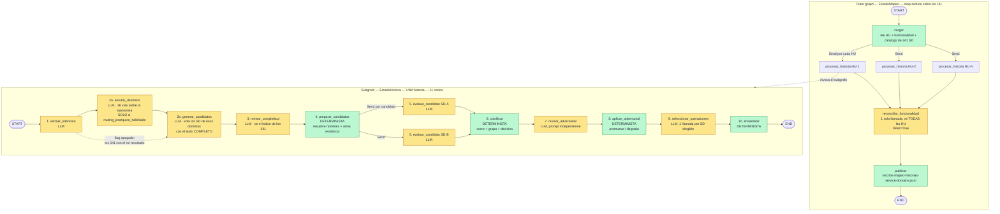

# `node_info/` — cómo funciona cada nodo del pipeline, uno por archivo

Un `.md` por nodo del caso de uso **`mapear-historias`** (Historia de Usuario → BIAN Service
Domains). Cada archivo responde siempre a lo mismo, en este orden:

1. qué hace el nodo y qué **NO** hace;
2. dónde vive en el código (`archivo:línea`);
3. su **contrato de entrada/salida** campo a campo;
4. un **ejemplo** de entrada y de salida, marcando siempre si es real o construido;
5. el **paso a paso** de lo que ocurre en runtime;
6. un **diagrama de flujo Mermaid**;
7. el **prompt exacto** que se manda (si es un nodo LLM);
8. caché, reintentos y failover;
9. modos de fallo;
10. cómo ejecutarlo aislado y verificarlo.

## Estado de esta carpeta

| # | Nodo | Tipo | Archivo | Estado |
|---|------|------|---------|--------|
| 1 | `extraer_intencion` | LLM | [`01-extraer-intencion.md`](01-extraer-intencion.md) | ✅ vigente |
| **2a** | `enrutar_dominios` | LLM + determinista | [`02a-enrutar-dominios-v1.md`](02a-enrutar-dominios-v1.md) | ✅ vigente (v1, 2026-09-20: router + canal de propiedad de clases BOM) |
| **2b** | `generar_candidatos` | LLM | [`02b-generar-candidatos-v1.md`](02b-generar-candidatos-v1.md) | ✅ vigente (v1, 2026-09-20: catálogo enrutado + propietarios rescatados) |
| **3** | `revisar_completitud` | LLM + determinista | [`03-revisar-completitud-v1.md`](03-revisar-completitud-v1.md) | ✅ vigente (v1, 2026-09-20: evidencia BOM, roles completos, índice filtrado) |
| 4 | `preparar_candidatos` | determinista | `04-preparar-candidatos.md` | ⏳ pendiente |
| 5 | `evaluar_candidato` | LLM (fan-out) | `05-evaluar-candidato.md` | ⏳ pendiente |
| 6 | `clasificar` | determinista | `06-clasificar.md` | ⏳ pendiente |
| 7 | `revisar_adversarial` | LLM | `07-revisar-adversarial.md` | ⏳ pendiente |
| 8 | `aplicar_adversarial` | determinista | `08-aplicar-adversarial.md` | ⏳ pendiente |
| 9 | `seleccionar_operaciones` | LLM (1 por SD) | `09-seleccionar-operaciones.md` | ⏳ pendiente |
| 10 | `ensamblar` | determinista | `10-ensamblar.md` | ⏳ pendiente |
| 11 | `cargar` / `procesar_historia` / `reconciliar` / `publicar` | outer graph | `11-outer-graph.md` | ⏳ pendiente |

### [`historico/`](historico/) — la foto anterior al routing jerárquico

Contiene la documentación tal y como estaba **antes** de partir el paso de candidatos en dos
nodos. Se conserva por dos motivos: describe el camino que el código **sigue ejecutando** con
`routing_jerarquico_habilitado: false`, y es la referencia del antes/después.

| Documento histórico | ¿Sigue siendo cierto? |
|---|---|
| [`historico/02-generar-candidatos.md`](historico/02-generar-candidatos.md) | Solo con el flag apagado. Reemplazado por `02a` + `02b` |
| [`historico/README.md`](historico/README.md) | El diagrama tenía 10 nodos; ahora son 11 |
| [`historico/02a-enrutar-dominios.md`](historico/02a-enrutar-dominios.md) | Solo con `entidades_bom_habilitado: false`. Reemplazado por `02a-enrutar-dominios-v1.md` |
| [`historico/02b-generar-candidatos.md`](historico/02b-generar-candidatos.md) | Solo con `entidades_bom_habilitado: false`. Reemplazado por `02b-generar-candidatos-v1.md` |
| [`historico/03-revisar-completitud.md`](historico/03-revisar-completitud.md) | Prompt 1.0.0. Reemplazado por `03-revisar-completitud-v1.md` |

El documento del **nodo 1 no está aquí**: se quedó en la raíz porque sigue siendo fiel al
funcionamiento actual. El routing no le cambió nada salvo a quién continúa.

## Los dos grafos

El pipeline son **dos** grafos de LangGraph anidados, y **solo dos**: el de fuera (*outer*) hace
map-reduce sobre las HU; el de dentro (*subgrafo*) procesa UNA historia y hace su propio fan-out
por candidato. `enrutar_dominios` es **un nodo más del subgrafo**, no un grafo nuevo.



**La regla que gobierna todo el diagrama:** los nodos amarillos (LLM) devuelven *señales*
—listas, rúbricas ordinales 0-3, trazabilidad, gaps—. Los verdes (deterministas) son los que
calculan el score y deciden `SELECTED` / `UNRESOLVED` / `REJECTED`. **El LLM nunca decide el
estado final.**

## Coste por corrida

```
llamadas_LLM ≈ HU * (4 + n_candidatos_evaluados + 2) + 1
                     │                │              │   └─ reconciliar_funcionalidad
                     │                │              └───── adversarial + operaciones
                     │                └──────────────────── nodo 5, una por candidato
                     └───────────────────────────────────── nodos 1, 2a, 2b y 3
                                                            (era 3 antes del routing jerárquico)
```

El routing añade **una llamada por HU** y quita tokens: el paso de candidatos pasa de 41.1k
tokens en una llamada a 4.7k + 9.2k en dos (medido con la HU de `cuentas_menores`, 3 dominios).

## Convenciones de estos documentos

- **`[det]`** = nodo determinista: mismo input → mismo output, 0 llamadas LLM, 0 red.
- **`[LLM]`** = nodo que invoca el modelo a través de `ChatConFailover`.
- Los ejemplos vienen de `tests/resources/cuentas_menores/mapeo-historias-service-domains.json`
  (corrida real con proveedores reales). **Cuando un ejemplo no procede de una corrida real, el
  documento lo dice en un aviso**, nunca se presenta como medido.
