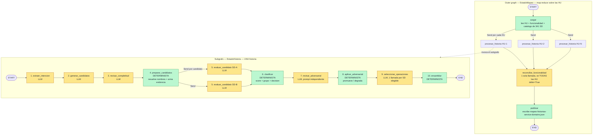

# `node_info/` — cómo funciona cada nodo del pipeline, uno por archivo

Un `.md` por nodo del caso de uso **`mapear-historias`** (Historia de Usuario → BIAN Service
Domains). Cada archivo responde siempre a lo mismo, en este orden:

1. qué hace el nodo y qué **NO** hace;
2. dónde vive en el código (`archivo:línea`);
3. su **contrato de entrada/salida** campo a campo;
4. un **ejemplo real** de entrada y de salida (sacado de una corrida de verdad, no inventado);
5. el **paso a paso** de lo que ocurre en runtime;
6. un **diagrama de flujo Mermaid**;
7. el **prompt exacto** que se manda (si es un nodo LLM);
8. caché, reintentos y failover;
9. modos de fallo;
10. cómo ejecutarlo aislado y verificarlo.

## Estado de esta carpeta

| # | Nodo | Tipo | Archivo | Estado |
|---|------|------|---------|--------|
| 1 | `extraer_intencion` | LLM | [`01-extraer-intencion.md`](01-extraer-intencion.md) | ✅ escrito |
| 2 | `generar_candidatos` | LLM | [`02-generar-candidatos.md`](02-generar-candidatos.md) | ✅ escrito |
| 3 | `revisar_completitud` | LLM | `03-revisar-completitud.md` | ⏳ pendiente |
| 4 | `preparar_candidatos` | determinista | `04-preparar-candidatos.md` | ⏳ pendiente |
| 5 | `evaluar_candidato` | LLM (fan-out) | `05-evaluar-candidato.md` | ⏳ pendiente |
| 6 | `clasificar` | determinista | `06-clasificar.md` | ⏳ pendiente |
| 7 | `revisar_adversarial` | LLM | `07-revisar-adversarial.md` | ⏳ pendiente |
| 8 | `aplicar_adversarial` | determinista | `08-aplicar-adversarial.md` | ⏳ pendiente |
| 9 | `seleccionar_operaciones` | LLM (1 por SD) | `09-seleccionar-operaciones.md` | ⏳ pendiente |
| 10 | `ensamblar` | determinista | `10-ensamblar.md` | ⏳ pendiente |
| 11 | `cargar` / `procesar_historia` / `reconciliar` / `publicar` | outer graph | `11-outer-graph.md` | ⏳ pendiente |

## Los dos grafos

El pipeline son **dos** grafos de LangGraph anidados. El de fuera (*outer*) hace map-reduce
sobre las HU; el de dentro (*subgrafo*) procesa UNA historia y hace su propio fan-out por
candidato.



**La regla que gobierna todo el diagrama:** los nodos amarillos (LLM) devuelven *señales*
—listas, rúbricas ordinales 0-3, trazabilidad, gaps—. Los verdes (deterministas) son los que
calculan el score y deciden `SELECTED` / `UNRESOLVED` / `REJECTED`. **El LLM nunca decide el
estado final.**

## Coste por corrida

```
llamadas_LLM ≈ HU * (3 + n_candidatos_evaluados + 2) + 1
                     │                │              │   └─ reconciliar_funcionalidad
                     │                │              └───── adversarial + operaciones
                     │                └──────────────────── nodo 5, una por candidato
                     └───────────────────────────────────── nodos 1, 2 y 3
```

## Convenciones de estos documentos

- **`[det]`** = nodo determinista: mismo input → mismo output, 0 llamadas LLM, 0 red.
- **`[LLM]`** = nodo que invoca el modelo a través de `ChatConFailover`.
- Los ejemplos vienen de `tests/resources/cuentas_menores/mapeo-historias-service-domains.json`
  (corrida real con proveedores reales). Cuando un campo del ejemplo **no** se persiste en el
  JSON de salida y hay que reconstruirlo, el documento lo dice explícitamente.
