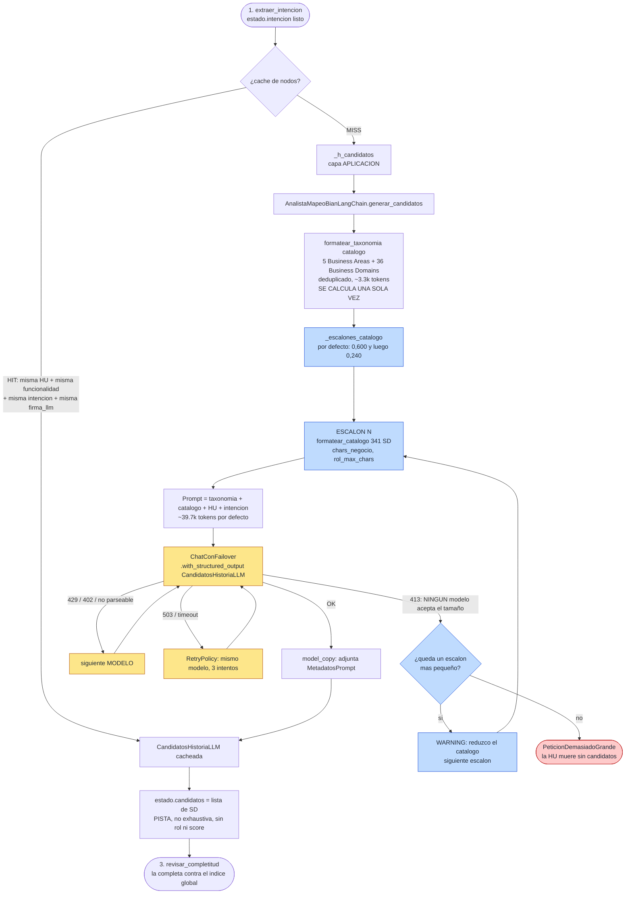

# Nodo 2 — `generar_candidatos` `[LLM]`

> **En una frase:** con la intención ya extraída, mira el **catálogo completo de los 341 BIAN
> Service Domains** y propone qué Service Domains podrían participar. Es una **PISTA, no una
> decisión** — y explícitamente **no** se considera exhaustiva.

Este es el primer nodo que ve BIAN, y el **prompt más grande de todo el pipeline**: ~39.7k tokens
de bloque estático (catálogo + taxonomía) por llamada. Es también el único nodo, junto con el 3,
que puede **degradar su propio contenido** cuando ningún modelo acepta el tamaño.

Tres cosas que este nodo **NO** hace, a propósito:

1. **No clasifica el rol contractual.** No dice si un SD es propietario o dependencia.
2. **No puntúa confianza.** Ninguna señal numérica suya entra al score final.
3. **No cierra la lista.** El nodo 3 la completa contra el índice global, el nodo 4 puede añadir
   más por retrieval, y el nodo 5 evalúa uno a uno contra evidencia oficial.

El prompt le dice al modelo esto literalmente: *"incluye todo candidato PLAUSIBLE; no te limites
a 3-8"*. **Un falso positivo aquí cuesta una llamada LLM en el nodo 5. Un falso negativo aquí
puede costar la historia entera**, porque un SD que nadie propone no lo evalúa nadie.

---

## 1. Dónde vive

| Pieza | Archivo | Línea |
|---|---|---|
| Handler del nodo (capa aplicación) | `src/aplicacion/servicios/mapear_historias_service_domain.py` | `514` (`_h_candidatos`) |
| Registro en el grafo + caché + retry | `src/aplicacion/servicios/mapear_historias_service_domain.py` | `1904` |
| Puerto | `src/aplicacion/puertos/analista_mapeo.py` | `37` (`generar_candidatos`) |
| Adaptador LLM | `src/adaptadores/salida/analista_mapeo_langchain.py` | `332` |
| Formateo del catálogo | `src/adaptadores/salida/analista_mapeo_langchain.py` | `91` (`formatear_catalogo`) |
| Formateo de la taxonomía | `src/adaptadores/salida/analista_mapeo_langchain.py` | `132` (`formatear_taxonomia`) |
| Degradación por tamaño | `src/adaptadores/salida/analista_mapeo_langchain.py` | `244` (`_escalones_catalogo`) y `268` (`_invocar_reduciendo`) |
| Prompt | `src/adaptadores/salida/prompts_mapeo.py` | `108`–`166` (`SPEC_CANDIDATOS`) |
| Modelos de salida | `src/dominio/historias.py` | `277` (`CandidatoServiceDomainLLM`), `287` (`CandidatosHistoriaLLM`) |
| Fuente del catálogo | `docs/BIAN_Service_Landscape_V14.0_Matrix_View.json` | 341 SD |

Identidad del prompt: **`prompt_id = "mapeo.candidatos"`, `prompt_version = "1.1.0"`**
(la `1.1.0` es la que añadió el bloque `<taxonomia_bian>`).

---

## 2. Contrato de entrada

El nodo lee **4 claves** del `EstadoHistoria` — todas las que existen en ese punto:

| Clave del estado | Tipo | De dónde viene | Para qué se usa |
|---|---|---|---|
| `historia` | `HistoriaUsuario` | Lector de HU | Texto completo de la HU, sin recortar |
| `funcionalidad` | `FuncionalidadMacro` | JSON de funcionalidad | Solo el **nombre** entra al prompt; el `detalle` **no** |
| `intencion` | `IntencionHistoriaLLM` | **Nodo 1** | Sus 5 listas son la consulta real contra el catálogo |
| `catalogo` | `list[EntradaCatalogo]` | `CatalogoJson.cargar()` en el nodo `cargar` del outer graph | Los 341 SD: se formatean dos veces, como catálogo y como taxonomía |

### Qué campos de `intencion` entran (y cuáles no)

| Campo de la intención | ¿Entra al prompt? | Variable |
|---|---|---|
| `resumen_funcional` | sí | `intencion_resumen` |
| `business_actions` | sí | `intencion_actions` |
| `business_objects` | sí | `intencion_objects` |
| `outcomes` | sí | `intencion_outcomes` |
| `external_dependencies` | sí | `intencion_dependencies` |
| `capacidades_funcionales` | **no** | — |
| `traceability_ids`, `assumptions`, `gaps`, `unresolved_questions` | **no** | — |

Las listas se serializan con `_lista()`: unidas por `"; "`, y `"(ninguno)"` si quedan vacías.

### Qué campos de `EntradaCatalogo` entran

`formatear_catalogo` produce **una línea por SD** con esta forma:

```
- "Nombre del SD" · Business Area > Business Domain · [functional_pattern / asset_type] :: service_role recortado
```

Ejemplo real de las 3 primeras líneas del catálogo formateado:

```text
- "Building Maintenance" · Business Support > Buildings Equipment and Facilities · [Maintain / Building] :: Administer and execute site and utility maintenance and repair activities (building refit and decoration etc.)
- "Equipment Administration" · Business Support > Buildings Equipment and Facilities · [Administer / Office Equipment] :: Track the operational state and administer assignment, maintenance and movements/inventory of available office equipment (printers, NW, Faxes, Shredders, kitchen etc..)
- "Equipment Maintenance" · Business Support > Buildings Equipment and Facilities · [Maintain / Office Equipment] :: Administer the regular and ad hoc maintenance and repair of office equipment (typically excludes IT)
```

**Lo que NUNCA se manda: `documentation`.** Es la concatenación literal de `service_role` +
`examples_of_use` + `executive_summary` + `features`: ~76k tokens por cero información nueva.

---

## 3. El bloque `<taxonomia_bian>`

Cada línea del catálogo lleva `· Sales and Service > Customer Management`. Hasta la versión
`1.1.0` del prompt, esa jerarquía viajaba como **una etiqueta sin definir** — pese a pesar un 10%
del score del nodo 6.

`formatear_taxonomia` la define: recorre el catálogo, deduplica y emite las **5 Business Areas** y
los **36 Business Domains** con su `documentation` del propio landscape:

```text
- Business Area "Business Support" :: This Business Area spans a wide range of general business management and support activities that may be found in any commercial business and that are therefore not specific to Banking. ...
  - Business Domain "Buildings Equipment and Facilities" (7 SD) :: This Business Domain covers all activities associated with the acquisition, administration, operation and maintenance of buildings and non-IT equipment ...
  - Business Domain "Business Command and Control" (6 SD) :: This Business Domain contains the range of capabilities associated with the organizational command and control structure of the enterprise. ...
```

**Por qué deduplicado y aparte, y no inline por SD:** medido sobre el landscape real, el bloque
deduplicado son **13.307 chars ≈ 3.3k tokens**. Repetir la misma documentación en las 341 líneas
del catálogo costaría **~23k tokens** — 8x más por exactamente la misma información.

El bloque de taxonomía se calcula **una sola vez, fuera del lambda de degradación**: es fijo y
pequeño, no es lo que hace que una petición no quepa.

---

## 4. Presupuesto del prompt (medido sobre los 341 SD reales)

| Escalón `(chars_negocio, rol_max_chars)` | Chars del catálogo | ≈ Tokens | Cuándo se usa |
|---|---|---|---|
| `(300, 600)` | 229.014 | ~57.3k | Solo con `cag_habilitado: true` |
| `(150, 600)` | 193.573 | ~48.4k | Solo con CAG, primera degradación |
| **`(0, 600)`** | **145.517** | **~36.4k** | **Escalón por defecto hoy** |
| `(0, 240)` | 106.538 | ~26.6k | Último recurso. Suelo histórico |

Sumando `<taxonomia_bian>` (~3.3k) el prompt por defecto es de **~39.7k tokens de bloque
estático**, más la parte variable (historia + intención), que es pequeña.

### El orden de degradación no es arbitrario

`_escalones_catalogo()` construye la lista así:

1. Primero se sacrifica el **vocabulario de negocio** (`examples_of_use` + `features`, el escalón
   CAG): `300 → 150 → 0`.
2. **Solo al final** se recorta el **Service Role**: `600 → 240`.

Porque el rol es la señal más discriminante — es lo último que se tira.

**El último escalón es SIEMPRE `(0, 240)`.** Existe porque subir `rol_max_chars` sube el **suelo**
del prompt: sin ese escalón, un catálogo que no cabe en ningún modelo dejaría la HU **sin
candidatos** en vez de degradarse. Con `rol_max_chars: 600` solo 26 de los 341 SD quedan
recortados; con el viejo 240 se recortaban **219 de 341**.

---

## 5. Contrato de salida

```python
{
    "candidatos": CandidatosHistoriaLLM,   # se ESCRIBE
    "huellas":   [MetadatosPrompt, ...],   # se ACUMULA
}
```

### `CandidatosHistoriaLLM`

| Campo | Tipo | Qué contiene | Quién lo consume |
|---|---|---|---|
| `candidatos` | `list[CandidatoServiceDomainLLM]` | La lista de SD propuestos | Nodos 3 y 4 |
| `coverage_notes` | `list[str]` | Capacidades u objetos de la HU que **no** parecen tener SD | JSON final |
| `assumptions` | `list[str]` | Supuestos | JSON final |
| `gaps` | `list[str]` | Huecos de evidencia | JSON final |
| `metadatos` | `MetadatosPrompt \| None` | Huella reproducible | `huellas_prompts` |

### `CandidatoServiceDomainLLM`

| Campo | Tipo | Qué contiene | Uso |
|---|---|---|---|
| `service_domain` | `str` | Nombre del SD, **copia literal del catálogo** | El nodo 4 lo resuelve con `resolver_nombre_sd`; si no resuelve → incidencia `NAME_UNRESOLVED` y el candidato se descarta |
| `rationale` | `str` | Justificación breve | Informativo |
| `supporting_intent` | `list[str]` | Qué `business_action` / `business_object` concreto lo sugiere | Viaja hasta el prompt del nodo 5: es la evidencia de **por qué** entró este candidato |

---

## 6. Ejemplo REAL de entrada

Mismo caso que el nodo 1 (`tests/resources/cuentas_menores/`). Así queda el mensaje `human`
una vez rellenado (catálogo y taxonomía **abreviados** aquí; en la llamada real van completos):

```text
<funcionalidad_macro>Actualización de datos personales</funcionalidad_macro>

<historia archivo="HU-Actualizar cuentas de menores.txt" titulo="Actualizar cuentas de menores">
Como   usuario menor de edad o usuario asociado a cuenta menor,
Quiero  que mis datos personales solo sean visibles y no editables,
...
Nota: El nombre del tutor será enviado por BE.
</historia>

<intencion_funcional>
resumen: Permitir que usuarios con cuenta de menor visualicen sus datos personales sin posibilidad de editarlos y muestren un mensaje informativo indicando que solo el tutor puede modificarlos.
business_actions: visualizar datos personales; restringir edición de datos de contacto; presentar mensaje informativo
business_objects: cuenta de menor; datos personales; número celular; correo electrónico; nombre del tutor
outcomes: Pantalla de datos personales muestra nombre completo, identificación, foto y datos de contacto en modo solo lectura; El sistema impide cualquier intento de edición del número celular y del correo electrónico; ...
external_dependencies: Backend (BE) para obtener nombre del tutor; Smart Token como mecanismo de seguridad; Sistema de autenticación/autoridad de identidad para determinar que el usuario es menor
</intencion_funcional>

<taxonomia_bian>
- Business Area "Business Support" :: This Business Area spans a wide range of general business management ...
  - Business Domain "Buildings Equipment and Facilities" (7 SD) :: ...
  ... [5 Business Areas y 36 Business Domains, ~3.3k tokens]
</taxonomia_bian>

<catalogo_bian fuente="docs/BIAN_Service_Landscape_V14.0_Matrix_View.json" total="341">
- "Building Maintenance" · Business Support > Buildings Equipment and Facilities · [Maintain / Building] :: Administer and execute site and utility maintenance ...
... [341 líneas, ~36.4k tokens]
</catalogo_bian>

Devuelve 'candidatos' (service_domain EXACTO del catálogo, rationale, supporting_intent),
'coverage_notes', 'assumptions', 'gaps'.
```

---

## 7. Ejemplo de salida

En esa corrida real el nodo propuso **4 Service Domains**, que son exactamente los 4 que aparecen
en el JSON de resultado con `origen_candidato: "llm"`:

```json
{
  "candidatos": [
    {
      "service_domain": "Party Reference Data Directory",
      "rationale": "Administra los datos de referencia de la parte: nombre, identificación y datos de contacto que la pantalla muestra, y la relación menor-tutor.",
      "supporting_intent": ["visualizar datos personales", "datos personales", "número celular", "correo electrónico", "nombre del tutor"]
    },
    {
      "service_domain": "Customer Access Entitlement",
      "rationale": "Determina qué puede hacer el usuario: es quien sostiene la restricción de edición para cuentas de menores.",
      "supporting_intent": ["restringir edición de datos de contacto", "cuenta de menor"]
    },
    {
      "service_domain": "Customer Relationship Management",
      "rationale": "Gestiona la relación con el cliente, incluida la información de la relación menor-tutor.",
      "supporting_intent": ["cuenta de menor", "nombre del tutor"]
    },
    {
      "service_domain": "Party Authentication",
      "rationale": "External dependency: autenticar al usuario y determinar que es menor de edad.",
      "supporting_intent": ["Sistema de autenticación/autoridad de identidad para determinar que el usuario es menor"]
    }
  ],
  "coverage_notes": ["La presentación del mensaje informativo es responsabilidad de la capa de UI, sin Service Domain propietario."],
  "assumptions": [],
  "gaps": [],
  "metadatos": {
    "prompt_id": "mapeo.candidatos",
    "prompt_version": "1.0.0",
    "prompt_sha256": "4ddebbdddcfe7668b44b892d8402ef022e4d7a602f1fd68b48bd4f3d87f30c19",
    "nodo": "generar_candidatos",
    "historia": "HU-Actualizar cuentas de menores.txt",
    "provider_used": "gemini",
    "model_used": "gemini-3.5-flash",
    "attempt": 4,
    "temperature": 0.0,
    "catalog_sha256": "ddb7d1907fa5c7a4ed265006d93eec1d68c84cc76b89ae63be77650fabcfcaac"
  }
}
```

> ⚠️ **Honestidad sobre este ejemplo.** Los **4 nombres de Service Domain**, los `metadatos` y el
> `origen_candidato: "llm"` son literales de la corrida real. Los textos de `rationale`,
> `supporting_intent` y `coverage_notes` están **reconstruidos**: el JSON de salida del pipeline
> no persiste la respuesta cruda de este nodo (`intencion_soporte` sale `null` en esa corrida), así
> que esos tres campos ilustran la forma esperada, no lo que dijo el modelo. Para ver la respuesta
> cruda hay que leer el log de la corrida o instrumentar `_h_candidatos`.
>
> La huella dice `prompt_version: "1.0.0"` porque esa corrida es **anterior** a que el prompt
> subiera a `1.1.0` con el bloque `<taxonomia_bian>`. Eso es precisamente para lo que sirve la
> huella: una corrida hecha con otro prompt es identificable.

### Cómo leer este ejemplo

- **`attempt: 4`, `provider_used: "gemini"`.** Los tres primeros modelos de la cadena no
  resolvieron este nodo, mientras que el nodo 1 lo resolvió el primero al primer intento. Es la
  consecuencia directa del prompt de ~40k tokens. Esa corrida es **anterior** a los presupuestos
  declarados por modelo (`max_input_tokens`): hoy esos tres intentos fallidos no se gastan — los
  modelos a los que el prompt no les cabe se saltan sin llamarlos.
- **`Party Authentication` entra aunque sea una dependencia.** El prompt lo exige: los SD que
  cubren `external_dependencies` **deben** entrar; ya se evaluarán como dependencia en el nodo 5.
- **3 de los 4 acabaron `descartados`** y solo `Party Reference Data Directory` acabó en
  `candidatos_directos`. Eso es funcionamiento normal: este nodo propone ancho, los deterministas
  cortan.

---

## 8. Paso a paso de la ejecución

1. **Entrada desde el nodo 1** por arista fija. El estado ya trae `intencion`.
2. **Caché de nodos** (si está habilitada). Clave:
   `"candidatos:" + sha_corto(firma_llm, historia, funcionalidad, intencion)`. Nótese que
   **`intencion` entra en la clave**: si el nodo 1 devuelve algo distinto, esta caché no se reutiliza.
3. **`_h_candidatos` llama al puerto** con los 4 argumentos: `historia`, `funcionalidad`,
   `intencion`, `catalogo`.
4. **El adaptador calcula `formatear_taxonomia(catalogo)` UNA vez**, fuera del bucle de escalones.
5. **`_escalones_catalogo()` calcula los presupuestos decrecientes.** Con la configuración por
   defecto (`cag_habilitado: false`, `rol_max_chars: 600`) son **dos**: `[(0, 600), (0, 240)]`.
6. **`_invocar_reduciendo` entra al bucle.** Para cada escalón:
   - formatea el catálogo con `(chars_negocio, rol_max_chars)` de ese escalón;
   - construye el diccionario de 12 variables del prompt;
   - invoca la cadena `SPEC_CANDIDATOS.template | chat.with_structured_output(CandidatosHistoriaLLM)`.
7. **Si el resultado llega → se devuelve** y el bucle termina en el primer escalón que quepa.
8. **Si salta `PeticionDemasiadoGrande`** (= *ningún* modelo de la cadena acepta ese tamaño), se
   registra un `WARNING` con el escalón que falló y se **reintenta con el siguiente escalón, más
   pequeño**. Cambiar de modelo no arregla un prompt que no cabe en ninguno; lo único que lo
   arregla es mandar menos.
9. **Si se agotan todos los escalones** → se relanza la última `PeticionDemasiadoGrande`.
10. **Se adjunta la huella** y el handler devuelve `{"candidatos": ..., "huellas": [...]}`.
11. **Arista fija** `generar_candidatos → revisar_completitud`.

### El detalle del 413 que ahorra round-trips

`ChatConFailover` **recuerda el menor tamaño de prompt que cada modelo rechazó** y se salta ese
modelo *sin llamarlo* para un prompt igual o mayor. Lo que recuerda es el **tamaño**, no el modelo:
un prompt más pequeño (p. ej. el del nodo 1) lo vuelve a intentar desde el principio. Sin esto,
cada corrida gastaba un round-trip por modelo en cada nodo de prompt grande.

---

## 9. Diagrama de flujo



---

## 10. El prompt exacto

### Mensaje `system` (`_SIS_CANDIDATOS`)

```text
<rol>
Eres arquitecto senior de BIAN (Service Landscape Release 14). Dada la intención funcional ya
extraída de una historia, propones qué BIAN Service Domains del catálogo podrían participar.
</rol>

<alcance>
Esta lista es una PISTA para el paso de evaluación, NO una decisión y NO se considera
exhaustiva. Un paso posterior la completa contra el índice global y confirma con evidencia
oficial. Por eso: incluye todo candidato PLAUSIBLE (propietario o dependencia consumida); no
te limites a 3-8; no clasifiques todavía el rol contractual; no puntúes confianza.
</alcance>

<procedimiento>
- Para cada `business_action` y `business_object` busca en `<catalogo_bian>` los Service
  Domains cuyo Service Role describa esa acción o administre ese objeto.
- `<taxonomia_bian>` define qué cubre cada Business Area / Business Domain de la jerarquía que
  lleva cada línea del catálogo. Úsala para descartar áreas que no tienen que ver con la
  historia y para no confundir dos Service Domains de nombre parecido en dominios distintos.
- Incluye también los Service Domains que cubren las `external_dependencies` (guard de auth,
  permisos, riesgo, auditoría, notificación): se evaluarán como dependencia, pero deben entrar.
- `supporting_intent`: qué business_action / business_object concreto sugiere ese candidato.
- `coverage_notes`: capacidades u objetos de la historia que NO parecen tener Service Domain.
- `assumptions` / `gaps`: supuestos y huecos de evidencia.
</procedimiento>

<restricciones>
  [el mismo bloque _ANTIALUCINACION del nodo 1: fuente única, copia literal de nombres,
   sin razonamiento paso a paso, no adivinar]
</restricciones>
```

### Mensaje `human` (`_HUM_CANDIDATOS`) — las 12 variables

```text
<funcionalidad_macro>{funcionalidad_macro}</funcionalidad_macro>

<historia archivo="{historia_archivo}" titulo="{historia_titulo}">
{historia_contenido}
</historia>

<intencion_funcional>
resumen: {intencion_resumen}
business_actions: {intencion_actions}
business_objects: {intencion_objects}
outcomes: {intencion_outcomes}
external_dependencies: {intencion_dependencies}
</intencion_funcional>

<taxonomia_bian>
{taxonomia_bian}
</taxonomia_bian>

<catalogo_bian fuente="docs/BIAN_Service_Landscape_V14.0_Matrix_View.json" total="{catalogo_total}">
{catalogo}
</catalogo_bian>

Devuelve 'candidatos' (service_domain EXACTO del catálogo, rationale, supporting_intent),
'coverage_notes', 'assumptions', 'gaps'.
```

### ⚠️ El bloque grande va AL FINAL — y ese orden es un problema conocido

Hoy la parte **variable** (funcionalidad, historia, intención) va arriba y el bloque **estático**
grande (taxonomía + catálogo, ~39.7k tokens) va abajo. Analizado, ese orden es el peor posible en
los dos ejes:

1. **Impide la caché de prefijo del proveedor.** El prefijo idéntico entre HU (el catálogo) queda
   *detrás* de texto variable, así que nunca hay prefijo común que cachear: cada HU repaga los
   ~39.7k tokens completos.
2. **Deja la HU lejos de la posición de recencia**, que es donde los modelos atienden mejor.

Invertirlo (estático primero, HU al final) gana en ambos ejes y cuesta solo subir
`prompt_version`. **No está hecho**: es trabajo pendiente, no una decisión de diseño.

Alternativa medida al dump completo, apoyada en la taxonomía que este nodo ya manda: **routing
jerárquico de dos etapas** — etapa 1 elige Business Domains sobre 41 líneas (~3.3k tokens), etapa 2
manda solo los SD de esos dominios pero con el texto **completo** (27 SD de dominios medianos ≈
4.4k tokens; 52 SD de los dominios más grandes ≈ 11.3k). Total ~7.7–14.6k frente a los 36.4k de
hoy con el rol recortado. Distribución real del landscape: 5 áreas, 36 dominios, 341 SD, mediana
de 9 SD por dominio, máximo 20.

---

## 11. Caché, reintentos y failover

| Mecanismo | Configuración | Comportamiento en este nodo |
|---|---|---|
| **Caché de nodos** | `cache_nodos_habilitado` | Clave = `candidatos` + firma de la corrida + `historia` + `funcionalidad` + **`intencion`** |
| **RetryPolicy** | `_RETRY` (fija) | 3 intentos sobre errores transitorios. **No** reintenta ante `TodosLosModelosAgotados` |
| **Failover entre modelos** | `routing.llm_priority` | Este es el nodo donde más se nota: en el ejemplo real hizo falta el **4º intento** |
| **Cadena propia por nodo** | `routing.llm_priority_por_nodo["mapeo.candidatos"]` | Aquí sí conviene: es un prompt grande. Un modelo con ventana pequeña gasta un round-trip 413 en cada corrida |
| **Degradación por tamaño** | `cag_habilitado`, `cag_chars_por_sd`, `rol_max_chars` | `_invocar_reduciendo` recorta el catálogo por escalones. **Es el ÚNICO nodo del pipeline con escalera**: ningún otro reduce su prompt, así que a los demás un 413 sin respuesta les mata la HU |
| **Presupuesto declarado** | `providers.<n>.llm.models[].max_input_tokens` | Se mide el prompt **antes** de llamar y se salta sin gastar nada a quien no lo admita. Con la cadena por defecto, en el escalón `(0,600)` (~39.7k tokens) se saltan **4 modelos**: los 2 de Groq y 2 de OpenRouter |
| **Memoria de 413** | automática en `ChatConFailover` | Segundo filtro, aprendido: se salta sin llamar a los modelos que ya rechazaron un prompt de ese tamaño o menor |

---

## 12. Modos de fallo

| Síntoma | Causa | Dónde se ve / quién lo compensa |
|---|---|---|
| **Falso negativo**: el SD correcto no se propone | Catálogo de 341 líneas, HU en español y catálogo en inglés | Lo compensan el nodo 3 (`missing_candidates`), el retrieval híbrido del nodo 4 y `deteccion_omitidos.py` |
| `service_domain` con un nombre que no existe | El modelo inventó o "corrigió" un nombre | Incidencia **`NAME_UNRESOLVED`** en el nodo 4 (`resolver_nombre_sd`); el candidato se descarta, no se adivina |
| Nombre traducido al español | El modelo tradujo pese a la restricción | Igual que el anterior: `NAME_UNRESOLVED` |
| **Demasiados** candidatos | El prompt lo pide a propósito | Tope `max_candidatos_hu: 14` en el nodo 4. Lo que exceda el tope **no desaparece en silencio**: queda como incidencia `TRUNCATED_BY_MAX_CANDIDATOS_HU` y suma a `candidate_drop_rate` |
| `PeticionDemasiadoGrande` tras todos los escalones | Ningún modelo acepta ni el catálogo mínimo | La HU muere sin candidatos. Es el escenario que justifica que el último escalón sea siempre `(0, 240)` |
| `attempt` alto en la huella | El prompt de ~40k tokens tumba los primeros modelos | `huellas_prompts` del JSON de salida |

---

## 13. Cómo ejecutarlo y verificarlo aislado

### Ver el catálogo y la taxonomía tal como los ve el modelo

```bash
cd /home/super/Desktop/angel_dir/generacion_contrato_bian
.venv/bin/python -c "
from src.adaptadores.salida.catalogo_json import CatalogoJson
from src.adaptadores.salida.analista_mapeo_langchain import formatear_catalogo, formatear_taxonomia
cat = CatalogoJson('docs/BIAN_Service_Landscape_V14.0_Matrix_View.json').cargar()
tax = formatear_catalogo(cat, 600, 0)
print('SD:', len(cat), '| catalogo chars:', len(tax), '| ~tokens:', len(tax)//4)
t = formatear_taxonomia(cat)
print('taxonomia chars:', len(t), '| ~tokens:', len(t)//4)
print(tax.split(chr(10))[0])
"
```

### Medir cada escalón de degradación

```bash
.venv/bin/python -c "
from src.adaptadores.salida.catalogo_json import CatalogoJson
from src.adaptadores.salida.analista_mapeo_langchain import formatear_catalogo
cat = CatalogoJson('docs/BIAN_Service_Landscape_V14.0_Matrix_View.json').cargar()
for neg, rol in ((300,600),(150,600),(0,600),(0,240)):
    t = formatear_catalogo(cat, rol, neg)
    print(f'negocio={neg:>3} rol={rol:>3} -> {len(t):>7} chars  ~{len(t)//4:>6} tokens')
"
```

### Ver qué modelo resolvió este nodo en una corrida

```bash
.venv/bin/python -c "
import json,sys
d=json.load(open(sys.argv[1]))
for h in d['huellas_prompts']:
    if h['prompt_id']=='mapeo.candidatos':
        print(h['historia'], '->', h['provider_used'], h['model_used'], 'intento', h['attempt'])
" tests/resources/cuentas_menores/mapeo-historias-service-domains.json
```

### Ver los candidatos que sobrevivieron, con su origen

```bash
.venv/bin/python -c "
import json,sys
d=json.load(open(sys.argv[1]))
for h in d['historias']:
    print(h['archivo'])
    for grupo, lst in h['service_domains'].items():
        for sd in lst:
            print(f\"  {grupo:<24} {sd['service_domain']:<35} origen={sd.get('origen_candidato')}\")
" tests/resources/cuentas_menores/mapeo-historias-service-domains.json
```

### Tests

```bash
.venv/bin/python -m unittest discover -s tests -v
```

Relacionados directamente con este nodo:

- `tests/unit_test/test_taxonomia_bian.py` — el bloque `<taxonomia_bian>`: deduplicación,
  documentación por nodo, recorte.
- `tests/unit_test/test_cag_catalogo.py` — `formatear_catalogo`, escalones CAG y degradación.

---

## 14. Nodos vecinos

- ← [`../01-extraer-intencion.md`](../01-extraer-intencion.md) — vive en la raíz: el nodo 1 no cambió con el routing
- → `03-revisar-completitud.md` *(pendiente)* — corrige el mayor riesgo de este nodo: el falso
  negativo. Vuelve a mirar el catálogo, ahora sabiendo qué se propuso, y devuelve
  `missing_candidates`.
