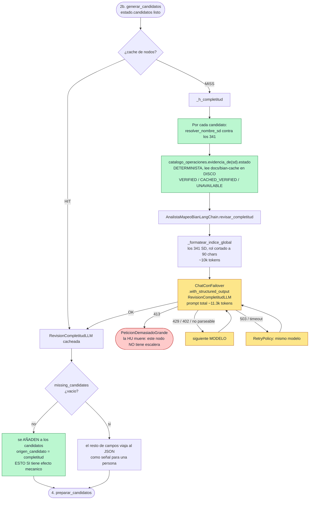

> ## 🗄️ ARCHIVO HISTÓRICO — nodo 3 con el prompt `mapeo.completitud` 1.0.0
>
> Foto del 2026-09-17. Describe el nodo cuando el revisor veía los 341 en un índice recortado a 90
> chars, los candidatos solo por su nombre, y se le pedía `unsupported_candidates`. Desde el
> 2026-09-20 (prompt 1.1.0) ve la evidencia de clases del BOM del nodo 2a, los candidatos con su
> `service_role` entero, un índice global SIN los ya propuestos, y `unsupported_candidates` lo
> escribe el código. La documentación viva es
> [`../03-revisar-completitud-v1.md`](../03-revisar-completitud-v1.md). **No editar.**

---

# Nodo 3 — `revisar_completitud` `[LLM]`

> **En una frase:** vuelve a mirar **los 341 Service Domains** —ahora sabiendo qué se propuso— y
> dice qué falta, qué sobra y qué se pisa. **No decide ownership ni genera contratos.**

Su razón de existir es una desconfianza explícita, escrita en el propio prompt:

> *"La lista inicial de candidatos de un LLM NO demuestra completitud por sí sola."*

Es la **segunda oportunidad estructural** del pipeline, y con el routing jerárquico su valor
aumentó: el nodo 2b ahora ve solo ~30 Service Domains, pero **este sigue viendo los 341**. Es la
red que puede recuperar un Service Domain cuyo Business Domain el nodo 2a no eligió.

Cuatro cosas que este nodo **NO** hace:

1. **No decide ownership.** No dice quién es propietario de nada.
2. **No confirma nada.** `missing_candidates` es una sospecha; la confirmación la hace el paso de
   evidencia (nodo 5).
3. **No descarta candidatos.** `unsupported_candidates` y `duplicated_responsibilities` son
   avisos: todos se evalúan igual.
4. **No degrada su prompt.** A diferencia del nodo 2b, **no tiene escalera** (ver §9).

---

## 1. Dónde vive

| Pieza | Archivo | Línea |
|---|---|---|
| Handler del nodo (capa aplicación) | `src/aplicacion/servicios/mapear_historias_service_domain.py` | `596` (`_h_completitud`) |
| Registro en el grafo + caché + retry | `src/aplicacion/servicios/mapear_historias_service_domain.py` | `2039` |
| Puerto | `src/aplicacion/puertos/analista_mapeo.py` | `70` (`revisar_completitud`) |
| Adaptador LLM | `src/adaptadores/salida/analista_mapeo_langchain.py` | `416` |
| Formateo del índice global | `src/adaptadores/salida/analista_mapeo_langchain.py` | `171` (`_formatear_indice_global`) |
| Prompt | `src/adaptadores/salida/prompts_mapeo.py` | `230`–`282` (`SPEC_COMPLETITUD`) |
| Modelo de salida | `src/dominio/historias.py` | `330` (`RevisionCompletitudLLM`) |
| Fuente de `disponibilidad_evidencia` | `src/adaptadores/salida/catalogo_bian_cache.py` | `evidencia_de(...)` |

Identidad del prompt: **`prompt_id = "mapeo.completitud"`, `prompt_version = "1.0.0"`**.

---

## 2. Contrato de entrada

Lee **4 claves** del `EstadoHistoria` y **calcula una quinta**:

| Entrada | Tipo | De dónde viene | Para qué se usa |
|---|---|---|---|
| `historia` | `HistoriaUsuario` | Lector de HU | Texto completo |
| `intencion` | `IntencionHistoriaLLM` | **Nodo 1** | Solo 3 listas (ver abajo) |
| `candidatos` | `CandidatosHistoriaLLM` | **Nodo 2b** | La lista a revisar |
| `catalogo` | `list[EntradaCatalogo]` | `CatalogoJson.cargar()` | **Los 341, siempre**: nunca el enrutado |
| `disponibilidad_evidencia` | `dict[str, str]` | **Calculada en el handler** | Qué candidatos tienen evidencia BIAN oficial |

### Solo tres campos de la intención

| Campo | ¿Entra? |
|---|---|
| `business_actions`, `business_objects`, `external_dependencies` | **sí** |
| `resumen_funcional`, `outcomes`, `capacidades_funcionales`, `traceability_ids`, `assumptions`, `gaps` | no |

Es un recorte deliberado: la pregunta de este nodo es *"¿qué acción, objeto o dependencia se quedó
sin candidato?"*, y para eso solo hacen falta esas tres listas.

### La quinta entrada la calcula el handler, no el LLM

```python
indice = {normalizar(e.service_domain): e for e in estado["catalogo"]}
for c in estado["candidatos"].candidatos:
    entrada, resol = resolver_nombre_sd(c.service_domain, indice)
    if entrada is not None and resol == "MATCH":
        disponibilidad[entrada.service_domain] = self._catalogo_operaciones.evidencia_de(
            entrada.service_domain
        ).estado
```

Es decir: por cada candidato que **resuelve** contra el catálogo, se consulta el estado de su
evidencia BIAN en la caché local (`VERIFIED` / `CACHED_VERIFIED` / `BIAN_EVIDENCE_UNAVAILABLE`).
Ese dato es **real y verificado en disco**, no una opinión del modelo, y es lo que le permite
señalar `unsupported_candidates` sin inventarse nada.

Un candidato que no resuelve simplemente no aparece en el bloque — su problema no es de
evidencia, es de nombre, y lo atrapa el nodo 4 con `NAME_UNRESOLVED`.

### El índice global: los 341, pero comprimidos

`_formatear_indice_global(catalogo, rol_max_chars=90, chars_negocio=cag_chars_por_sd)`:

```text
- "Building Maintenance" :: Administer and execute site and utility maintenance and repair activities (building refit...
- "Equipment Administration" :: Track the operational state and administer assignment, maintenance and...
- "Party Reference Data Directory" :: The party reference data directory service domain maintains a potentially wide range of...
```

Nombre + rol cortado a **90 chars**. Nada de jerarquía, patrón funcional ni asset type. Con
`cag_habilitado: true` se le añade el vocabulario de negocio tras un `|`.

| Variante | Tamaño |
|---|---|
| `chars_negocio=0` (por defecto) | 39.979 chars ≈ **9.994 tok** |
| `chars_negocio=300` (CAG) | 123.476 chars ≈ **30.869 tok** |

**Es un índice, no un catálogo**, y a propósito: aquí no se decide, solo se señala qué mirar.
Con 90 chars de rol el nombre sigue siendo reconocible y el bloque cuesta una cuarta parte de lo
que costaría el catálogo del nodo 2.

---

## 3. Contrato de salida

```python
{
    "revision_completitud": RevisionCompletitudLLM,   # se ESCRIBE
    "huellas":              [MetadatosPrompt, ...],   # se ACUMULA
}
```

### `RevisionCompletitudLLM`

| Campo | Tipo | Qué contiene | Quién lo consume | ¿Qué efecto tiene? |
|---|---|---|---|---|
| `missing_candidates` | `list[str]` | SD del índice que las acciones/objetos/dependencias sugieren y **no** están en la lista | **Nodo 4** (`_h_preparar`) | **Alto: se añaden a los candidatos a evaluar** (`origen_candidato="completitud"`) |
| `unsupported_candidates` | `list[str]` | Candidatos cuya evidencia es `BIAN_EVIDENCE_UNAVAILABLE` | JSON final | Informativo: se evalúan igual |
| `ownership_conflicts` | `list[str]` | Dos o más candidatos que reclamarían el mismo objeto como propietario | JSON final | Informativo aquí; quien decide es el nodo 7-8 |
| `duplicated_responsibilities` | `list[str]` | Candidatos cuya responsabilidad ya cubre otro | JSON final | Informativo |
| `coverage_gaps` | `list[str]` | Capacidades / objetos / escenarios sin ningún candidato | Se fusiona en `gaps` de la HU | Informativo, visible |
| `blocking_codes` | `list[str]` | `BIAN-SCOPE-009` si hay cobertura demostrada sin candidato | Se fusiona en `blocking_codes` de la HU | Visible en el resultado |
| `review_summary` | `str` | 1-2 frases | JSON final | Informativo |
| `metadatos` | `MetadatosPrompt \| None` | Huella reproducible | `huellas_prompts` | — |

**El único campo con consecuencias mecánicas es `missing_candidates`.** Los demás son señales que
viajan al JSON para que una persona las lea. Eso es coherente con la regla del pipeline: el LLM
señala, el código decide.

---

## 4. Ejemplo REAL de entrada

De `tests/resources/cuentas_menores/`. El mensaje `human` una vez rellenado (índice abreviado):

```text
<historia archivo="HU-Actualizar cuentas de menores.txt" titulo="Actualizar cuentas de menores">
Como   usuario menor de edad o usuario asociado a cuenta menor, ...
Nota: El nombre del tutor será enviado por BE.
</historia>

<intencion_funcional>
business_actions: visualizar datos personales; restringir edición de datos de contacto; presentar mensaje informativo
business_objects: cuenta de menor; datos personales; número celular; correo electrónico; nombre del tutor
external_dependencies: Backend (BE) para obtener nombre del tutor; Smart Token como mecanismo de seguridad; Sistema de autenticación/autoridad de identidad para determinar que el usuario es menor
</intencion_funcional>

<candidatos_actuales>
- "Party Reference Data Directory"  (visualizar datos personales; nombre del tutor)
- "Customer Access Entitlement"  (restringir edición de datos de contacto)
- "Customer Relationship Management"  (cuenta de menor)
- "Party Authentication"  (autenticación / usuario menor)
</candidatos_actuales>

<disponibilidad_evidencia>
- "Customer Access Entitlement": CACHED_VERIFIED
- "Customer Relationship Management": CACHED_VERIFIED
- "Party Authentication": CACHED_VERIFIED
- "Party Reference Data Directory": CACHED_VERIFIED
</disponibilidad_evidencia>

<indice_global fuente="docs/BIAN_Service_Landscape_V14.0_Matrix_View.json" total="341">
- "Building Maintenance" :: Administer and execute site and utility maintenance and repair activities (building refit...
... [341 líneas, ~10k tokens]
</indice_global>

Devuelve missing_candidates, unsupported_candidates, ownership_conflicts,
duplicated_responsibilities, coverage_gaps, blocking_codes, review_summary.
```

El bloque `<disponibilidad_evidencia>` es **real**: esos cuatro `CACHED_VERIFIED` salen de
consultar `docs/bian-cache/release14.0.0/` en disco.

**Prompt completo medido: 45.069 chars → 11.268 tokens** (32.142 con CAG a 300).

---

## 5. Ejemplo REAL de salida

Literal del JSON de esa corrida (`historias[0].revision_completitud`):

```json
{
  "missing_candidates": [],
  "unsupported_candidates": [],
  "ownership_conflicts": [],
  "duplicated_responsibilities": [],
  "coverage_gaps": [],
  "blocking_codes": [],
  "review_summary": "The proposed candidates are complete and fully supported by the evidence provided in the user story and functional intent.",
  "metadatos": {
    "prompt_id": "mapeo.completitud",
    "prompt_version": "1.0.0",
    "prompt_sha256": "7c8da3d0b8ef83efa4fb82417c8636564ebd39097461b7d9c58a6ea9442fd09f",
    "nodo": "revisar_completitud",
    "historia": "HU-Actualizar cuentas de menores.txt",
    "temperature": 0.0,
    "catalog_sha256": "ddb7d1907fa5c7a4ed265006d93eec1d68c84cc76b89ae63be77650fabcfcaac"
  }
}
```

### Cómo leer este ejemplo

- **Todo vacío es un resultado legítimo**, y probablemente el más frecuente: quiere decir "la
  lista me parece completa". No es un fallo del nodo.
- **Pero también es el resultado menos informativo**, y es el riesgo real de este nodo: un revisor
  que siempre dice que sí no revisa nada. Con una sola corrida de referencia **no se puede
  distinguir** "la lista estaba bien" de "el revisor no está aportando". Eso necesita medirse
  sobre muchas HU, y hoy no está medido.
- **`ownership_conflicts` vacío** pese a que la HU sí tiene tensión entre `Party Reference Data
  Directory` y `Customer Access Entitlement` sobre los datos de contacto. Quien acaba resolviendo
  eso es el nodo 7 (adversarial) con su prompt independiente, no este.

---

## 6. Paso a paso de la ejecución

1. **Entrada desde el nodo 2b** por arista fija.
2. **Caché de nodos.** Clave: `"completitud:" + sha_corto(firma_llm, historia, intencion, candidatos)`.
   Nótese que **el enrutamiento no entra**: este nodo ve los 341 pase lo que pase.
3. **El handler calcula `disponibilidad_evidencia`**: resuelve cada candidato contra el índice de
   los 341 y consulta el estado de su evidencia en la caché BIAN local. Cero red.
4. **Llama al puerto** con 5 argumentos: historia, intención, candidatos, catálogo y disponibilidad.
5. **El adaptador formatea tres bloques**: `candidatos_actuales` (nombre + `supporting_intent`),
   `disponibilidad_evidencia` (ordenado por nombre) e `indice_global` (341 líneas).
6. **Invoca la cadena** `SPEC_COMPLETITUD.template | chat.with_structured_output(RevisionCompletitudLLM)`.
   **Sin `_invocar_reduciendo`**: este nodo no degrada (ver §9).
7. **Se adjunta la huella** y se devuelve.
8. **Arista fija** `revisar_completitud → preparar_candidatos`.

---

## 7. Diagrama de flujo



---

## 8. El prompt exacto

### Mensaje `system` (`_SIS_COMPLETITUD`)

```text
<rol>
Eres revisor de completitud BIAN R14. La lista inicial de candidatos de un LLM NO demuestra
completitud por sí sola. Usas el índice global BIAN como HINT y señalas lo que falta evaluar
o lo que sobra, sin decidir todavía ownership ni generar contratos.
</rol>

<procedimiento>
1. `missing_candidates`: Service Domains del `<indice_global>` que las business_actions /
   business_objects / external_dependencies sugieren y que NO están en `<candidatos_actuales>`.
   Nómbralos con su nombre EXACTO del índice. La confirmación real la hará el paso de evidencia.
2. `unsupported_candidates`: candidatos actuales cuyo `<disponibilidad_evidencia>` es
   BIAN_EVIDENCE_UNAVAILABLE — se podrán evaluar pero probablemente queden sin resolver.
3. `ownership_conflicts`: dos o más candidatos que reclamarían el mismo objeto de negocio como
   propietario.
4. `duplicated_responsibilities`: candidatos cuya responsabilidad ya cubre otro candidato.
5. `coverage_gaps`: capacidades / objetos / escenarios de la historia sin ningún candidato.
6. `blocking_codes`: usa `BIAN-SCOPE-009` si hay cobertura funcional demostrada por la historia
   sin ningún candidato que la cubra.
7. `review_summary`: 1-2 frases.
</procedimiento>

<restricciones>
  [el bloque _ANTIALUCINACION común: fuente única, copia literal de nombres,
   sin razonamiento paso a paso, no adivinar]
</restricciones>
```

### Mensaje `human` (`_HUM_COMPLETITUD`)

```text
<historia archivo="{historia_archivo}" titulo="{historia_titulo}">
{historia_contenido}
</historia>

<intencion_funcional>
business_actions: {intencion_actions}
business_objects: {intencion_objects}
external_dependencies: {intencion_dependencies}
</intencion_funcional>

<candidatos_actuales>
{candidatos_actuales}
</candidatos_actuales>

<disponibilidad_evidencia>
{disponibilidad_evidencia}
</disponibilidad_evidencia>

<indice_global fuente="docs/BIAN_Service_Landscape_V14.0_Matrix_View.json" total="{catalogo_total}">
{indice_global}
</indice_global>

Devuelve missing_candidates, unsupported_candidates, ownership_conflicts,
duplicated_responsibilities, coverage_gaps, blocking_codes, review_summary.
```

### Por qué el prompt es así

- **El `<rol>` declara la desconfianza como tarea.** Sin esa frase el modelo tendería a ratificar
  la lista que ya tiene delante.
- **El índice va con el rol a 90 chars**, no con el catálogo completo: aquí no se decide nada, se
  señala qué mirar. Cuesta ~10k tokens en vez de ~36k.
- **`<disponibilidad_evidencia>` es un hecho verificado en disco**, no una opinión: permite
  señalar `unsupported_candidates` con base real.
- **Se le pide el nombre EXACTO del índice** porque `missing_candidates` va directo a resolverse
  contra el catálogo en el nodo 4; un nombre aproximado se pierde como `NAME_UNRESOLVED`.

---

## 9. El detalle importante: este nodo **no** tiene escalera

El nodo 2b degrada su catálogo por escalones cuando ningún modelo acepta el tamaño. **Este no.**
`revisar_completitud` llama a `self._cadena(...).invoke(...)` directamente, así que si su prompt
no cabe, `PeticionDemasiadoGrande` sube y **la HU muere**.

Hoy no es un problema: **~11.3k tokens** le caben a toda la cadena salvo a Groq (presupuesto 12k,
justo por debajo). Pero con `cag_habilitado: true` el índice pasa a **~32.1k tokens** y quedan
fuera también los dos `:free` de OpenRouter, sin ninguna red debajo.

Es una asimetría conocida y **no resuelta**: encender CAG sube el prompt de un nodo que no sabe
degradar. Si alguna vez hace falta, la solución es la misma que ya existe en el 2b — pasar por
`_invocar_reduciendo` con escalones sobre `chars_negocio` del índice.

---

## 10. Caché, reintentos y failover

| Mecanismo | Configuración | Comportamiento en este nodo |
|---|---|---|
| **Caché de nodos** | `cache_nodos_habilitado` | Clave = `completitud` + firma + `historia` + `intencion` + `candidatos`. **El enrutamiento no entra**: este nodo siempre ve los 341 |
| **RetryPolicy** | `_RETRY` | 3 intentos sobre transitorios |
| **Failover** | `routing.llm_priority` | A 11.3k tokens le cabe a toda la cadena menos a Groq |
| **Presupuesto declarado** | `max_input_tokens` | Salta los 2 modelos de Groq (12k) sin llamarlos |
| **Degradación por tamaño** | — | **No tiene.** Ver §9 |

---

## 11. Modos de fallo

| Síntoma | Causa | Dónde se ve / quién lo compensa |
|---|---|---|
| **Todo vacío siempre** | El revisor ratifica en vez de revisar | **No hay detección automática.** Es el fallo más silencioso del nodo: parece éxito. Solo se ve comparando `missing_candidates` con lo que el nodo 4 acaba necesitando |
| `missing_candidates` con un nombre inexacto | Alucinación o paráfrasis | Incidencia `NAME_UNRESOLVED` en el nodo 4; el candidato se pierde sin más efecto |
| **Inunda `missing_candidates`** | Revisor demasiado laxo | Cada nombre extra es una llamada LLM en el nodo 5; el tope `max_candidatos_hu: 14` corta y deja `TRUNCATED_BY_MAX_CANDIDATOS_HU` |
| `PeticionDemasiadoGrande` | El índice no cabe (típico con CAG encendido) | **La HU muere**: sin escalera. Ver §9 |
| `ownership_conflicts` vacío con conflicto real | El nodo no es el árbitro | Lo resuelve el nodo 7 (adversarial), con prompt independiente |

---

## 12. Cómo ejecutarlo y verificarlo aislado

### Ver el índice global tal como lo ve el modelo

```bash
cd /home/super/Desktop/angel_dir/generacion_contrato_bian
.venv/bin/python -c "
from src.adaptadores.salida.catalogo_json import CatalogoJson
from src.adaptadores.salida.analista_mapeo_langchain import _formatear_indice_global
cat = CatalogoJson('docs/BIAN_Service_Landscape_V14.0_Matrix_View.json').cargar()
for neg in (0, 300):
    ig = _formatear_indice_global(cat, chars_negocio=neg)
    print(f'chars_negocio={neg:>3}: {len(ig):>7} chars ~{len(ig)//4:>6} tok')
print(_formatear_indice_global(cat).split(chr(10))[0])
"
```

### Ver la disponibilidad de evidencia de unos Service Domains

```bash
.venv/bin/python -c "
from src.adaptadores.salida.catalogo_bian_cache import CatalogoBianCache
c = CatalogoBianCache('docs/bian-operation-catalogs.json','docs/bian-cache','14.0.0',permitir_descargas=False)
for sd in ['Party Reference Data Directory','Customer Access Entitlement','Party Authentication']:
    print(f'{sd:<35} {c.evidencia_de(sd).estado}')
"
```

### Inspeccionar la revisión de una corrida

```bash
.venv/bin/python -c "
import json,sys
d=json.load(open(sys.argv[1]))
for h in d['historias']:
    r=h['revision_completitud']
    print(h['archivo'])
    for k in ('missing_candidates','unsupported_candidates','ownership_conflicts',
              'duplicated_responsibilities','coverage_gaps','blocking_codes'):
        if r[k]: print(f'   {k}: {r[k]}')
    print('   resumen:', r['review_summary'][:110])
" tests/resources/cuentas_menores/mapeo-historias-service-domains.json
```

### Ver si aportó candidatos que el nodo 2b no propuso

```bash
.venv/bin/python -c "
import json,sys
d=json.load(open(sys.argv[1]))
for h in d['historias']:
    for g,lst in h['service_domains'].items():
        for sd in lst:
            if sd.get('origen_candidato')=='completitud':
                print(h['archivo'], '->', sd['service_domain'], f\"({g})\")
" ./salida/mapeo-historias-service-domains.json
```

Cero líneas de forma sistemática es la señal de que este nodo no está aportando nada — cosa que,
a día de hoy, **no está medida**.

---

## 13. Nodos vecinos

- ← [`02b-generar-candidatos.md`](02b-generar-candidatos.md) — produce la lista que este nodo
  revisa. Con routing solo vio ~30 SD; este vuelve a ver los 341, y ahí está su valor.
- ← [`02a-enrutar-dominios.md`](02a-enrutar-dominios.md) — este nodo es una de las tres redes que
  cubren un enrutamiento equivocado.
- → `04-preparar-candidatos.md` *(pendiente)* — el determinista que une los candidatos del LLM con
  `missing_candidates`, resuelve los nombres contra los 341 y arma el paquete de evidencia por SD.
